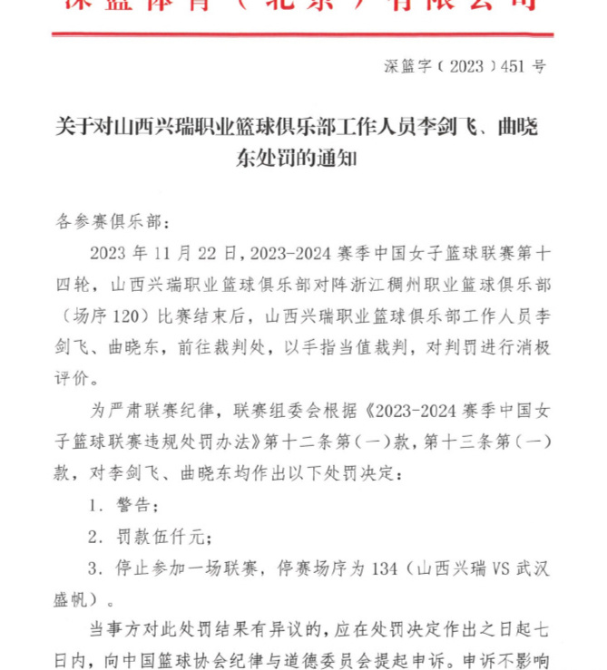
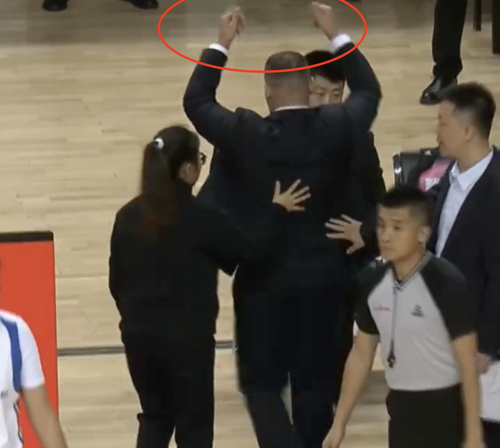

# 中国篮协开出重磅罚单：总计22人被停赛+罚款 重拳出击整治乱象

中国篮协开出了重磅罚单，对大庆女篮和福建女篮冲突进行了处罚，与此同时，山西女篮也遭到了处罚。

在大庆女篮跟福建女篮的最后时刻，场上爆发了激烈冲突。比赛还剩40秒，先是大庆女篮主帅莫米尔-
塔西奇不满裁判，甚至怒摔篮球，被驱逐之后，塔西奇退场时比数钱手势讽裁判。

随后，吴爽和周月明先后故意犯规，双方由此爆发肢体冲突，场上乱成一团。大庆女篮外援钱内迪-卡特情绪相当激动，多次怒推对手。

另一场比赛，最后时刻裁判让山西女篮相当不满，山西女篮教练组和管理层大闹技术台，表达愤怒之情。

对于这两场比赛引发的冲突，中国篮协也开出了重磅罚单。对大庆女篮主帅塔西奇罚款1万，停赛2场，取消评奖资格；两俱乐部各罚款5万，取消评奖资格；与此同时，有6名球员被罚款1万、停赛2场、并且取消评奖资格，她们分别是周月明、张亚琪、钱内迪·卡特、陆紫薇、刘纯韶、陈思奇。还有13名球员被罚款罚款5千、停赛1场和警告，分别是：吴爽、曹丽庆、罗怡璐、郑好、王雨薇、马琪蕊、黄金莲、博亚娜·科瓦切维奇、胡玥明、邢金博、方敏、王泽、陈少玲。

另外，山西女篮领队李剑飞、体能教练曲晓东各停赛1场，罚款5千元。至于两场冲突的根源裁判，通知没有任何提及。

