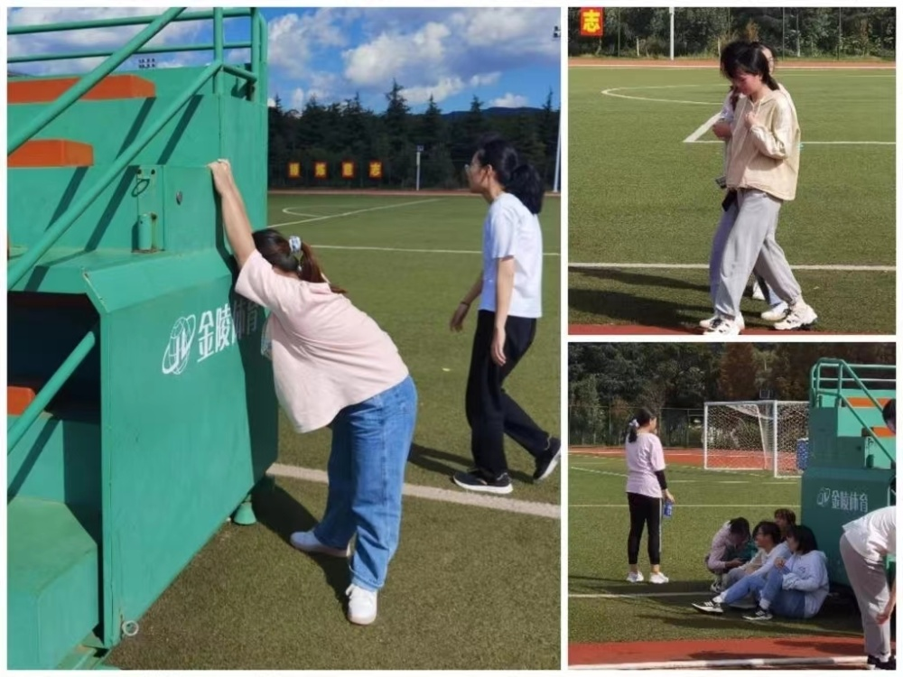
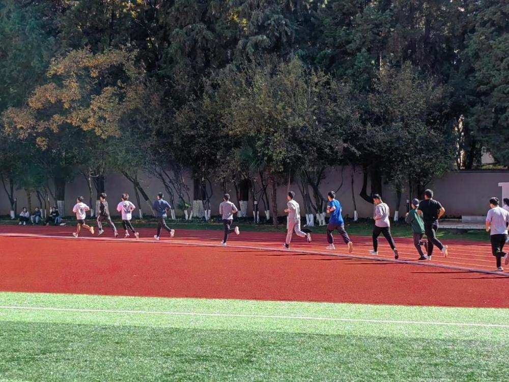

# 新华视点丨“很多男生一个引体向上都做不了”——部分高校大学生身体素质下降现象调查

新华社北京11月24日电 **题：“很多男生一个引体向上都做不了”——部分高校大学生身体素质下降现象调查**

新华社“新华视点”记者

在单杠上晃来晃去一个引体向上也拉不起来、5分多钟跑完800米上楼两腿直哆嗦……

“新华视点”记者近日走进一些高校发现，部分学生身体素质堪忧。很多男生做引体向上非常吃力，立定跳远跳不远，不少学生短跑爆发力不足，存在“长跑恐惧”。

教育部2014年印发的《高等学校体育工作基本标准》要求，加强学校体育工作管理，创新教育教学方式，指导学生科学锻炼，每年对所有学生进行体质健康测试，指导学生有针对性地进行体育锻炼。如何落实相关要求，不断提升大学生体质？

**“没有劲”“跑不动”**

“我校40%的男生体测引体向上项目拿不到分，很多男生一个都做不了。体测优良率每年都在下降。”山东某高校体育部负责人说，十几年前大部分男生都能拉到10个甚至更多。

记者曾到云南大学实地调研体测课。男生1000米成绩多在及格线上下；某个班的女生跑800米，到了最后50米，明显非常吃力，冲过终点后弯腰佝背，表情痛苦。

_2021年11月，云南大学跑完800米后的女生。（拼版照片） 新华社记者岳冉冉 摄_

北京体育大学运动与体质健康教育部重点实验室主任张一民曾参与修订《国家学生体质健康标准》，长期关注大学生体质健康状况。“即便基于学生体质状况，一些项目的及格标准有所降低，但体测结果仍不尽如人意。”他说。

张一民说，以大学男子组1000米为例，1989年60分及格是3分55秒，2014年是4分32秒，降低37秒。这相当于，1989年长跑刚及格的学生已到达终点，2014年的学生还在距离上百米开外的地方跑着。

2021年，教育部公布的第八次全国学生体质与健康调研结果显示，大学生身体素质下滑问题严峻，肥胖、耐力不足等问题突出。

北京一名体育老师说，为逃避体测，部分学生会购买“病历”装病请假，声称膝关节积水、半月板损伤。“我们无法一一辨别‘病历’真伪，也害怕学生真的发生意外，所以免测人数居高不下。”

有的学生为体测过关甚至还会找“枪手”。记者在网络社交媒体上看到，有大学生发帖“求代测”或“替考”，主要集中在中长跑等项目。有大学生说，找“替考”一方面是因为身体素质较差，另一方面也因为体测成绩与评优评奖挂钩。

**身体素质为何下降？**

记者调查发现，大学生身体素质下降，既有学生不愿锻炼的原因，也和一些高校对体测不重视、体育课设置不合理相关。

——部分高校未严格执行《国家学生体质健康标准》，对体测不重视。根据《国家学生体质健康标准》，普通高中、中等职业学校和普通高等学校学生毕业时，测试成绩达不到50分者按结业或肄业处理。

多所高校体育部负责人表示，出于各种考虑，这一规定在不少高校并未严格执行，有的甚至直接忽略，导致学生心理上对体育锻炼、测试产生松懈。

张一民透露，有高校为应对大学生体质健康测试抽查复核，得知专家组来了还会专门找体育成绩好的学生配合，导致体测数据失真。

——一些高校体育课设置不合理。提高大学生身体素质，大学体育课发挥着不可或缺的作用。记者调查发现，当前很多高校的体育课程设置雷同，与大学生的运动需求脱节，影响其上课积极性。

“现在上体育课基本还是在操场上学田径、足球、篮球等，和十几年前差不多。”一些高校学生反映，现在年轻人喜欢的瑜伽、运动减脂、户外拓展之类的“新体育课”几乎没有。

据张一民介绍，相比中小学生体育课有体育与健康课程标准，高校体育课并无统一课标。不少本科院校通常只在一、二年级开设体育课，学生体育锻炼时间明显不足、效果不佳。

教育部学生体质健康抽样复查数据显示，截至2020年，大学生的不及格率约为30%。

——部分大学生锻炼意愿不强。受访体育老师表示，一些学生上体育课在操场边玩手机，“以前足球场上常看到学生们抢场地，现在就只有零星几个人”“晨练时间，运动的学生寥寥无几”……

山东某高校研究生李景磊说，学校研究生阶段没有体育课，体育运动全靠个人。班里仅有十分之一的同学平时会进行有规律的体育锻炼，想打个篮球都凑不齐人。要么嫌夏天热、冬天冷，要么就是有其他娱乐活动。

部分受访大学生甚至表示：“吃饭都懒得走路去食堂，还运动啥？”“早上八点的专业课都爬不起来上，怎么可能去晨跑？”“是手机不好玩了还是上网不香了？”……

**多措并举增强大学生体质**

受访人士表示，提升大学生身体素质，不仅需要大学生“自我加压”，还需要相关部门和学校的联合推动。

专家表示，要严格执行相关标准，提升学生重视程度。2021年，云南大学出台的“最严体育校规”曾引发网上热议：从2021年秋季入学的大一新生开始，任何一个学年体质测试不及格的话，将拿不到毕业证。

“这并非云南大学首创，而是教育部的规定。”云南大学体育学院院长王宗平说，学校严格执行相关规定后，学生体测合格率大幅提升，从2018年的68.6%提高到2022年的90.3%。“现在学生们越来越重视体育锻炼，每天晚上八九点，学校操场上都有他们锻炼的身影。”

 _2023年11月21日，云南大学男生1000米体测现场。 新华社记者岳冉冉 摄_

清华大学体育部主任刘波建议，学校可以基于自身条件开设更多特色课程，帮助学生提升运动兴趣。目前，清华坚持本科四年开设体育课，涉及竞技体育、休闲体育、民族传统体育和体疗课等50多个课项，为研究生开设体育选修课。

此外，应优化体育课成绩构成、评价方式，严防体测造假。合肥工业大学体育教师成守允说，学校进行了体育教育课内外一体化改革，将“体育健身”纳入“第二课堂成绩单”必修模块之一，作为学生毕业硬指标。体育课成绩与学生课外锻炼挂钩，体育课内课堂测试及期末考核占60分，理论学习占10分，课外健身占30分，课外健身中健跑运动不少于60%，通过智慧系统预约其他体育运动不超过40%。

为防范替考等造假行为，合肥工业大学采用验证学生身份证的方式，人证合一方可测试；安徽大学则通过身份证和面部识别检测双重认证，一旦发现替考现象将严肃查处。

尤为重要的是，要体教融合，养成良好锻炼习惯。在清华大学，本科新生会齐聚一堂，通过“体育第一课”体会“无体育，不清华”的体育传统与精神。也有不少学生因为参加新生赤足运动会、校园马拉松，找到热爱的体育项目，收获属于自己的成就感和归属感。

“高校可以通过符合自身特色的举措，帮助学生掌握1至2项运动技能，养成终身锻炼的习惯，打造面向全体学生、贯穿全过程、渗透育人全方位的校园体育文化。”刘波说：“体育锻炼所具备的内在教育价值可转化为社会生活中所提倡的优良品质，这将令学生终身受益。”（记者谭谟晓、舒静、张力元、周畅、岳冉冉）

