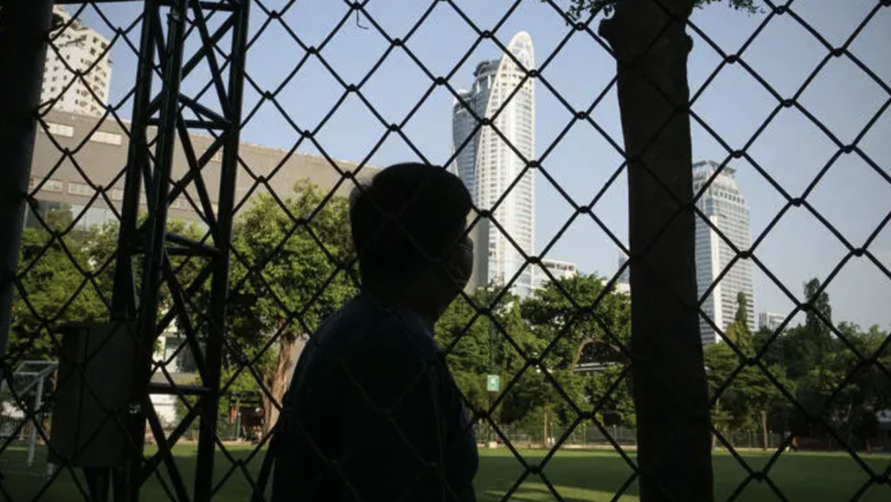

# 曼谷街头乞讨者日收入两千元：泰国人口贩卖屡禁不止，利润比贩毒还高

本文来源：时代周报 作者：刘沐轩

据《曼谷邮报》11月22日报道，泰国警方初步调查表示，近期在曼谷发现并抓捕的6名中国籍毁容乞讨者背后，可能是涉及由泰国人组织的团伙。

曼谷大都会警察局副局长Amnat表示，警方尚未断定他们是跨国人口贩运团伙的一部分，但怀疑这些中国乞讨者同属于一个组织，有泰国人对他们进行监管和收容。

_《曼谷邮报》相关报道（图源：《曼谷邮报》官网截图）_

日前，据《环球时报》援引多家泰媒报道，泰国警方在11月10日至20日抓捕了6名毁容的中国籍乞讨者。警方对他们进行了100泰铢-500泰铢（约合20元-100元人民币）的罚款，并列入黑名单，10年内不得入境泰国。

此次事件令泰国警方起疑的是，这些乞讨者身上携带大量硬币和纸币，却没有携带任何身份证件。而在这些乞讨者被捕后，有乘坐豪车的中文翻译人员拿着乞讨者们的护照来到警局，并自称愿意支付每人1万泰铢（约合2027元人民币）的“放人费用”。

泰国警察称，这名翻译人员的行为非常可疑，几名乞讨者可能属于同一组织，涉及人口贩卖。

根据泰国法律，在泰国各地乞讨都是违法的，警察遇见乞丐有权直接逮捕。但每一个去过泰国旅游的人，大概率都见过街头的乞丐，尤其在游客众多的旅游目的地。

实际上，绝大多数泰国乞丐上街乞讨并不是为了果腹，而是为了挣钱。

**“被迫乞讨”的乞丐**

除了偏远的贫困地区，在曼谷等较为发达的泰国城市区域内，有大量的慈善机构在帮助低收入群体。不仅泰国王室会在王室纪念日发放免费食物，其他来自民间捐赠、宗教组织等相关机构也会为穷人提供基本的救助。

 _在泰国王室成员纪念日期间，曼谷的穷人在王宫外领取免费晚餐。（图源：时代周报记者 刘沐轩摄）_

驱使着乞丐们铤而走险的原因，是在旅游区乞讨可以获得高额收入。

据泰国社会发展和人类安全部统计，尽管泰国乞丐的平均收入为每天1000至2000泰铢，但曼谷街头的一些乞丐每天的收入可以高达7000泰铢（约合1419元人民币），比泰国官方规定的每日最低工资高出20多倍。

Amnat表示，近期被逮捕的中国籍乞讨者，每天收入可高达1万泰铢（约合2027元人民币）。

_曼谷大都会警局副局长Amnat（图源：社交媒体）_

“给乞讨者钱只会鼓励对弱势群体的剥削，他们可能会被他人强迫乞讨，”泰国社会发展和人类安全部的福利保护和生活质量促进司司长Sarawut呼吁，希望泰国人停止向乞讨者施舍。

Sarawut还在11月22日的新闻发布会上指出，自2016年至今，泰国警方记录在案的乞讨者有7151名，包括4678名泰国人和2473名外国人。其中，这些外国乞讨者的年龄在22至47岁之间，大多数是柬埔寨和缅甸人，还包括68名中国人。

**买卖人口，利润比贩毒还高**

自20世纪50年代以来，连接泰国、缅甸和老挝的“金三角”地区一直是非法活动的温床。1998年至2006年开展铲除毒品运动后，金三角地区的毒品产业规模被削弱，但犯罪分子们却找到了新的赚钱机会——人口贩卖。

据国际相关组织估计，泰国人口贩卖产业的利润在2003年就已经比贩毒还要高。

游走在此地的人贩子们买来残疾人士去做乞丐来赚钱，买来儿童作为童工、买来女性进行性剥削，买来成年男性用作劳工或从事电诈等非法活动。

泰国的陆路边境并不都是安全的，有部分地方腐败横行，海路也存在可逃避监管的空间，有些渔船三年才回国一次，给了人贩子们可乘之机。

东南亚各国的贫富差距极大，多重因素的影响下，相对发达的泰国成为了人口贩卖的枢纽。

不可否认的是，在泰国经济高速发展的阶段，部分周边国家的劳工的确是自愿前往泰国务工，赚到过第一桶金。但如今，互联网传闻中的“泰国高薪工作”，却成为其他东南亚国家人民落入人贩子圈套的常见原因。

_“泰国高薪工作”是最常见的套路。（图源：社交媒体）_

印度尼西亚大学生艾哈迈德（化名）就通过泰国的一位朋友，收到过一份“高薪”的营销工作录用通知，他在抵达曼谷后跟着公司的对接人驱车前往泰国北部，但很快他就在河边被武装人员包围。

“我当时非常害怕，”他对国际移民组织回忆道，“过了河后，我看到了另一个国家的国旗，这肯定不是泰国国旗，我应该是被带到了缅甸。”

据路透社援引2018年的数据报道，泰国有超过60万名人口贩卖受害者，也就是说在泰国，大概每120个人中就有一人是被“卖”到泰国的。而据国际移民组织估计，泰国近500万移民中，有100万-250万人是没有合法移民身份的。

_泰国有大量的非法移民，经常盘踞在酒吧、卡拉ok、按摩店等场所。（图源：社交媒体）_

数据触目惊心的背后，是真正能被解救出来的受害者，少得可怜。

2022年，泰国政府仅确认了444名人口贩运受害者，2021年确认了424名受害者。泰国政府为他们提供了庇护所、重返社会支持、法律援助、经济援助和其他支持。

此外，泰国不仅是东南亚人口贩运的中转国，可能还是最大的人口贩卖来源国。

有报告显示，泰国人主要会被贩运到日本、德国、美国、英国、南非和澳大利亚。

想要坚持将旅游业作为经济支柱的泰国，每年都在增加预防和打击人口贩卖的预算，试图改变现状。

但泰国政府对人贩子的刑罚却不够严厉，常常因太轻而被诟病，犯下贩卖成年人口罪仅判处4年-12年监禁，和40万-120万泰铢（约合8万-24万元人民币）的罚款。涉及儿童和妇女的罪犯，判罚会加重一点。

历史遗留的移民问题，跨国执法的困难和边境治安系统的腐败，使得泰国难以在短期内动摇人口贩运的现状。

（实习生杨昕雨对本文亦有贡献）

