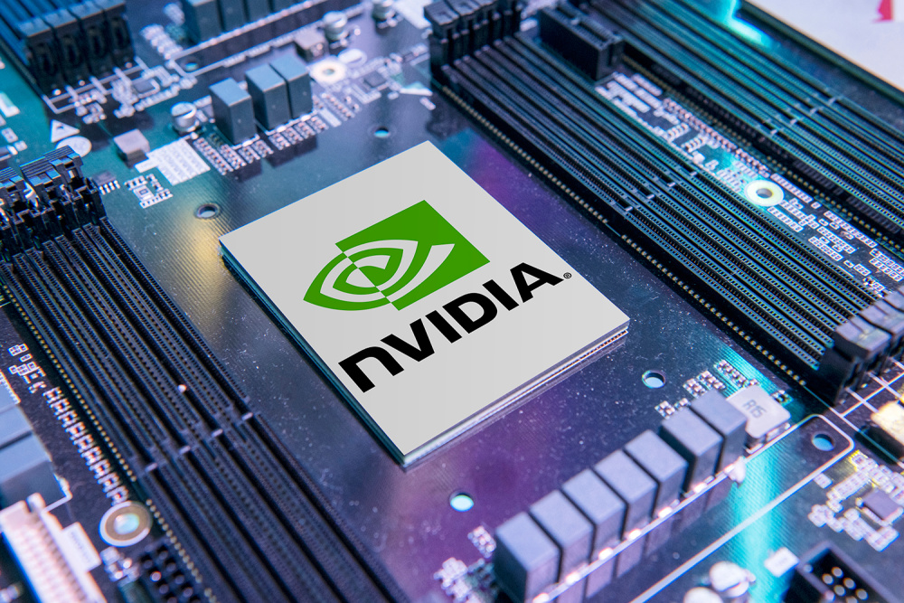

# 英伟达被曝推迟面向中国的新芯片：系3款允许出口芯片中最强大的一款

（观察者网讯）11月24日，路透社援引消息人士独家报道称，英伟达的“中国特供版”人工智能（AI）芯片将延迟推出。

芯片行业咨询公司SemiAnalysis本月报道称，这家总部位于加州的AI芯片巨头预计最早于11月16日推出新产品。然而两名知情人士称，英伟达已经告知中国客户，将推迟一款符合美国出口规定的新款AI芯片发布时间，直至明年第一季度。

被延迟推出的芯片是H20，在英伟达为遵守美国新出口限制而面向中国市场开发的三款芯片中，H20是功能最强大的一款。消息人士称，由于服务器制造商在集成芯片方面遇到了问题，H20现在被推迟到明年第一季度上市，并且可能会是2月或3月。这可能会使英伟达与华为等本土企业的中国市场份额争夺战变得更加复杂。

对此，英伟达拒绝置评。

除了H20，英伟达还计划推出另外两款符合美国新出口规定的芯片——L20和L2。消息人士称，L20不会推迟，将按照原定计划推出，L2的情况则无可奉告。

路透社指出，美国的出口限制将为华为等竞争对手创造机会。英伟达正押注于这些芯片，希望借此保住在中国的市场份额。

很长一段时间以来，美国不断在芯片半导体领域对中国进行打压，实际上全球产业链都受到了巨大伤害，令行业人士叫苦不迭。从去年10月到今年10月，美方这一打压仍在“加码”。在中国价值70亿美元的人工智能芯片市场上，英伟达占据了90%以上的份额，以英伟达为代表的许多美国企业，都对美国政府的这一做法持不同看法。

去年，英伟达由于无法向中国市场提供A100和H100人工智能处理器，专门为中国市场特供符合美方规定的A800和H800芯片，以绕开美国政府的管制。一年后，美国政府再次收紧出口规定，新的限制措施定于11月16日生效，届时A800和H800将被禁售。

路透社11月10日援引行业人士报道称，作为A800和H800的替代品，英伟达已针对中国客户开发出符合美国最新出口规则的“改良版”芯片，HGX H20、L20
PCle和L2 PCle。英伟达最早或将于本月16日之后公布。

_图自IC Photo_

报道称，这三款新产品都是从H100的基础版修改而来，包含了英伟达用于人工智能工作的大部分最新功能，但一些计算能力被削减以符合美国新规。美国富国银行分析师亚伦-
瑞克斯（Aaron
Rakers）在给客户的一份报告中写道，英伟达准备发布的这三款芯片的计算能力似乎都低于美国新规中设定的绝对上限，不过其中一款可能需要取得许可证才能获准出售给中国。

《南华早报》分析称，若英伟达确认此事，这将表明中国市场对美国芯片公司有多重要，以及其中一些公司准备在多大程度上遵守华盛顿不断变化的限制。

当地时间11月22日，英伟达在披露财报时透露，美国政府上个月公布的管制新规对其上个季度业绩没有造成“有意义的影响”，中国市场和一些受限地区占其数据中心业务收入的四分之一。但这家美国芯片巨头同时表示，当前季度，该公司对这些地区的销售额将大幅下降。

在业绩会上，英伟达首席财务官科莱特·克雷斯（Colette
Kress）证实了正在为中国市场开发“合规芯片”的消息。克雷斯表示，这些芯片将在未来几个月内露面，但不太可能对英伟达当前业绩产生帮助，现在预测此类产品将如何影响未来收入还为时过早，因为涉及因素太多。

**本文系观察者网独家稿件，未经授权，不得转载。**

