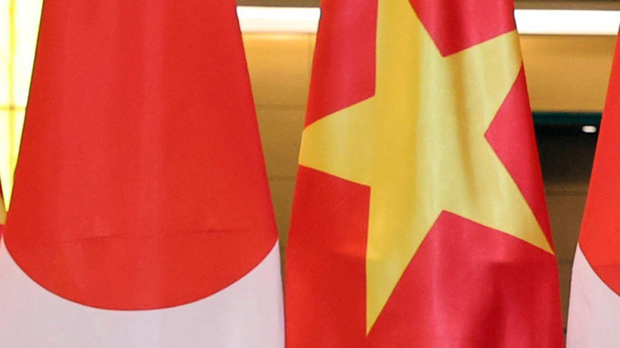

# 越南国家主席下周访日，两国关系或迎来升级

据越南外交部23日消息，越南国家主席武文赏将于11月27日至30日对日本进行正式访问。外界认为此访最大看点在于，日越关系会否提升为全面战略伙伴关系，与美越关系保持同等级别。此外，日本如何开展对东南亚国家外交，配合美国“印太战略”，同样令人关注。

**恰逢两个节点**

越南外交部称，访问期间，武文赏将与日本首相岸田文雄举行会谈；会晤日本天皇与皇后；会见日本高层领导人，在日本国会发表讲话；出席越日建交50周年纪念典礼等多项重要活动。

越方认为，此访将有助于进一步深化两国政治、经贸、投资关系，推动绿色、创新、数字化转型等新领域合作，为地区与世界和平发展作出贡献。

外界注意到，此访恰逢两个节点。

第一，今年是日越建交50周年，也是日本与东盟建立友好合作关系50周年。即将于12月举行的日本—东盟特别首脑会议，更被日方视为“今年最重要外交活动之一”。因此，日本今年以来的东南亚外交十分活跃。

第二，今年9月，越南和美国刚刚将双边关系升级至“全面战略伙伴”。美国由此成为继中国、俄罗斯、印度和韩国后，第五个与越南建立全面战略伙伴关系的国家。

日本表现出紧随美国的态势。武文赏访日期间，日越关系或升级至与美越关系同等水平。如果实现，将具有极强的象征意义。预计日本将借此在经济和安全领域扩展双边关系。

日越于2014年建立“致力于亚洲和平与繁荣的广泛战略伙伴关系”。外交官们说，将双边关系升级为“全面战略伙伴关系”的谈判已进行数月，官员们讨论了各种合作协议。但两国官方尚未就可能的升级作出回应。

**对越南“加注”**

今年以来，日本对东南亚开展密集外交攻势，在争取越南方面不断“加注”。

政治上，7月，自民党政调会长萩生田光一访问越南。9月，岸田出席在印尼举行的东盟—日本首脑会议。会议通过了将日本与东盟关系提升至“全面战略伙伴关系”的联合声明。10月，日本新任外相上川阳子将越南选为上任后的首批出访国之一。

经济上，日本是越南第三大外国投资来源国和第四大贸易伙伴，目前越南有2000多家日本企业。去年双边贸易额达到近500亿美元。日本还长期充当越南官方发展援助的最大出资国。

防务上，日本政府正考虑将越南设为“政府安全保障能力强化支援”（OSA）的新支援候选对象。此前，日本已将菲律宾、马来西亚等东南亚国家作为2023年度OSA支援对象。

分析认为，日越走近互有需要。对日本而言，意在为实现“自由开放的印太”战略加强合作；对越南而言，则是从国家利益出发与各国建立多样化的双边关系，寻求大国之间的平衡。

**令人担忧的一面**

有评论指出，东南亚已成为日本新防卫政策和在亚洲扮演更自信安全角色的关键。但与此同时，由于日本自视为美国“印太战略”的“地区话事人”，这使其东南亚外交凸显出令人担忧的一面。

今年以来，无论是日本向菲律宾兜售和渲染“中国威胁论”，还是插手东南亚事务，都引起地区国家警惕。外界注意到，即便中日关系气氛最近有所缓和，但日本对华政策仍表现出对美依附性，对华战略认知存在偏差。

因此，武文赏访日期间，日方种种动向依然值得高度关注——是不是会利用中越争议问题，见缝插针对越南实施拉拢？又会不会兜售“友岸外包”，破坏产业链稳定并给地区经济带来负面影响。

分析认为，尽管日美等国都对东南亚国家加强外交攻势，但地区国家奉行平衡外交路线，不愿在大国之间选边站队。

从越南来看，自实施革新开放以来，它注重与主要大国都建立稳定、良好的关系。今年8月，越共中央总书记阮富仲曾回顾中越人民“同志加兄弟”的特殊传统友谊，表示越南视发展对华关系为头等优先。

《环球时报》援引观察人士的话指出，东南亚国家是中日两国共同的伙伴，中日韩三国是《区域全面经济伙伴关系协定》（RCEP）核心国家，东盟各国显然不愿在中日之间选边站队。日本应该做的，是继续在包括东南亚在内的亚洲地区共促稳定与繁荣，而非跟着美国制造分裂，害人害己。

