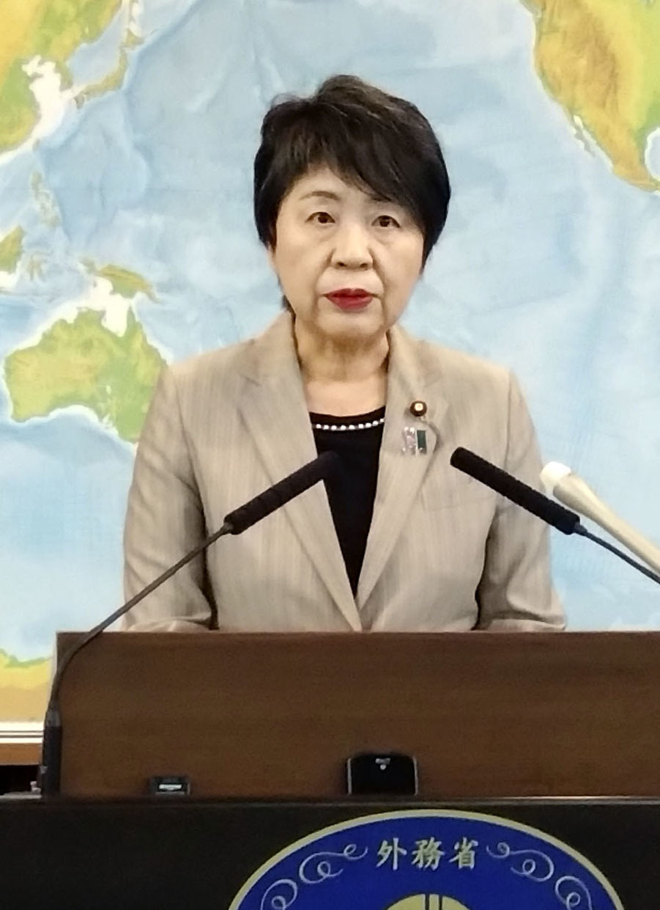

# 韩国慰安妇受害者对日索赔案二审获胜，日方：违反日韩共识，无法接受

（观察者网讯）韩国首尔高等法院民事33庭23日推翻了第二起日军“慰安妇”受害者对日索赔案的一审判决，认定原告提出的所有索赔金额，要求日方向原告每人支付2亿韩元（约合人民币109万元）的赔偿。

对此，据日本共同社消息，日本官房长官松野博一在24日的记者会上称，“（韩法院判决）明显违反国际法及日韩两国的共识，令人极其遗憾。绝对无法接受”。

_松野博一，图自NHK电视台_

松野博一强调，在两国首脑的领导下，日韩关系朝着积极方向发展，将继续在各个方面推进相关举措。他还强烈要求韩方，妥善管理日韩间存在的各种悬而未决的问题，与对方保持紧密沟通。

与此同时，据韩联社报道，韩国外交部24日也就日军慰安妇受害者对日索赔案原告胜诉一事表明原则性立场，称尊重韩日政府间协议。

韩国外交部一名官员当天表示，2015年朴槿惠政府时期与日方达成的《韩日慰安妇问题协议》是两国政府之间的正式协议，政府尊重该协议，并正在了解判决详情。韩联社称，此番话被解读为，政府将在2015年签署的上述协议框架内对待有关问题。

 _慰安妇受害者李容洙（轮椅）庆祝索赔案胜诉。图自韩联社_

2016年12月，李容洙等“慰安妇”受害者和金福童等已故“慰安妇”受害者的家属21人，针对日本政府提起上述赔偿诉讼，但在2021年4月的一审判决中遭首尔中央地方法院驳回，理由是日本享有不受韩国法院管辖的“国家主权豁免权”。法庭还认为，《韩日慰安妇问题协议》可视为日本政府做出的权利救济。虽然协议文本未能征得受害者的同意，但该协议包含了日本政府对受害者的谢罪和反省之意，日本政府表示将出资设立财团，用于受害者赔偿，并将其视为“替代性权利救济”手段，部分受害者还领取了和解治愈基金会以现金形式发放的赔偿金。

然而，此次判决与同一法庭同年1月判决的第一起对日索赔诉讼获胜形成鲜明对照，引发争议。第二起索赔案原告中15人不服判决，向首尔高等法院提起上诉。在11月23日的最新判决结果中，首尔高等法院指出，根据习惯国际法，应认定韩国法院对被告日本政府的管辖权。法院认定被告在动员慰安妇过程中的非法行为，认为被告需向原告支付合理的抚慰金。

随后，日本政府召见韩驻日大使尹德敏，并以外务大臣的名义发表谈话提出抗议，要求韩政府“采取切实措施纠正违反国际法的行为”。

_24日，日本外相上川阳子出席新闻发布会。图自视觉中国_

据报道，日本外务省事务次官冈野正敬得知韩国法院的判决结果后，立刻召见韩国大使尹德敏提出了抗议。冈野正敬称，韩国法院的判决极其令人感到遗憾，要求韩国政府采取适当措施，纠正对国际法的违反。而日本外务省也以外相上川阳子的名义发表了谈话。上川阳子称，这一判决违反了国际法及韩日两国间的协议，敦促韩国纠正其违反国际法的行为，并承担起身为国家的责任。

一直以来，日本以国际法的国家豁免原则为由，拒不参加法院的审判程序，此次也采取了相同的立场，并表示绝不可接受法院的判决。日本政府主张其对慰安妇不负有法律责任，不认可相关诉讼，始终采取无视韩国法院的立场。日本政府此次也未参加诉讼，并拒绝接受法院的判决。

**本文系观察者网独家稿件，未经授权，不得转载。**

