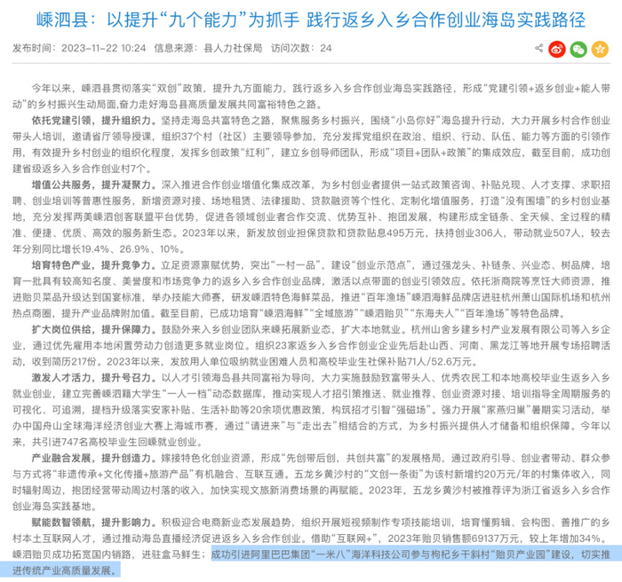

# 马云新动作：旗下公司进军预制菜

预制菜赛道再迎重量级人物！

天眼查显示，杭州大井头贰拾贰号文化艺术有限公司（以下简称：大井头）11月22日成立全资子公司杭州马家厨房食品有限公司（以下简称：马家厨房），出资额为1000万元。

其中，马家厨房经营范围包括食品销售（仅销售预包装食品）、食品互联网销售（仅销售预包装食品）、食用农产品初加工、食用农产品批发、食用农产品零售等。而大井头由马云实控，持股比例为99.99%。

作为2023年最火爆的赛道之一，“提升净菜、中央厨房等产业标准化和规范化水平，培育发展预制菜产业”写入了2023年中央一号文件。

艾媒咨询数据显示，2022年中国预制菜市场规模为4196亿元，预计2026年规模将达10720亿。未来，面米、蔬菜类将占据近五成份额，而肉禽类和水产类增速更高。

**马云落子农渔食品大赛道**

马云布局预制菜产业并非新鲜事。近年来，马云行程信息表明他对农产品、渔业、食品等领域表现出浓厚的兴趣。

荷兰瓦格宁根大学官网披露的信息显示，2022年7月2日，马云到访瓦格宁根大学，交流和探讨畜牧业和渔业的新技术。马云称，接下来自己的时间和精力会完全投入到农业领域，包括在戈壁沙漠种植农作物。

当时，荷兰科学家向马云分享了可持续畜牧业、水产养殖、渔业未来等方面的见解。马云还参观了校区内的全新高科技温室和荷兰植物生态表型中心。

2023年1月，马云在泰国曼谷考察了正大集团。由于正大集团长年深耕农牧食品、批发零售等领域，外界也猜测马云此行的目的是交流食品、粮食等行业的发展经验。

今年5月，日本东京大学宣布聘请马云为“东京学院（TokyoCollege）”的客座教授。该校称，马云将就重大研究课题提供建议和支持，并与东京大学的研究人员开展联合研究，尤其是在可持续农业和粮食生产领域。而2022年下半年，马云在日本旅居期间曾实地考察了日本渔业养殖技术，参观了近畿大学水产养殖研究所的大岛站等。

今年7月，马云参股成立海洋科技公司，进军水产养殖等赛道。天眼查信息显示，7月20日，一米八海洋科技（浙江）有限公司成立，注册资本1.1亿元，法定代表人为邓中华，经营范围包括水产养殖；海上风电相关系统研发；生物质能技术服务等，由1.8
Meters Technology Holding Limited、大井头等共同持股。其中，马云为大井头实际控制人。

而上述“一米八”海洋科技公司已在水产养殖领域有所作为。浙江嵊泗县人民政府官网11月22日的消息显示，该县已成功引进阿里巴巴集团“一米八”海洋科技公司参与枸杞乡干斜村“贻贝产业园”建设。

**预制菜行业竞争格局尚未形成‍‍**

按照中国烹饪协会发布的标准，预制菜是以农产品、畜禽、水产品等为原料，配以各种辅料，运用标准化作业，经预先加工，或烹调制成，并经过包装好的成品或半成品菜肴。

资料显示，2021年美国、日本预制菜的渗透率已达到60%以上，而我国仅为13%左右，发展空间巨大。2022年我国预制菜市场规模超过4000亿元，预计未来市场规模保持1.5%左右的增速。

预制菜已成为农产品和食品企业争相发力的方向之一。例如，世界粮油巨头益海嘉里旗下的中央厨房沈阳项目预计明年初正式投产，预计可日产4万份金龙鱼丰厨品牌学生餐、2万份冷链便当、46吨预制菜、40吨净菜。

第六届进博会期间，益海嘉里相关负责人对证券时报记者表示，中央厨房是公司近年重点发力的板块。“面对中国市场对中央厨房产品需求的日益增加，公司依托深耕多年的全链条管理能力，以现有的米面油等业务为基础，并凭借在全国布局、原料采购、产品研发、加工制造、物流配送、销售渠道等方面的优势，构建极强的全产业链竞争壁垒，加速推进中央厨房业务布局，为不同人群用餐提供个性化的解决方案。”

在不久前召开的M2023中国大农业经营年会上，全联农业产业商会会长、广东恒兴集团有限公司董事长陈丹表示，预制菜与新生代的生活方式已深深融合在一起，是有效保证农业产业健康可持续发展的重要环节，是实现乡村振兴、共同富裕的有效途径，预制菜产业的发展壮大是必然的。要推动预制菜产业走标准化、园区化、集群化、品牌化发展道路。

对于预制菜产业未来的发展趋势，陈丹提到，随着国家标准、行业标准、产品标准的逐步完善，以及预制菜产业生产许可审查制度的推广和数字化评价体系的搭建，预制菜产业一定会逐步规范起来，更好地满足消费者的健康饮食和个性饮食需求。行业品牌意识将不断增强，行业竞争将逐渐转向品牌竞争。随着标准化菜品、标准化产品的日臻成熟，预制菜也将加快出海步伐，服务海外市场。

川财证券认为，预制菜行业仍然处于蓝海竞争阶段，并未出现较多的规模以上企业，竞争格局尚未形成。目前B端为预制菜市场的重心，主要参与企业类型有上游农林牧渔企业、传统速冻食品企业、专业预制菜企业和食材供应链服务商。C端主要参与企业类型为餐饮企业和新零售企业。上游原材料企业具备更强的抗风险能力和盈利能力，在渠道铺设方面，保证B端客户的同时，需要发展电商、新零售平台的合作机会，B、C端兼顾发展塑造竞争优势。

来源：证券时报

