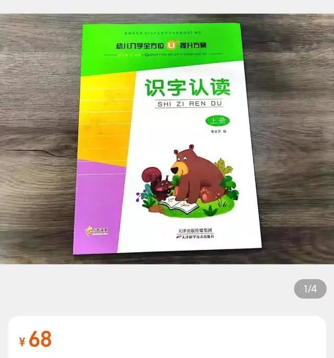
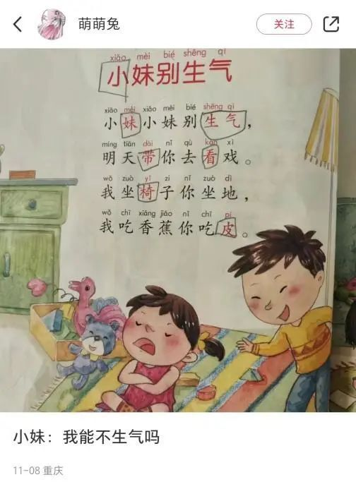
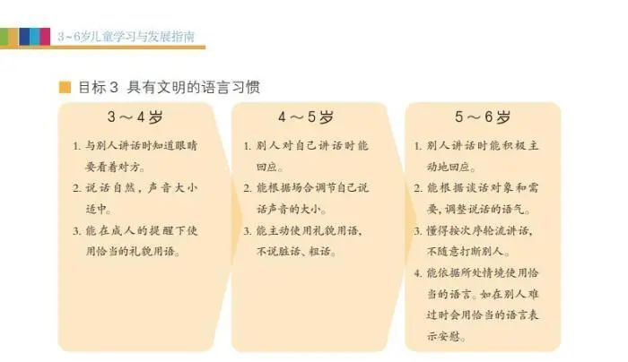

# “我吃香蕉你吃皮”，幼儿读物现恶搞顺口溜，出版社：童谣很经典

“小气鬼，喝凉水，喝了凉水变魔鬼”“张三一回头，吓死河边一头牛”“小明的屁，震天地，一屁崩到意大利”……你的学生时代，曾经流行过这些顺口溜吗？

此类形式简短、语言逗趣、本质戏谑的内容，往往在孩子们之间口口相传。而近日，一首这样的“灰色童谣”，引发了不小的网络争议。有网友发文称，一本儿童读物里收录的儿歌《小妹别生气》有不良引导的嫌疑：“小妹小妹别生气，明天带你去看戏。我坐椅子你坐地，我吃香蕉你吃皮。”

对此，有人觉得童趣盎然，认为“不必较真，大家小时候都调皮过”；但也有人提出：这样的儿歌，怎么能印在纸上，教给孩子呢？

_《识字认读》（上）。淘宝页面截图_

**01**

**出版社人员：**

**每个人观感不同**

据公开资料显示，《小妹别生气》一文收录于儿童读物《识字认读》（上册）中，该书由天津出版传媒集团旗下的天津科学技术出版社出版。通过查询各大购书平台，记者发现《识字认读》分为上下两册，每册的售卖价格从39-68元不等。

该书上册收录了《咏鹅》《静夜思》《冬爷爷》《对韵歌》等多首古诗、童谣。其中，《小妹别生气》出现在书本的第40页，相应的插画描绘着小姑娘盘腿坐地叉手生气，一旁的小男孩乐得手舞足蹈的场景。

_网友晒出的《小妹别生气》插图。小红书截图_

“这是在从小培养孩子的自私”“顺口溜和俏皮话不适合正经教给孩子听”“这种歌谣放读物里是在扼杀祖国的花朵”……网友们在提出异议之余，还对该书编辑发起诘问：编辑的认知是否和大众出现了偏差？

为此，记者致电天津科学技术出版社寻求解答。
**该出版社工作人员回应称，将这首儿歌录入书本的原因是其“够经典”：“这首童谣流传较广，流传的时间也比较久，包括音频、文字什么的网上都有记录。”**

据悉，《识字认读》发行于2020年，而工作人员表示，自发行起，出版社方从未收到过负面的读者反馈：“从来没有（收到）过。这本书都好几年了，我们现在也不发行了。最近突然有一个家长可能觉得不合适。
**可能每个人的价值取向不一样，我们也尊重对方。如果将来需要重印的话，我们就把内容调整一下。** ”

“我们所有的书都是三审三校，严格按照国家的政策法规来做。”该名工作人员直言，并不存在部分网友猜测的“编辑夹带私货”，一切争议来源于“每个人观感不一样”。他坦言，出版社内部并不会因此进行追责，但在以后的工作中对于素材的选取会更为谨慎：“尽量选大家不会觉得有争议的。我们之前选的是经典，以后选更经典的。”

**02**

**孩子们眼中**

**“我吃香蕉你吃皮”礼貌吗**

出版社人员口中的“每个人观感不一样”，也体现在网友们的众说纷纭上。

有部分人认为，大家没必要对一首童谣反应过度：“开玩笑而已”“过度理解了吧，这就是一首普通的儿歌”“小孩子顶多觉得很好玩，反倒大人上纲上线”……

既然大人们吵不出答案，那不如问问这本书真正的读者。在孩子们的世界里，“我坐椅子你坐地，我吃香蕉你吃皮”到底带着怎样的语义色彩呢？

在湖南省永州市某公立幼儿园工作的幼师贾璐（化名）告诉记者，日前她特意就此话题在班上开展了相关讨论。活动中，
**这群4岁-5岁的孩子们普遍提出，这是一句“让人不开心”的话：“我听了不开心，因为地上很脏，会有小虫子爬到屁股里去”“香蕉皮没味道”“而且香蕉皮上有很多细菌”……**

经过调研后，贾璐直言：“中班的孩子语言表达不会很丰富，一般都说开心或者不开心。她们觉得这是一种不友好的行为。此外，这首歌谣给小朋友传播的是一种不平等的思想，我优化，你劣化，拉高自己，踩低他人，这样的思想会导致孩子越来越自私，也会影响他们对于礼貌用语的学习和使用。所以我们教师一致认为这是有问题的话。”

此外，记者还采访了多位儿童和家长，受访者们同样普遍认为，童谣里的行为“很不礼貌”。

“这句童谣里面的‘我’非常不礼貌，让自己坐椅子吃香蕉，只让小妹坐地上吃香蕉皮。”就读于北京市某小学的2年级学生源源（化名）说：“己所不欲勿施于人，自己不想做的事情不要施加给别人。”

源源的妈妈郑女士则表示，儿童读物是家长会更加信赖的信息来源，其审核管理机制应更加严格：“应该本着对儿童负责任的原则去设计内容，不建议这种玩梗过度的顺口溜出现在正规儿童读物上，这样会令孩子们难辨是非，不利于三观的建立。”

“学前儿童的学习方式就是模仿，一百个孩子，一百种理解，一百种想法。很多孩子并没有辨别是非的能力，一个孩子看了，进行模仿，一个变成一个班，一个班变成一个小区，这种传播速度是很快的。”贾璐坦言，
**“灰色童谣”在校园内传播的危害极大：“这些孩子还在成长中，意识还在发展中，他们没有健全的人格，我们要给他们传播正能量的思想。”**

**03**

**专家：需谨慎对待**

**3-6岁幼儿教育问题**

“小朋友刚来学校的时候就是一张白纸，老师教什么就是什么。我们不单单要教给学生知识，还要教他们做人。而学会分享是很重要的一课。”

深耕教育行业43年、如今运营一家独立幼儿园的老教师徐月仕向记者科普，小班、中班的教授内容主要是儿歌、故事和礼仪，大班孩子才会接触到握笔书写，因此挑选低龄儿童的教材时要慎之又慎。

徐月仕的顾虑很有必要。记者注意到，这本《识字认读》的封面清楚标注了“根据教育部《3-6岁儿童学习与发展指南》编写”的字样。据教育部官网，该指南于2012年印发，其中内容明确提出要“为幼儿创设温暖、关爱、平等的家庭和集体生活氛围”及“让幼儿在积极健康的人际关系中获得安全感和信任感，发展自信和自尊”，并反复强调需引导幼儿在与他人交谈时使用恰当的礼貌用语。

 _《3-6岁儿童学习与发展指南》内容。教育部官网截图_

“我吃香蕉你吃皮”的含义与该指南“关爱幼儿”的核心要素是否相悖？对此，中国传媒大学新闻学院副教授、中国社会心理学会传播心理专业委员会副秘书长倪桓向记者表示，
**如果这本读物针对的是3-6岁的儿童，那确实存在不良引导倾向。**

“3到6岁年龄段的孩子正处在大脑高速发育的过程中，他们开始在识字和认读中形成基本的是非观雏形。他们按二元式的认知方式思考问题，还处理不了既好又坏的具备复杂和整合性的信息。”

倪桓提出，该年龄段的孩子大部分只能单向接收信息，因此学习材料的导向特别重要：“如果这个时候的读物里出现‘我吃香蕉你吃皮’，那孩子们是会认同的，也可能会在现实中进行模仿。”

而对于部分网友提出的“不要上纲上线”“只是开玩笑”等意见，
**倪桓则认为，戏谑的内容应该针对已经具有完整的认知能力、建立起相对稳固的价值观后的个体，而非低龄儿童**
：“因为这部分网友自己不会真的只吃香蕉让对方吃皮，他才会觉得这种说法无伤大雅。但在孩子还在形成价值观的年龄段里，不能轻易地在教育性的读物里出现这种明显不文明、不礼貌的行为。”

其实，对比曾经流传过的那批极具攻击性、“很黄很暴力”的“灰色童谣”，《小妹别生气》的遣词造句并不算出格。但口口相传和出版成书的传播介质差别，决定了后者必须承载更大的社会责任。

“口口相传带有随意性和人际互动性，所以可以有一些戏谑的表达，但放在读物上就不行了。”倪桓说：“读物属于大众传播，白纸黑字统一印刷。我们对大众传播的要求更高，内容要无可指摘，价值观、表达、印刷各方面都要经得起推敲，因为它面向的是不同阶层、不同年龄段的受众群体。”

编辑：赵晓倩

责编：李金磊

