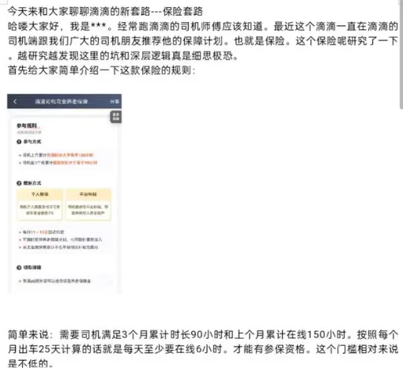
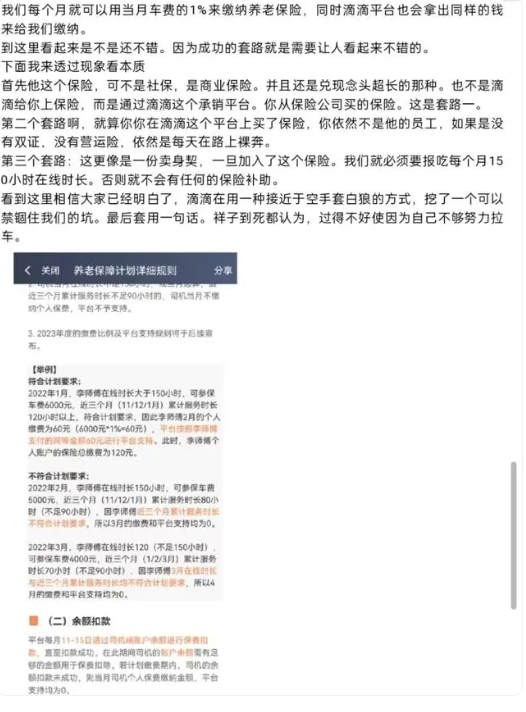
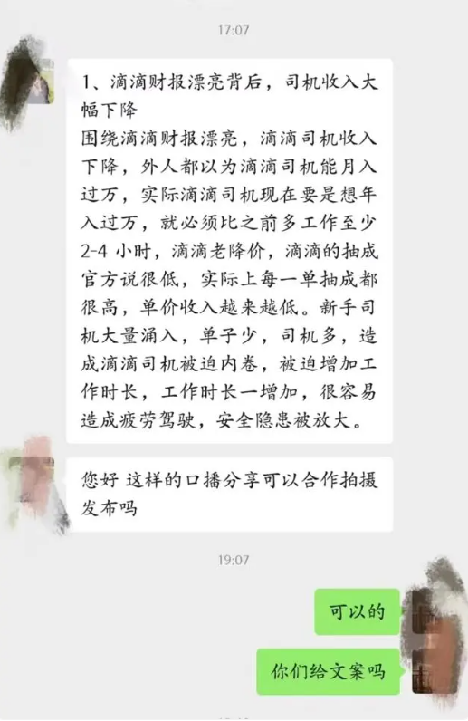

# “黑滴滴”成为一门生意？背后谁是赢家？

“有偿悬赏能够吐槽滴滴的自媒体账号，小号给300，大号给3000！”近日，一波全网明码标价“黑滴滴”的狂潮席卷了网约车自媒体平台。

11月20日杭州“滴滴司机节”的风头热闹正劲，网约车自媒体圈子里，却悄然流传出一条“黑滴滴”的“江湖悬赏令”，赫然打出 **“寻找有偿吐槽滴滴账号”。**
数天内，几乎所有网约车自媒体账号都收到了这则有诱惑力的邀请：只要粉丝数量超过500，便可参与有偿口播分享“黑滴滴”文案，报酬从小号300-500到大号2000-3000不等。这种简单的赚钱方式迅速吸引了众多网约车自媒体号主的参与。

_微信社群内流传的多个“黑滴滴”文案截图_

这轮全网“黑滴滴”风潮引发疑问：
**为何会有人愿意出大价钱去抹黑滴滴，背后谁是推手？网络水军造谣抹黑，触及了哪些法治红线？对行业生态又将带来哪些不良影响？**

只要骂滴滴就能赚钱？

专家：已构名誉侵权，或涉刑事犯罪！

滴滴司机节作为滴滴重磅打造的一项活动，今年已经是第五届。除了表彰来自全国各地的优秀司机之外，也邀请了少部分司机自媒体，借此宣扬其平台最新的政策、以及各项福利保障。司机节期间，滴滴在现场向所有司机做出“十大承诺”，包括抽成公开透明、费用保障、提升派单体验、打击作弊、改善司乘关系、增加养老和医疗保障和投入等承诺。

而这场“黑滴滴”悬赏风波中，被重点攻击的正是滴滴为保障司机权益提出的这一系列正向操作，
**从保险补贴福利到司机群体分层再到公开亮眼财报，有关滴滴的方方面面都成为了悬赏征集的“黑点”。**

**据悉，早在今年年中，针对灵活就业的特点，** 滴滴就已推出“橙意保障计划”，落实新业态劳动者权益保障，其中也提及
**平台已试点通过补贴联合保险机构，推出多项服务司机家庭的商业养老医疗保障。滴滴方面称“虽然还是试点，到去年底已经有超过20万名师傅参与。”**

事件发酵后南都记者第一时间联系滴滴公关部，对方表示目前暂不公开回应。

_网传用于抹黑滴滴为司机提供商业保险的套路文案_

“这次悬赏开黑的风波中，这条保险套路的文案我也有关注到，这已然是对企业的名誉侵权。” **知名互联网法律专家、北京嘉维律师事务所赵占领律师**
在接受南都连线时斩钉截铁地表示。“滴滴的十大承诺中，有一个承诺是说司机去购买保险，滴滴会进行1:1的补贴，这条黑滴滴文案则曲解成滴滴骗大家买保险只是为了套住司机签卖身契之类的。
**根据谁主张谁举证的原则，它这个文案需要举证证明滴滴没有按承诺对符合条件的司机实际补贴，除非有这样的证据，否则就属于捏造歪曲事实，构成诽谤。**
据我所知，实际上此前已经有滴滴司机领到此类补贴了。”

_网传攻击滴滴财报的统一“黑模板”_

赵占领进一步解析称，通过诽谤的形式损害他人的名誉，是名誉侵权的一种常见形式。“侵权主体首先是这类文案的发布者，这个主体可能是个人，也可能是某个机构，那么发布文章者先构成名誉侵权；
**如果说有证据证明其背后有推手，是受指使的，那么指使者和发布这种不实文章的主体，应该是构成共同侵权的关系，共同承担法律追责。**
”赵占领还补充，在这一全网招募写手无脑“黑滴滴”的事件中，因不少自媒体水军借助社交平台，对“黑滴滴”套路文案进行病毒式传播，导致侵权结果在很短时间内进一步扩散，
**在民事侵权之外，根据情节和影响恶劣程度，此类行为或还将涉及刑事犯罪。**

网络“水军”“黑公关”大行其道

背后司机KOL或涉资本运作？

**黑滴滴的狂潮甚至波及了正常去参加滴滴司机节的一线司机。**
一位参加了本次滴滴司机节的司机主播“石头哥”，就在其社交平台直接炮轰，称大量的恶评水军涌入其评论区，疯狂带节奏言语攻击。
**“看了一下几乎都是私密账号，互动的有来有往。”**

“悬赏开黑，为黑而黑，的确闻所未闻。尤其黑的还是企业的正向动作。”一位网约车业内人士向南都记者坦言，企业舆论战并非新鲜事，但从大量的网传信息来看，
**这波悬赏开黑幕后问题比较大的还有一批成规模的司机KOL** ，“有些甚至是
**组建了多个数百人的社群，里面粉丝都是司机，这些KOL自己开设网约车服务公司，拉司机租车，然后分润赚钱。** 其中
**大部分账号的内容几乎清一色是无脑喷，制造司机与乘客、与平台的对立，甚至还会有号召司机停运、扎针（下虚假订单）的极端行为。**
”该分析人士指出，司机KOL的存在，确实可以在保障司机权益方面发挥监督功能推动平台改进；平台与他们加强沟通合作，也不完全是受制于人，很多时候也是希望通过他们更好地了解与服务、保障司机群体。“这些人中有不少平时都是各平台的座上宾，因为他们已经具有不小的社会动员力，但需要直面的是，其中也有一些KOL是藏有私心的，根本不在乎真实情况，一味要把自己影响力做大吃流量饭，就可以要挟平台甚至自己开公司。
**司机KOL本应是平台和司机群体之间的润滑剂，但贪婪的KOL就容易制造麻烦，破坏司机群体的稳定。** ”

观察这场“黑滴滴”运动，很容易发现这背后或涉及到同行业内竞的资本运作。

值得一提的是，因为 **类似内容涉及低俗、恶意辱骂、博眼球等，已经有部分视频号主被平台限流和封号处罚。**
实际上国家政策与法律早已对网络水军、抹黑等问题作出了明确的回应。

“法律层面看，网络水军抹黑行为可能构成商业诋毁。”采访中， **中国政法大学法治与可持续发展研究中心执行主任郝作成**
向南都记者援引具体法条，解读此类非法行为。《反不正当竞争法》第十一条明确规定了“
**经营者不得编造、传播虚假信息或者误导性信息，损害竞争对手的商业信誉、商品声誉**
”。第二十三条规定“经营者违反本法第十一条规定损害竞争对手商业信誉、商品声誉的，由监督检查部门责令停止违法行为、消除影响，处十万元以上五十万元以下的罚款；情节严重的，处五十万元以上三百万元以下的罚款。”

“网络水军抹黑行为必然 **对各行各业行业的公平竞争、良性发展产生很大的负面影响** 。”郝作成强调。

专家谈行业水军抹黑的负面效应

劣币驱逐良币 助长行业戾气

阻碍市场真实供需信号传递

“雇佣水军对头部企业抹黑造谣，不仅仅是败坏行业竞争秩序的生态，更恶劣的影响在于，令准确的行业市场供需信号无法得到真实传播和反馈，受损最大的实则是广大司机群体，因为司机往往会相信这种打着一线从业者身份的司机KOL。”
**东南大学交通法治与发展研究中心执行主任、中国城市公共交通协会网约车分会会长顾大松**
在连线中向南都记者分析，网约车的市场化改革当前事实上面临需求饱和、供给过剩的问题，“现在有些地方主管部门的做法，比如成都、重庆等地，就是将市场真实情况反馈给社会从业者、投资者，以利于行业内决策和调控市场。”

据悉，11月初，成都发布的《成都市2023年9月网约车市场运行监测信息》显示，成都日均在营网约车7.87万辆，单车日均订单14.5单，单车日均营收约247.3元。此前广州以及苏州公布的网约车日均营收分别是358.44元及331.90元。这是成都首次公布网约车月度市场运行监测信息，根据这一数据可以一窥当前网约车市场的饱和情况。

重庆市日前更是直接发布投资经营风险提示称， **重庆中心城区网络预约出租汽车运力已远超实际需求，入行、入职务必谨慎。**

在顾大松看来，司机自媒体号的一线从业者身份背书，往往令其天然具备司机圈层的粉丝基础， **本应该成为真实反映行业信号和司机生存状况的信息渠道，**
为司机群体发声代言，同平台企业沟通诉求，协同共建良好的网约车行业生态，推动网约车市场深化改革。然而，
**这类恶意造谣传谣的司机自媒体号的存在却扰乱了市场信号的正确传导，更遑论利用雇佣网络“水军”推“黑公关”的非法手段已越过法治红线** 。

“网约车行业供大于求，很多人并不适合这个行业，比如身体不好，又或许对收入期望值过高。盲目入坑赚不到钱的新进司机，更容易被这些水军带偏方向。”一位来自上海的司机KOL主播告诉南都记者，他能明显感觉到今年网约车市场竞争异常激烈，现在是
**司机高呼钱难赚、乘客抱怨打车贵、撮合平台成本水涨船高。**
“拿上海来说，上海现在最低峰的时候一个小时可能就40多块钱，有些新手司机对派单抢单路线规则不熟的，一天要挣个四五百那可能就是要连续运营10多个小时。”

“今年网约车行业整体都很卷”，顾大松也有同感，他同时指出，
**造谣滋事的水军大行其道，新入行的司机更难了解行内真实数据，更易助长行业戾气，对网约车司机群体的社会形象产生负面效应。**
“错误认知带来的心理预期落差，加之长时段运营的压力，有时在服务作业中动作就难免走形，甚至引发冲突。”他说。

“放任这种业内有组织的水军抹黑，更直接后果就是会让很多在一线从业的KOL真实的发声也被殃及，一线从业司机的现身说法也没人信了。最后大家都不知道该信谁，到底是听监管部门的、车企的，还是听KOL的？”顾大松直言，
**真正的市场供需信号调节发挥不了作用，这会阻碍网约车市场化改革的真实发展进程。**

郝作成表示：“适当的舆论监督本可以提升行业的整体发展水平，但是如果将主要精力放在抹黑竞争对手，甚至捏造一些事实，则可能导致各家企业的资源投入与关注重心出现偏差，最终导致
**劣币驱逐良币，长远上不利于消费者和劳动者权益的保障与提升，也不利于维护公平的市场竞争秩序。** ”

监管发力 深化供给侧改革

政府出手 网络清朗势在必行

网络“水军”“黑公关”等非法手段，作为近年来个别不法经营者和商家屡试不爽的手段，不仅扰乱了受害企业正常经营秩序，给企业品牌造成冲击伤害，更严重污染了网络环境。除了滴滴，顺丰、美团、格力在内的许多知名企业都深受其害。聚力行业水军也一直是互联网依法治理打击的重点。

今年4月，中央网信办就发布开展“清朗·优化营商网络环境 保护企业合法权益”专项行动通知，要求
**深入清理处置涉企业、企业家虚假不实和侵权信息，坚决打击恶意炒作行为，依法查处侵害企业、企业家合法权益的网站平台和账号。**

“打击网络水军是有关部门重要关注点。”郝作成指出，11月10日国家网信办2023年“清朗”系列专项行动中，把“清朗·打击网络水军操纵信息内容”作为一项专项行动，
**明确提出“全面清理网络水军违法违规信息”** 。“相信随着打击网络黑公关力度不断升级加码，网络生态也将逐步好转。”郝作成表示。

“打铁更需自身硬，除了政府对黑滴滴水军重拳出击坚决纠偏之外，车企自身在当前经济形势下也应降本增效。
**要深化推动司机端的供给侧改革，保障好服务好广大司机的权益才是根本。”郝作成说。**

**与中国许多行业的发展路径类似，网约车经历了从野蛮生长到合规经营的嬗变，在这一过程中监管也正在持续发力。**

今年4月，交通运输部印发《2023年推动交通运输新业态平台企业降低过高抽成工作方案》。该《方案》指出，将推动主要网约车和道路货运新业态平台公司加强与从业人员代表、行业协会等沟通协商，保障从业人员合理劳动报酬水平。推动主要网约车和道路货运新业态平台公司降低平台过高的抽成比例或者会员费上限，并向社会公开发布。

随后、杭州、上海、福州等城市也纷纷跟进，围绕抽成比例、“一口价订单”等进行政策指导。此次滴滴司机节，滴滴十大承诺第一条就是
**“账单公开透明、抽成单单可查”** ，率先回应政府监管举措。

“以网约车行业为例，企业应当更加专注安全保障义务履行、订单匹配效率提升、司乘服务体验完善、消费者权益维护、劳动者权益保障等核心竞争力。”郝作成在采访中进一步建议，
**一方面要督促网约车平台公司合理确定网约车运价，保持计价及动态调价规则的公开透明；另一方面还是要顺畅与司机、行业协会等主体意见沟通机制，加大上述群体对网约车定价决策的参与度，提高网约车定价机制的科学性和民主性。**

在采访的最后，顾大松向南都记者分享了他此前在第四届中国网约出行产业峰会上的一个观点。在他看来，网约车作为国内交通领域相当重要的市场力量，除了车企自身结构优化完善合规之外，更需要政府、市场、社会各方共同努力，
**要形成“有效市场”“有为政府”“有位协会”结合的网约车合作治理新业态。**

采写：南都记者 吕虹

