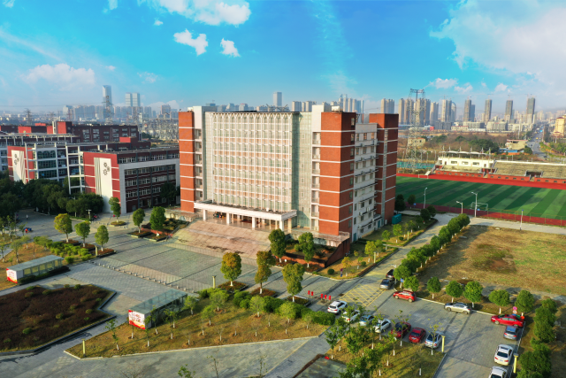
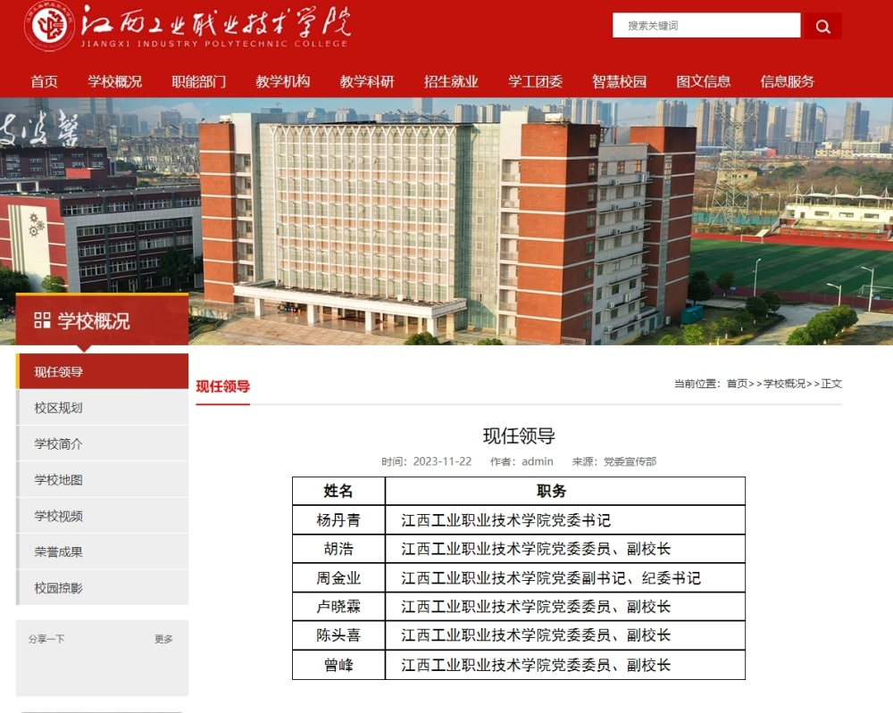
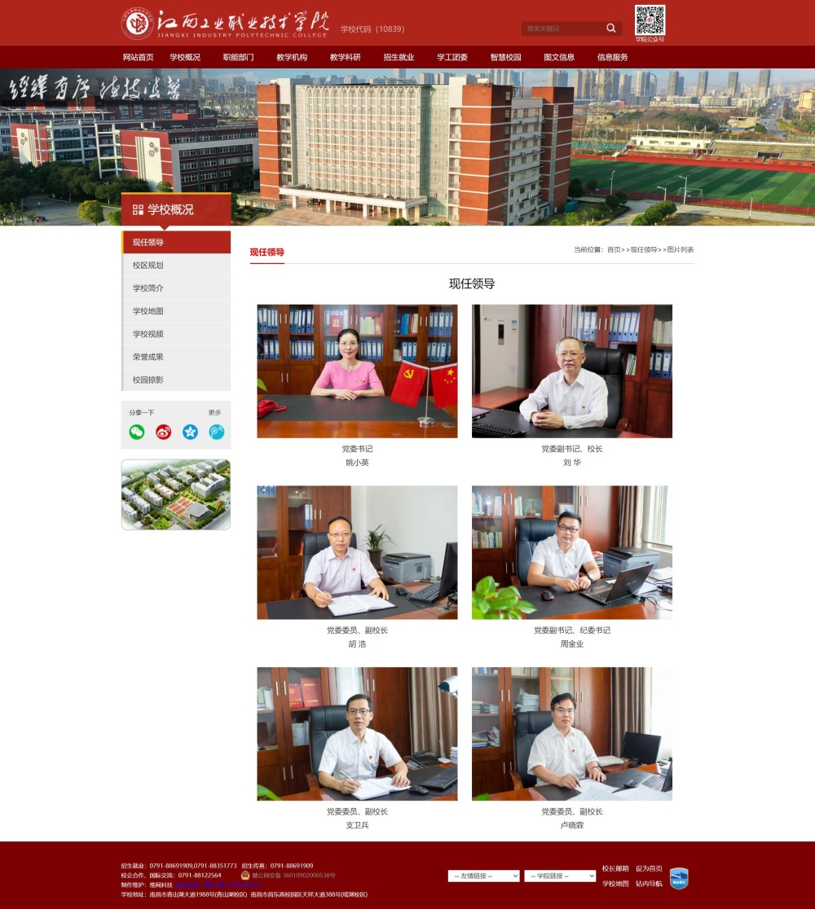
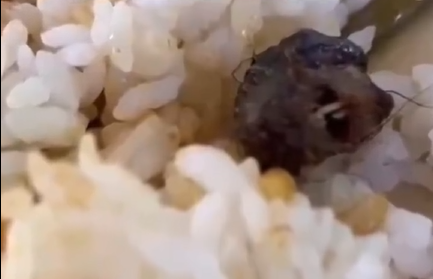

# “鼠头鸭脖”事发5个月后，涉事高职院校党政领导双双去职

_江西工业职业技术学院_

备受舆论关注的“鼠头鸭脖”事发5个月后，涉事的江西工业职业技术学院（简称“江西工职院”）领导班子已于近日调整，校党委书记姚小英、校长刘华等校领导去职。

更新后的江西工职院网站“现任领导”栏目显示，杨丹青任江西工职院党委书记，陈头喜、曾峰均任校党委委员、副校长。校长一职目前空缺，胡浩、周金业、卢晓霖继续担任原职。

_现领导班子_

其中，新任江西工职院党委书记杨丹青是江西永新人，1990年7月参加工作，2003年6月入党，本科毕业毕业于江西师范大学体育教育专业，拥有学士学位、高级讲师职称，曾任江西省化学工业高级技工学校副校长、党委委员，江西应用工程职业学院党委副书记、院长等职，于2019年1月任江西应用工程职业学院党委书记。

相较江西工职院官网此前公布的校领导班子成员名单，除了姚小英、刘华以外，原任校党委委员、副校长的支卫兵也不在现任校领导之列。

 _江西工职院原领导班子_

其中，姚小英曾任江西工职院副校长、校长等职，于2018年2月出任该校党委书记；刘华曾任江西现代职业技术学院党委副书记、副院长等职，于2019年4月出任江西工职院党委副书记、校长。

今（2023）年6月，一则“江西一高校饭菜中疑吃出老鼠头”的视频在网络传播。6月3日晚，涉事的江西工职院发布情况通报称，饭菜中的“异物”经当事人确认为鸭脖。6月4日，南昌市高新区市场监管局相关人员称，初步判定系鸭脖。

_视频截图_

但相关通报并未消除公众的质疑。6月10日，由江西省教育厅、省公安厅、省国资委、省市场监督管理局等部门组成的联合调查组宣告成立，对该事件进行调查。6月17日，联合调查组对外通报了调查结果。

通报称，联合调查组经勘察现场，调取监控视频发现，6月1日，学生在食堂吃出疑似为“鼠头”的异物，被涉事食堂工作人员事发当日丢弃。通过查看食堂后厨视频，查阅采购清单，询问涉事食堂负责人、后厨相关当事人、当事学生和现场围观学生等，判定异物不是鸭脖。根据国内权威动物专家对提取的当事学生所拍现场照片和视频进行专业辨识，判定异物为老鼠类啮齿动物的头部。

联合调查组指出，南昌高新区市场监督管理局昌东分局、江西工业职业技术学院未认真调查取证，发布“异物为鸭脖”结论是错误的。经认定，江西工业职业技术学院对此次事件负主体责任，涉事企业负直接责任，市场监督管理部门负监管责任。

据江西工职院官网介绍，该校是1999年经教育部批准成立的江西省首批独立设置的公办全日制综合性高等职业院校，是江西省示范性高职院校。学校创办于1954年，先后经历了调整、升格、合并、更名等发展阶段，至今近70年的办学历史。

