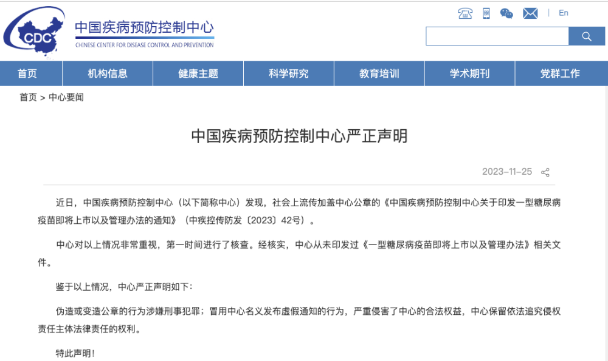

# 中疾控：从未印发过《一型糖尿病疫苗即将上市以及管理办法》相关文件

中国疾病预防控制中心发布严正声明，具体内容如下：

近日，中国疾病预防控制中心（以下简称中心）发现，社会上流传加盖中心公章的《中国疾病预防控制中心关于印发一型糖尿病疫苗即将上市以及管理办法的通知》（中疾控传防发〔2023〕42号）。

中心对以上情况非常重视，第一时间进行了核查。经核实，中心从未印发过《一型糖尿病疫苗即将上市以及管理办法》相关文件。

鉴于以上情况，中心严正声明如下：

伪造或变造公章的行为涉嫌刑事犯罪；冒用中心名义发布虚假通知的行为，严重侵害了中心的合法权益，中心保留依法追究侵权责任主体法律责任的权利。

特此声明！

