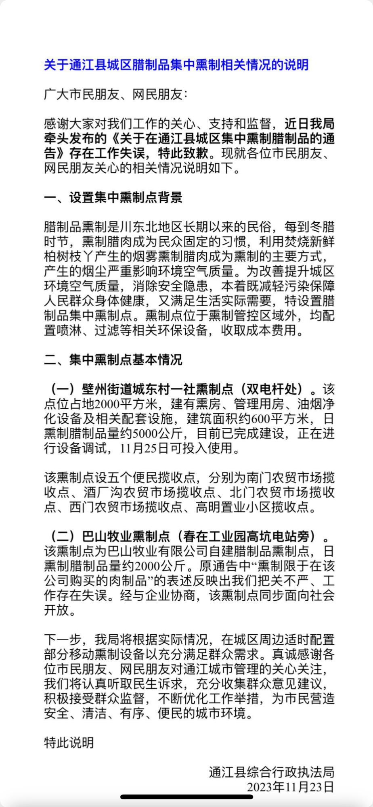

# 从禁止到致歉！还原四川两地禁止城区熏制腊肉事件

央广网成都11月25日消息（记者 王颖 见习记者
雷怡安）11月15日，四川省巴中市通江县发出通告称，城区禁止私自熏制腊制品，熏制腊肉、腊肠等需送到指定的集中熏制点；随后，11月20日，巴中市南江县也发出类似通告。

通告表示，“随着熏制腊制品高峰期到来，熏制产生的烟尘将污染空气，影响市民生产、生活，并存在火灾安全隐患。为尊重传统、方便市民，同时保护生态环境、保障熏制安全，根据有关规定，禁止在县城区农贸市场、居民小区院内、楼道、阳台、屋顶以及岩坡旁、路边、河沟等非指定地点熏制腊制品；禁止在县城区内擅自搭建腊制品熏制设施；县城区腊制品实行定点集中熏制。”

同时，通江县、南江县通告中均指出，凡违反本通告的，将依法依规进行处理。

两县通告一经发出，迅速在社会上引起了诸多关注。

11月23日晚，通江县综合行政执法局发出一封致歉信。

从通告到致歉，不到十天的时间，这一事件背后的争议关键点究竟是什么？在致歉信发出前后，记者均第一时间联系上了这起事件中的相关当事人，试图多角度探讨这一事件始末。

聚焦三个集中熏制点

在两县的通告中，记者看到其明确给出了集中熏制点的点位及负责人姓名、联系方式。

11月23日下午3时，记者联系到通江县集中熏制点之一的壁州街道城东村一社罗老板。“你想问啥子就问啥子。”罗老板说，他这两天已经接到了很多电话，主要还是询问熏制腊肉怎么收费。

“熏制价格分为两种，自己带腌制好的肉，就按照一斤1.6元-2元左右价格收取，如果需要腌制，就按照一斤4元钱左右收取。”

11月25日，罗老板就开始熏制工作，对于一部分人的不理解，他觉得很正常，对新事物新规定肯定有一个接受过程。

对于存在诸多争议的巴山牧业，记者也联系上了该公司负责人刘先生。“为什么通告上会有熏制限于在该公司购买的肉制品呢？”对记者的问题，刘先生解释说：“我们公司本来就有养殖和加工，之前没有对外加工过，所以这次为了响应政府的倡议，我们就提供加工服务选项。但为了公司肉类防疫安全着想，我们才提出了需要购买公司的肉。”对于记者询问该公司猪肉的价格，刘先生说按照市场价格来定价，腌制价格也是根据市场的定价来。“作为一家上市公司，我们根本没想从这个事情上赚钱，主要是积极配合政府的倡议。”刘先生表示。

而位于南江县石光村一社熏制点的周仕强面对记者时表示，下个月他们才开始集中熏制腊肉。对于通告上要求的集中熏制，周仕强说出自己的理解：“这个规定只针对城区，城区有人用电有人用柴火，我觉得政府最主要是怕引起火灾。在农村，地广人稀还是可以熏制的。”关于熏制生意好坏，周仕强说：“来不来人都无所谓，我又不靠这个赚钱的。”

当地综合行政执法局 “会给出统一解答”

在与集中熏制点老板了解完情况后，记者拨通了通江县综合行政执法局和南江县综合行政执法局的电话。

通江县综合行政执法局的电话一直处于占线状态，南江县综合行政执法局分别有两位工作人员接听电话。对记者的去电，南江县综合行政执法局工作人员表现得很谨慎。据悉，通告发出后的这几日，该局工作人员接到许多电话，不堪其扰。

“目前县级有关单位正在紧急开会，针对群众所关心的问题会进行统一解答。”南江县综合行政执法局工作人员表示。

专家：探寻更好的方式 延续风俗

熏制腊肉，是否会对环境造成影响？长久以来的习俗是否真要一刀切？带着这样的疑问，记者咨询了西华大学食品与生物工程学院教授车振明。

在车振明看来，如果是家庭式、小规模、小作坊的熏制腊肉不会对环境造成太大影响。因为空气是流动的，特别在巴中这样人口并不密集的城市，就算有一些污染出现也会迅速消散。但如果进行工业化、规模化地熏制腊肉，其对大气污染防治的影响有待重视。

作为食品安全方面的专家，车振明也表示，熏制腊肉的习俗也可与时俱进，做出一些改变。由于每个家庭对熏制腊肉的经验不一，在这个过程中就极有可能出现意外情况，因此可运用更好的方式，统一化、标准化、安全化地熏制腊肉。“这样大家都能吃上口感好、卫生条件好的腊肉，也能让这样的习俗更加绵延持久。”车振明说。

_四川各地素有熏制腊肉的习俗，上千年来已成为当地的特色风俗。（央广网发 图片来源视觉中国）_

致歉信发出后

11月23日晚上9时10分，记者收到了《关于在通江县城区腊制品集中熏制相关情况的说明》。《说明》第一段有这样的表达：“近日我局牵头发布的《关于在通江县城区集中熏制腊制品的通告》存在工作失误，特此致歉”。

距离致歉信发出10个小时后，记者再次联系上了通江县综合行政执法局主要负责人。针对第一次通告中“需购买某企业猪肉才可在该熏制点熏制”及下一步通江县将如何真正做好为民服务这两个问题，该局主要负责人给出了以下解释。

“首先对我们工作疏忽造成的社会负面影响，我们再一次做出诚挚道歉。”主要负责人说，“虽然我们这里有着上千年的熏制腊肉、腊肠风俗习俗，但预防大气污染、提高安全生产意识，也是势在必行的。所以今年我们最终决定集中熏制腊肉等制品，避免出现以往发生过的‘悲剧’。为了让更多的老百姓能延续吃腊肉的风俗，所以在我们确定了第一家熏制点后，巴山牧业也主动找到了我们，希望将他们也列入集中熏制点，为当地做一些实事。”该局主要负责人坦言，所以初衷很美好，但由于前期两方讨论不及时、不专业，许多信息出现了遗漏，因此在通告中出现了“熏制限于在该公司购买的肉制品”等负面影响的字句。

“前天（11月21日）晚上8点左右，我们第一时间与巴山牧业主要负责人坐下来重新讨论熏制工作，在政府积极磋商下，企业也表示同意对社会开放，不强制要求市民购买企业猪肉。”该局负责人说。

下一步通江县将如何开展此项工作。该局主要负责人告诉记者：“针对老年人、残疾人及行动不便人群，我们已在县城五个菜市场增设了揽收点，市民将肉放到揽收点，就会有专门人员做好揽收和发放的免费服务。”同时，对较偏远的另外三个社区，政府已决定购买三台移动熏制设备，放在社区附近，供老百姓方便就近熏制腊肉等。

（来源：央广网）

