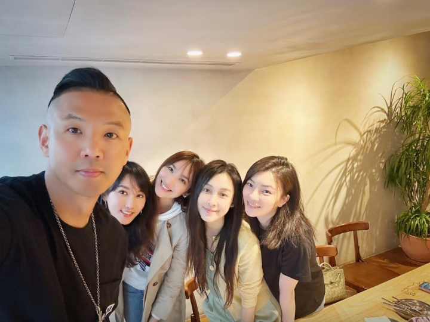

# 吴佩慈百亿身家男友被定性为恶势力团伙首脑，男方姨妈被判入狱

11月24日，北京市第一中级人民法院披露了重大恶势力犯罪集团犯罪案件，团队首脑是女星吴佩慈的男友纪晓波。

据悉，法院于24日判处崔丽梅等15人犯开设赌场等多项罪名，其中纪晓波的姨妈崔丽梅被判8年6个月，判罚人民币20万元。

判决书内容显示，2008年至2021年间，以纪某某、董某某、崔丽梅等人组织的犯罪集团犯下多项罪名，纪某某和董某某被“另案处理”。

据港媒透露，案件首犯纪某某就是在澳门赌场横行的“赌场大亨”纪晓波，不过法院没有宣判纪晓波的刑期，猜测纪晓波尚未归案。

另外，港媒还指出纪晓波的女友吴佩慈现在住在香港，上个月曾发文庆祝自己的生日，一改往日的高调，只分享了精美的礼物。

今年4月，吴佩慈曾回台湾与范玮琪等人聚餐。

早在洗米华、陈荣炼等人被捕时，坊间就传出纪晓波涉案，今年曾有人在街上贴大字报，痛骂纪晓波是“国际级大老千”。

据了解，纪晓波是黑龙江哈尔滨人，港澳从事房地产、赌场发家，一度坐拥上百亿资产，在2012年与女星吴佩慈交往而为人熟知，两人分分合合，吴佩慈一心想要嫁入豪门，不仅主动与纪晓波复合而且未婚先孕，分别在2014年、2015年、2017年及2020年剖腹产生下2子2女。

4度剖腹产却没有嫁入豪门让吴佩慈成为笑柄，她却不以为然，曾多次在网络上炫富。尽管没有得到名分，但吴佩慈确实从纪晓波身上获赠大量礼物，包括一枚10克拉钻戒、3.3亿豪宅以及40亿现金，她也经常替男友打广告，透露纪晓波在塞班岛开设赌场，一时风光无两。

据港媒透露，纪晓波的财务状况很早就出现问题，他送给吴佩慈的3.3亿豪宅在2018年传出遭到抵押，吴佩慈当时解释，抵押是为了做新的投资，否认面临债务危机。

纪晓波的母亲崔丽杰曾多次在香港豪宅举办宴会，邀请众星及阔太参与，据说这套3.3亿的豪宅，是吴佩慈生下第二胎后收到的礼物。

2019年，吴佩慈宣布怀上第四胎，与纪晓波一同拍全家福，秀尽恩爱。

洗米华被捕后，纪晓波和母亲开始“销声匿迹”，而吴佩慈亦未曾再公开男友的照片，不过她长期在香港定居，低调照顾四个子女。

虽然吴佩慈口口声声表示抵押3亿豪宅是用于投资，但港媒爆料指出，其名下的豪宅以月租10万的超低价出租给他人，吴佩慈则带着四个孩子在香港租房住。

目前，纪晓波案东窗事发，还是呼吁吴佩慈认清事实，尽早劝老公和婆婆接受调查吧。

