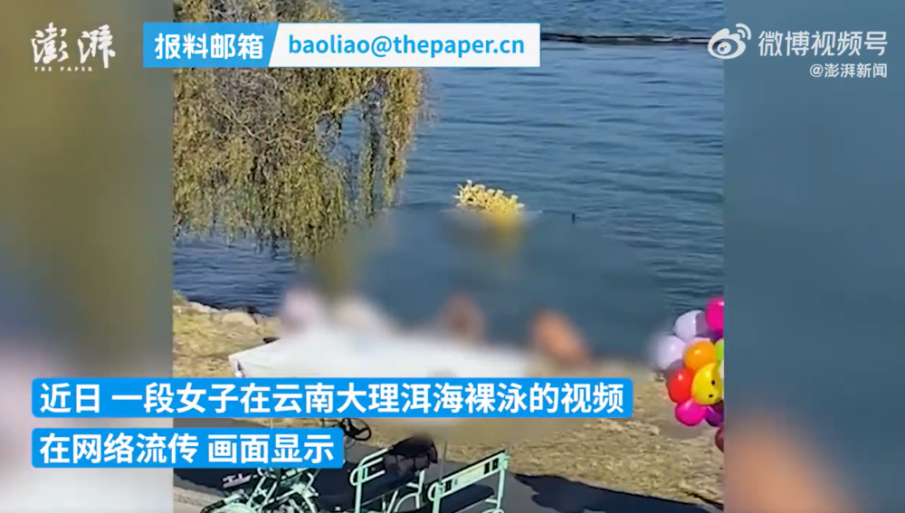
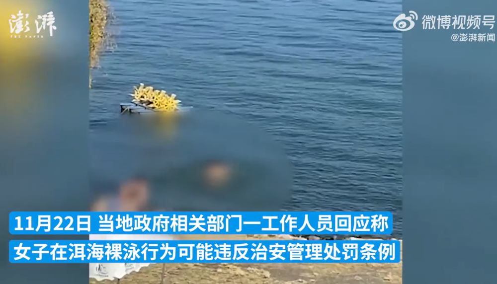

# 女子在云南大理洱海裸泳？当地回应：可能违反治安管理处罚条例

据澎湃新闻报道，近日，一段女子在云南大理洱海裸泳的视频在网络流传，引发关注。

_视频画面显示，一女子赤裸全身下水游泳，而她此举，也使得岸边的围观拍摄者为之欢呼。_

11月22日，当地政府相关部门一工作人员回应称，自然保护核心区禁止游泳。“西洱河的兴盛大桥以内，到闸门这一块允许游泳，有些开放水域，不可能全都控制起来，一般情况下是规定，在没有安全保障的情况下，不允许游泳。”

该工作人员表示，女子的行为可能已涉嫌违反治安管理处罚条例，警方以前曾处理过在洱海裸泳的问题。

对此，网友们纷纷表示，“真是离谱！”“无法理解这种行为......”“禁止游泳！罚她！”

**【来源：九派新闻综合澎湃新闻、网友评论】**

