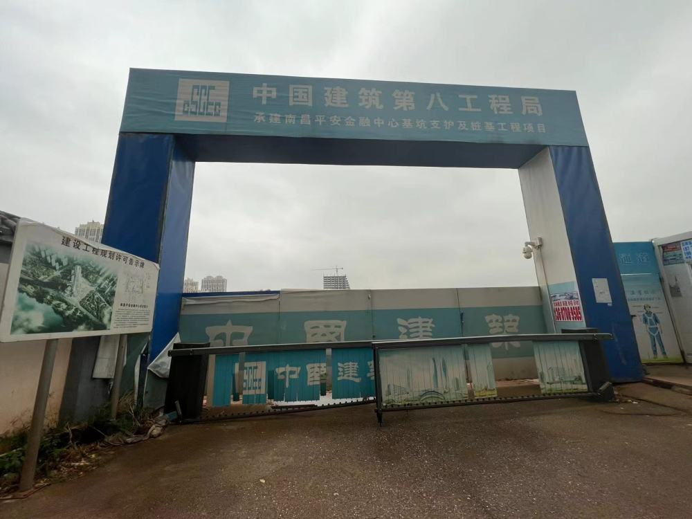

# 接连对合作方追索资金，还有项目长期停工，平安不动产“缺钱”了？

**财联社11月25日讯（记者 万佳丽）**
近日，平安系公司接连起诉重庆多家地产公司，试图快速收回项目资金。就此，有接近迪马股份的人士告诉财联社记者，公司正与平安协调解决。接近金科方面的人士也对记者表示，会尽力协商，“如果不能妥善解决，大家都会受损。”

同时，财联社记者注意到，不仅是与地产公司合作开发的项目出现问题，平安不动产在南昌投资的大型商业地产项目也陷入长期停工状态。

随着地产行业整体进入下行趋势，曾被视为国内地产公司“大金主”的平安不动产，也似乎陷入困境。对于公司目前情况究竟如何，截至发稿时，记者尚未收到平安不动产的回复说明。

南昌商业地产项目长期停工

江西南昌，平安曾信誓旦旦地想要建成一个地标项目——南昌平安金融中心。根据规划，南昌平安金融中心超高层建筑高度为375米，共68层，整个项目业态包括超高层办公楼、五星级酒店、大型商业体等。

然而，财联社记者实地调查了解到，已投入重金的南昌平安金融中心商业项目，目前已处于长期停工状态。

近日，记者来到位于南昌赣江南大道边的南昌平安金融中心项目所在地，发现该项目所在地被围墙围住，所有的门都紧闭着，没有看到工人或保安。项目所在地的地块成了一片烂泥地，工地上已经没有了施工设备，完全处于停工状态。

只见项目大门立着写有“中国建筑第八工程局承建南昌平安金融中心基坑支护及桩基工程项目”字样的牌子，门左边竖立的建设工程规划许可告示牌已破旧不堪，告示牌上写有该项目简介。

南昌平安金融中心项目位于南昌市红谷滩区九龙湖片区，项目总占地面积5.2万平方米，规划总建筑面积37万平方米。如果顺利建成将成为江西第一高楼，南昌市新地标。

_（图：南昌平安金融中心项目大门口 ，财联社记者拍摄）_

该项目四周也显得比较荒凉，大片土地要么还在开发中，要么空置着，来往车辆和行人稀少。
**记者询问南昌平安金融中心马路对面正在施工的其他项目工地的保安，对方表示，“对面那块地（南昌平安金融中心）已经停工很久了，一个人都没有。”**

记者注意到，今年10月，曾有网友在问政江西上咨询九龙湖街道办事处，平安金融中心何时开工。九龙湖街道办事处的回复是：南昌平安金融中心项目作为省市重点项目，受到群众高度关注，目前该项目整体由于资金原因处于暂缓状态，项目建设单位南昌平越置业有限公司（简称“南昌平越”）正在积极协调解决，待基本解决后将进一步加快项目建设。

记者联系到九龙湖街道办事处，工作人员表示，也不清楚南昌平安金融中心项目什么时候能开建。

简单追溯，2020年12月，江西平创置业有限公司（简称“江西平创”）以总价约19.88亿元拿下红谷滩区九龙湖片区龙兴大街以南、赣江南大道以西地块（JLH702-A06地块）和红谷滩区九龙湖片区阁皂山大道以东、上饶大街以南地块（JLH902-A01-01、A01-02、A01-03、A01-04、A01-05地块），共计22.44公顷。2021年4月，南昌平安金融中心正式备案。
**2021年6月，南昌平安金融中心建设用地规划许可证获批，用地单位为南昌平越。2022年3月，南昌平越获得施工许可证。**

据查，目前南昌平越由江西平创置业有限公司（“江西平创”）全资控股，后者股东又包括平安不动产有限公司、平安不动产资本有限公司和杭州聚敬企业管理有限公司，分别持股39%、30%和31%。穿透杭州聚敬企业管理有限公司股权结构，其背后控股方是上海宝龙实业发展（集团）有限公司。

人员结构上，江西平创目前的法定代表人还是平安不动产华中区域总经理张炎平。2021年9月24日，南昌平安金融中心正式开工建设，当时该项目负责人兼江西平创董事聂涛曾对媒体表示，“我们将持续导入中国平安的优势资源，切实推进项目落地，为南昌城市发展注入新动能。”

**然而，此话说出没多久，南昌平安金融中心项目就很快陷入停工状态。江西平创在2021年12月开始，就接连因为承揽合同纠纷被起诉，原告方包括广告公司、建筑工程公司等上下游企业。**

江西平创对外投资了南昌平越和南昌平拓房地产有限公司，并全资持股。目前，江西平创已将其持有的全部南昌平拓股权，质押给了中国银行南昌市红谷滩支行，状态依然有效。

诉讼信息显示，南昌平越今年11月初有一起工程施工合同纠纷案开庭，原告为福建省岩田基建工程技术有限公司。而南昌平拓面临的诉讼更是多达40余起，有来自信息技术公司、设计公司、广告公司、物业公司、咨询公司以及自然人的合同纠纷、劳动争议纠纷等。

**那么，南昌平安金融中心投入了多少建设资金呢？**
根据联合资信整理的平安不动产截至2021年底的公司主要商业投资项目显示，南昌平安金融中心项目总投资规模23.24亿元，平安不动产持股51%，公司已累计投资了1.38亿元，计划2022年投资1.6亿元，2023年投资2.1亿元，2024年投资2.7亿元。

需注意的是，对于商业物业，平安不动产一般有两种投资方式：

一是重资产模式，平安不动产通过自有资金或集团内险资或第三方资金等进行投资建设，然后部分项目自持并运营管理，或者将产权转让给平安集团及其他成员企业实现退出后，再由平安不动产继续受托运营管理已转让的商业项目；二是轻资产模式，平安不动产通过整租物业后，对该物业进行装修改造、招商招租获取长期稳定收益。

目前，平安不动产主要通过第一种模式进行商业地产项目的投资。 这一模式对于企业资金要求极高。

有熟悉商业地产的人士告诉记者，商业地产如今也不好做，出租难。类似平安不动产这种自持的商业地产，项目开发周期长，公司要承担较大的资金压力，做得好的商业项目或许有五六个点以上的毛利，如果资金成本低还好，一二线城市好地段的项目通过长期的运营，商业业态也许能做起来。问题是，现在房企的融资成本很多高达六个点以上，这怎么做？

“当然，也可以建成后直接转卖掉商业项目实现退出，但现在这种项目很难卖，除非是地段及商业业态极好的项目，不然基本没人接盘，要接那也是腰折的价格可以考虑考虑，但贱卖对平安不动产来说不划算。还可以转让给平安集团等其他平安成员企业，这构成关联交易，最终如果出现亏损依然是整个平安体系在兜着”，该人士讲道。

对多家重庆地产公司发起诉讼

自身重资产投入的项目陷入困境之外，平安不动产参与的一些地产公司的项目也出现问题。财联社记者注意到，近期有多家重庆地产公司也被平安系公司如平安不动产、平安银行等起诉并冻结相关资产。

近日，金科股份公告称，公司获悉，申请人深圳市创朗企业管理有限公司向上海仲裁委对被申请人贵阳花溪金科房地产开发有限公司（简称“花溪金科”）、贵州金科天宸房地产开发有限公司和重庆金科房地产开发有限公司提起仲裁申请。

仲裁理由是，2021年8月至2022年4月，申请人与被申请人签署了《合作备忘录》《合作协议》及《合作协议补充协议》等，约定各方共同合作开发、经营贵阳花溪凤鸣项目。但因项目经营情况不及预期，双方对前述协议履行情况产生纠纷，申请人认为被申请人未能按照协议约定返还借款本金利息，构成根本违约，遂向上海仲裁委提起仲裁申请。

创朗企业管理请求确认双方于2021年10月11日签订的《关于贵阳市花溪区凤鸣项目之合作协议》与《关于贵阳市花溪区凤鸣项目之合作协议补充协议》以及基于前述协议的补充、修订、函件已于2023年8月15日解除；并请求裁决三名被申请人共同、连带地向申请人支付股东借款本金约9.54亿元、实缴出资4000万元；支付款项约3.17亿元；支付违约金约1508万元。

财联社记者了解到，协议中的花溪区凤鸣项目是位于贵阳花溪区的金科·博瀚天元。截至2021年8月，项目已分四个批次，完成三个地块土地款缴纳，累计支付土地款23.17亿元。

该项目楼盘位于花溪区甲秀南路辅路与金戈路交叉口南，该项目目前由深圳市创朗企业管理有限公司100%控股。

花溪金科原来由贵州金科天宸房地产开发有限公司100%，后来逐渐退出股份，在2022年6月，公司股权全部由创朗企业管理持股，而创朗企业管理的控股股东是平安不动产。记者查询国家信用信息系统，发现目前花溪金科依然由创朗企业管理全资持股。

记者在现场看到，该项目并不像贵阳其他一些楼盘一样处于停工状态，其首期地块已基本开发完成，现场除了有部分施工人员继续交房前最后的作业之外，金科的销售顾问也在为客户进行讲解，同时销售中介公司贝壳也在现场进行着拍摄。并且该楼盘所处的地段也相对较好，距离花果园商圈较近，约一公里外有地铁站，附近有四五所大学和多个湿地公园等，楼盘还签约了重点中小学。

楼盘售楼处的工作人员告诉记者，目前二期地块已基本开发完毕，由别墅、高层和商业等组成。“别墅已经基本快卖完了，两栋高层还在销售中，一栋预计今年底交房，另一栋大概要明年交房。配套的学校也已经签下来了，大概在2024年秋季可以开始招生。”

只是，平安给该项目带来的影响也在一些很细微的地方呈现出来。在该项目介绍展示牌上写着“联合企业开发，稳如磐石。2022年6月，万亿企业中国平安旗下公司入股，与金科联合开发及建设项目。双方建立统一账户管理体系，项目资金专款专用。”
**值得注意的是，“万亿企业中国平安旗下”这几个字已经用白色胶布贴住。显然，中国平安旗下公司入主曾是该项目的重要卖点。**

 _（图：被贴住“中国平安”字样的展示牌，财联社记者拍摄）_

一位金融机构人士认为，该项目有可能是平安（不动产）投的一个明股实债的项目，应该是以股东借款的方式为金科提供项目资金。“但平安（不动产）这个时点要追回投资资金还是有点奇怪。”

**毕竟地块资金也交付了，同时在保交楼的前提下，项目涉及的各方能够（现在就）抽回资金吗？**
2022年9月，贵阳市住建局对贵阳市所有房企监管账户内资金依法审慎采取保全、执行措施，支持保障并防范应对房地产项目逾期交付风险，维护购房者合法权益。

一位接近金科方面的人士告诉记者，“他们这么做其实最后也不一定能追回全部投资款，一旦诉讼，加速项目恶化，本来马上交房的项目，最后可能因此烂尾或者无法销售出去，导致项目最终只能走法拍的话，法拍的价格几乎只有市场价的三四成，亏损严重，最后双方（利益）都受损。”

“一般地产公司和机构合作开发的项目，遇到这种情况只能先尽力协商，以盘活项目降低亏损为前提，有些项目最终也能协调下来”，前述接近金科方面的人士讲道。

不仅是平安不动产在加速向金科追索，平安银行近日还将重庆华宇集团、金科、迪马股份等地产公司相关企业都起诉了。

2023年11月，平安银行武汉分行在重庆市第五中级人民法院起诉了武汉业硕房地产开发有限公司（简称“武汉业硕”）及重庆华宇集团、重庆金科、迪马股份、武汉华宇业辉房地产公司、武汉金科长信置业、武汉东原长睿房地产公司。

武汉业硕成立于2020年，其股东为武汉华宇业辉、武汉东原长睿和武汉金科长信，分别持股34%、33%和33%。

穿透华宇业辉的股东，背后实际控制人是重庆华宇集团和李先秀；穿透东原长睿的股东，背后实际控制人是迪马股份（600565.SH）；穿透金科长信的股东，背后实际控制人是金科地产。而武汉业硕开发的项目叫“武汉渝樾春江”，是重庆华宇、金科和迪马这三家地产公司合作开发的。

迪马相关人士向记者透露，正在和平安方面协商解决此事。

财联社记者查询到，2020年12月18日，武汉华宇业辉、武汉东原长睿和武汉金科长信曾将各自持有的9520万元、9240万元和9240万元的武汉业硕的股权质押给平安银行武汉分行。

“大金主”也缺钱了？

为何平安不动产如今这么着急要追回合作项目资金？商业项目又为何因资金问题而长期停摆？这或许与平安不动产整体经营状况下滑有关。

首先要了解，平安不动产靠什么业务赚钱？平安不动产是平安集团旗下专业的不动产投资及管理平台，主要业务是资产管理和不动产投资。

资产管理业务是由平安不动产接受平安集团及其子公司、外部第三方委托，提供不动产的资产运营、工程管理、项目投资顾问等服务。平安不动产主要管理的物业有写字楼、商业综合体、酒店、租赁住房等。

不动产资产运营管理业务的上游客户主要是平安寿险、平安产险等。
**换句话说，平安寿险、产险等平安系企业投资的不动产项目，交给平安不动产来运营管理，后者以此赚取运营管理等费用。这类业务对平安不动产来说，偏管理咨询性质，属于轻资产模式，面临的资金压力不大。**

**另一块不动产投资业务主要是股债权投资、商业物业、康养和海外投资等，这类业务大多需要平安不动产投入真金白银，对其来说资金需求较大。**

对于股权的投资项目，平安不动产主要通过增资或股权收购的方式持有项目公司股权，双方约定到期退出的方式。2020至2022年末，平安不动产长期股权投资余额分别为251.09亿元、362.32亿元和351.17亿元，主要投向与合作方共同设立的不动产项目公司；同期，平安不动产长期股权投资实现的投资收益分别为35.03亿元、27.91亿元和12.62亿元，与投资额变化呈背离式下降。

业内人士分析指出，除非是极其优质的项目，一般金融机构不会选择以股权投资的方式来投。“毕竟股权项目要真出问题了，机构很难通过起诉等强制执行手段来甩锅了。”

对于债权类投资项目，一般以股东借款形式发放借款，以到期收回本息的方式退出，项目退出优先考虑合作方回购或受让平安不动产持有股权的方式，其次为项目清算退出。2020至2022年末，平安不动产相关债权类投资账面价值分别为385.60亿元、329.56亿元和489.27亿元，债权类投资实现收益为25.75亿元、28.48亿元和17.48亿元。其中，2022年末，债权投资中约85%投向中国平安体系内的关联方，约15%投向其他关联方，均为信用贷款。

除债权投资外，平安不动产其他应收款中也包括大额关联方往来款。2020至2022年末，平安不动产的其他应收款分别为47.08亿元、74.82亿元和63.96亿元。根据平安不动产2022年审计报告对纳入预期信用损失评估范围的债权投资（含其他流动资产）及其他应收款按信用风险等级的分析，当年末上述资产账面总额合计560.46亿元，其中第一阶段和第三阶段资产分别为549.53亿元和10.93亿元，减值准备余额为7.23亿元。其中分类为第三阶段的资产主要来自其他应收款，系由于合作方出险或底层项目不达预期所致。

从商业物业的盈利模式来看，主要是平安不动产通过自有资金或集团内险资或第三方资金等进行投资建设，然后部分项目自持并运营管理或者将产权转让给平安集团及其他成员企业实现项目退出。

**值得注意的是，平安不动产的主要盈利来自投资收益，但近几年投资收益是逐年下滑，净利润更是断崖式下跌，已快接近亏损边缘。**
2020年、2021年和2022年，平安不动产投资收益分别为62.32亿元、57.82亿元和30.37亿元；净利润为56.45亿元、45.92亿元和8.97亿元；净资产收益率为13.18%，9.2%和1.8%。

根据平安不动产2023年债券中期报告显示，公司2023年上半年资产管理业务的营业收入为42113.94万元，占比77.66%，同比下滑58.03%，毛利率100%。不动产投资业务的营业收入12112.24万元，占比22.34%，同比上升105.6%，毛利率为22.34%，去年同期毛利率是负的19.52%。

可以看到，平安不动产的资产管理业务因为是轻资产模式，毛利率水平较高，而其投资业务却因为地产行业的整体下滑，毛利率波动较大。同时，平安不动产来自资产管理业务的营收出现大幅下滑，来自不动产投资业务的营收却大幅增加。

平安不动产在其2023年中期债权报告中也坦言，平安不动产资产管理业务板块营业收入同比下降
58.03%，主要系地产市场行情下行，公司投资顾问费收入、财务顾问费收入、资产管理费收入均减少所致；不动产投资业务板块营业收入同比上升105.59%，营业成本同比上升68.63%，主要系出售物业规模增加，商业物业收入同比上升395.37%，成本同比上升394.97%，主要系新增项目2022年底竣工，新增结转收入。

据悉，平安不动产2022年的经营性现金流流出0.93亿元（剔除“其他与经营活动有关”的现金流影响），投资收益收到的现金为31.64亿元，回笼的现金减少，且商业地产投资加速，2022年投资活动净现金流大额流出95.27亿元，筹资性活动产生的现金流为净流出32.08亿元。平安不动产投资建设的商业项目尚需投资金额较大，有较大外部筹资需求。这或许可以解释，南昌平安金融中心为何会陷入停工状态。

平安不动产最初设立主要就是为了服务平安系相关公司的不动产投资和管理。如今其业务依然高度依赖平安集团体系，接受关联方的支持较多。平安不动产的营业收入中，2020年至2022年，关联交易收入占比分别为63%、53%和48%。

截至2022年末，平安不动产实收资本增至211.61亿元，公司股东为中国平安人寿保险股份有限公司，持股46.79%；中国平安财产保险股份有限公司，持股33.08%；深圳平科信息咨询有限公司，持股20.13%。平安不动产的最终控股股东是中国平安保险（集团）股份有限公司（简称“平安集团”）。

债券评级人士认为，平安不动产一直做为平安集团内专业的不动产投资及资产管理平台，平安集团能否继续对平安不动产进行发展上的支持，将对后者的经营和信用水平产生较大影响。

（财联社记者 万佳丽）

