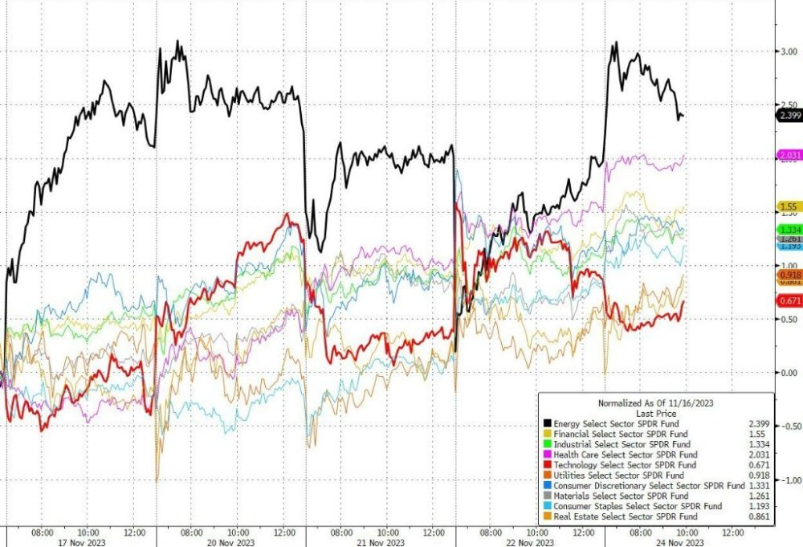
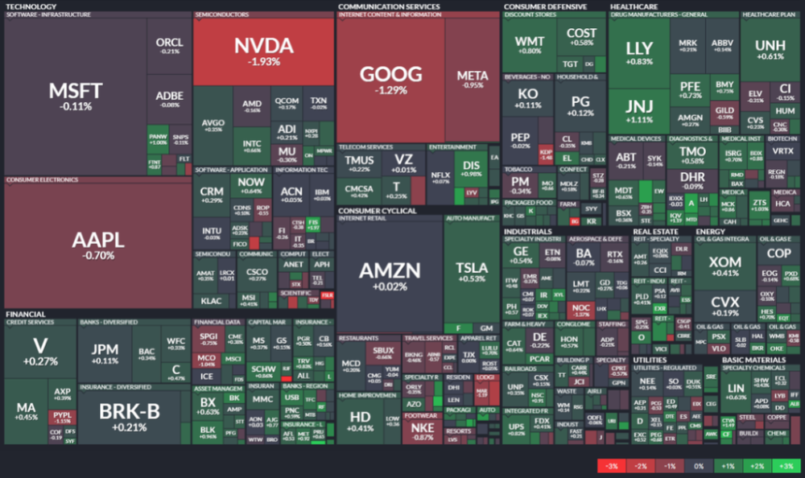
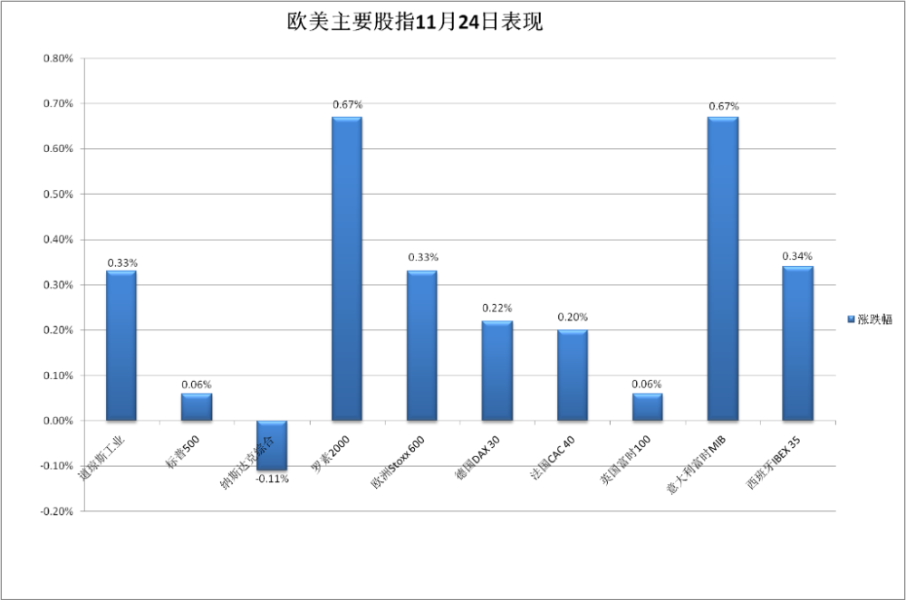
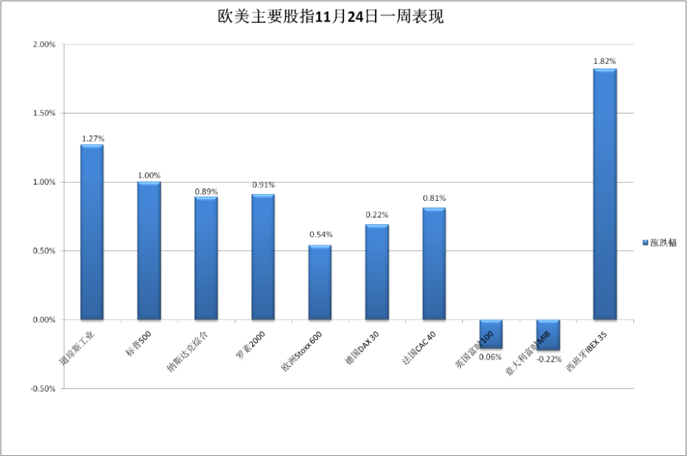
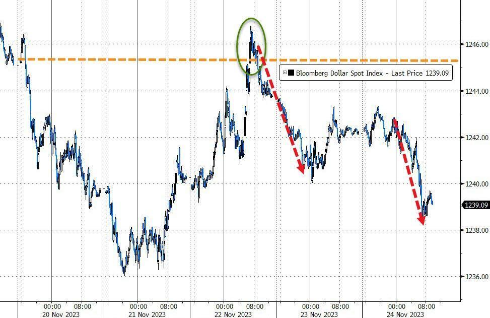
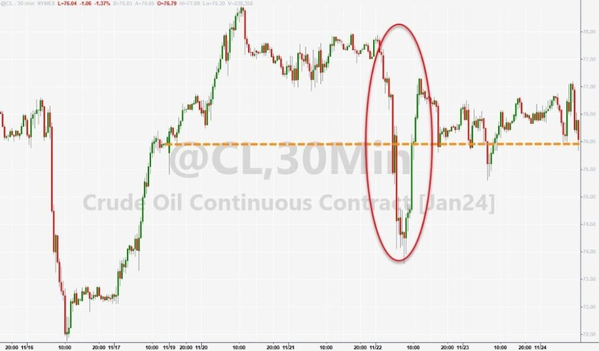

# 美股收盘：标普纳指创五个月最长周连涨 英伟达财报后连跌 中概亮眼

感恩节休市一日后，美股在“黑色星期五”提前收市。三大股指涨跌不一，但一个月来保持单周累涨势头。

部分个股受报道影响波动，传出延迟在华推出新芯片消息的英伟达跌入两周来低谷，领跌蓝筹科技股，延续发布财报后周三的跌势，虽然第三财季业绩碾压预期，但在四季度营收指引低于华尔街高端预期、且预警当季对华销售大幅下滑后，股价未能得到财报提振。而百度在公布财报向好后持续上涨，且一再跑赢大盘，全周两位数大涨。

“黑色星期五”拉开假日购物季序幕。Adobe估算，美国消费者在感恩节周四当天支出56亿美元，同比增长5.5%，并预计周五销售额将为96亿美元。零售巨头沃尔玛反弹，而电商巨头亚马逊险些未能保住涨势、跌落历史高位。感恩节假日销售季伊始，亚马逊的仓库工人和司机在美国、英国、德国、意大利、西班牙多国罢工，要求涨薪。

美债周五也提前收市。周四欧债因担忧德国政府将增加举债的担忧而下跌，周四休市的美国国债价格追跌欧债，收益率在周三V形反弹后进一步回升。基准十年期美债收益率不但进一步脱离周三所创的两个月低位，而且盘中升至一周来高位，抹平本周内累计降幅转升。本周欧美国债价格齐回落，英债收益率带头回升，主要源于周四公布英国11月PMI意外升至扩张区间后，一日升至少10个基点。

汇市方面，欧洲PMI回暖继续推动欧元和英镑走强，美元指数进一步回落，逼近周二所创的8月末以来低位，本周继续累跌，但跌势较大幅回落的上周缓和。评论称，本周公布的一些经济数据疲软，促使投资者押注美联储会转向更偏鸽的立场。人民币盘中几度转跌，离岸人民币曾失守7.16，虽然未能继续逼近7月末以来高位，但连续第二周累涨。

大宗商品中，美元走软的支持下，黄金反弹，纽约期金本周二度站上2000美元整数位心理关口，又创10月末以来新高，保持单周涨势，巴以冲突以来仅上上周累跌。在OPEC+宣布推迟讨论产油政策的会议至下周末、却未透露具体缘由后，国际原油连续第三日下跌，延续一个月来周跌势头。

最新消息称OPEC+就非洲产油国的配额分歧接近达成协议，油价仍跌，但本周原油总体跌幅较此前缓和。评论指出，最近消息显示，推迟会议并非源于主要产油国沙特有意改变减产的立场，沙特看来仍愿意负担OPEC+成员中大部分减产的份额。

三大美股指连涨四周 标普纳指均创五个月最长连涨 英伟达财报后连跌 中概指数两连涨

三大美国股指早盘表现不一，高开的道琼斯工业平均指数保持涨势，早盘刷新日高时涨近130点、涨近0.4%，低开的标普500指数盘初转涨后不止一次小幅转跌。而低开的纳斯达克综合指数保持跌势，刷新日低时跌近0.4%。最终，三大指数未能继续集体收涨。纳指在周三反弹后回落，道指和标普连续两个交易日收涨。

纳指收跌0.11%，报14250.85点，未再逼近周一刷新的7月31日以来收盘高位。道指收涨117.12点，涨幅0.33%，报35390.15点，刷新8月7日以来高位。标普收涨0.06%，报4559.34点，连续两个交易日刷新周一所创的8月1日以来高位。

价值股为主的小盘股指罗素2000收涨0.67%，连涨两日至9月20日以来高位。科技股为重的纳斯达克100指数收跌0.12%，未能继续靠近周一五连涨所创的去年1月以来高位。衡量纳斯达克100指数中科技业成份股表现的纳斯达克科技市值加权指数（NDXTMC）收跌0.44%，未继续靠近周一反弹所创的收盘历史高位，但本周累涨0.5%，连涨四周。

主要美股指本周均继续累计上涨，涨幅都不及上周。标普累涨1%，道指涨1.27%，纳指涨0.89%，纳斯达克100涨0.91%，都连涨四周。标普自6月16日以来首次连涨四周。纳指和纳斯达克100连续两周创6月16日以来最长周连涨。罗素2000累涨0.54%，连涨两周。

_主要美股指本周走势_

标普500各大板块中，周五只有科技股相关的两个板块收跌，Meta和谷歌所在的通信服务跌近0.7%，英伟达和微软所在的IT跌逾0.3%。收涨的九个板块中，涨幅最大的医疗也只涨逾0.5%，特斯拉所在的非必需消费品涨逾0.1%，涨幅垫底。

本周各板块继续全线累涨。医疗涨超2%领跑，通信服务、必需消费品和房产涨超1%，金融涨约1%，涨幅最小的能源涨近0.3%，受到原油下跌影响。

_标普各板块ETF本周走势_

龙头科技股多数下跌，而特斯拉收涨0.5%，本周只有跌近3%周三一日收跌，但累计涨近0.5%，涨幅远不及上周的及9.2%。FAANMG六大科技股中，周三连涨三日至10月24日以来高位谷歌母公司Alphabet收跌1.3%；Facebook母公司Meta收跌近1%，跌落周三反弹刷新的2021年12月以来高位；苹果收跌0.7%，未继续逼近周一反弹刷新的8月2日以来高位；周三反弹的微软收跌0.1%，未能继续刷新周一所创的收盘历史高位；而亚马逊微幅收涨，继续刷新周三反弹所创的历史高位；奈飞收涨0.3%，连涨四日，两日刷新去年1月以来高位
。

本周这些科技股都累计上涨。奈飞涨近3%，微软在OpenAI内斗、一度招揽其CEO加入公司的一周涨超2%，亚马逊涨超1%，Alphabet涨约1%，Meta涨近1%，苹果涨近0.2%。

芯片股总体连续两个交易日收涨，费城半导体指数和半导体行业ETF
SOXX收涨不足0.1%，仍未能接近周一刷新的8月1日以来高位，本周微跌。收盘时，Arm涨3.4%，英特尔涨近0.7%，用材料涨近0.6%，高通涨0.2%，而AMD跌近0.2%，英伟达跌1.9%，进一步跌离财报公布前一日周一所创的历史高位，在财报后后持续下跌，创11月9日以来收盘新低，本周累计跌近3.1%。

AI概念股未能继续集体反弹。截至收盘，BigBear.ai（BBAI）涨超5%，C3.ai（AI）涨0.3%，SoundHound.ai（SOUN）跌近0.5%，而Palantir（PLTR）跌2.5%，Adobe（ADBE）跌不足0.1%。

热门中概股总体继续上涨，跑赢大盘。纳斯达克金龙中国指数（HXC）收涨1.6%，连续两个交易日收涨，本周累涨近3.4%。中概ETF
KWEB和CQQQ早盘分别涨超1%和0.1%。个股中，到收盘，好未来涨超15%，小鹏汽车涨超6%，百度涨2.7%，自周二公布财报以后持续跑赢大盘，本周累计涨近14.2%，京东、拼多多、理想汽车涨超1%，B站涨近1%，腾讯粉单涨0.8%，而网易跌超1%，蔚来汽车跌近1%，阿里巴巴跌0.6%。

零售股涨跌各异，到收盘，沃尔玛涨0.9%，塔吉特涨0.7%，百思买涨近2.2%，Nordstrom涨5.9%，On
Holding涨3.3%，而Kohls跌不足0.1%；电商eBay、Shopify分别跌近0.4%和0.9%。

银行股指数连续两个交易日小幅反弹。整体银行业指标KBW银行指数（BKX）收涨0.3%，仍未能逼近上周五刷新的8月14日以来高位，本周累跌0.6%；地区银行指数KBW
Nasdaq Regional Banking Index（KRX）收涨近0.2%，地区银行股ETF
SPDR标普地区银行ETF（KRE）收涨逾0.1%，均继续脱离周二刷新的11月13日上周一以来低位，本周分别累跌近1.7%和1.8%。

波动较大的个股中，媒体称欧盟反垄断监管机构将无条件批准亚马逊将其收购后，机器人公司iRobot（IRBT）收涨近39.1%；币安与美国司法部达成和解、CEO赵长鹏认罪并卸任后，美国最大加密货币交易所Coinbase（COIN）收涨5.8%；宣布推迟递交季度报告以及财务管理人员变动后，电动汽车生产商Fisker（FSR）收涨5.2%；在Colt
CZ Group提议以每股30美元估值进行战略性合并后，户外运动和娱乐产品公司Vista Outdoor（VSTO）收涨3.9%。

欧股方面，PMI公布次日泛欧股指继续走高，连涨三日。欧洲斯托克600指数连续三日刷新周一所创的9月20日以来收盘高位。主要欧洲国家股指继续齐涨。各板块中，零售收涨0.9%领跑，化工涨逾0.8%，受益于媒体称阿布扎比国家石油公司考虑可能收购旗下能源公司Wintershall
Dea后，德国化工巨头巴斯夫涨1.8%。

本周斯托克600指数连涨两周，涨幅不及上周的2.82%。各国股指未能继续齐涨，德股和西股连涨四周，法股连涨两周，而上周反弹的英股和意股回落。全周零售板块涨超2%领涨，传媒涨近2%，而对利率敏感的房产跌近0.3%，在上周大涨近6%后，和上周涨超6%领涨的基础资源均回落，基础资源跌逾0.2%。

十年期英债收益率一周回升18个基点 十年期美债收益率两连升至一周高位

欧洲国债价格总体继续齐跌，收益率续升。到债市尾盘，英国10年期基准国债收益率收报4.28%，日内升3个基点；基准10年期德国国债收益率收报2.64%，日内升3个基点。

在欧央行官员放鹰、德国政府据称将突破举债规模上限、欧洲PMI回暖的本周，欧债收益率齐反弹，英债收益率全线10升超个基点领跑，源于周四一日至少升10个基点。上周回落约23个基点的10年期英债收益率累计升约18个基点；上周降约13个基点的10年期德债收益率累计升约6个基点。

美国10年期基准国债收益率在欧股盘前曾下破4.44%刷新日低，后持续上行，美股盘初曾逼近4.50%，刷新11月16日以来高位，日内升近9个基点，到债市尾盘时约为4.47%，日内升近7个基点，在上周大幅回落降约21个基点后，本周反弹，累计升约3个基点。

对利率前景更敏感的2年期美债收益率在美股盘中曾上逼4.96%，连续两个交易日刷新11月14日公布美国CPI超预期放缓后美债收益率大跳水当天以来高位，日内升近6个基点，到债市尾盘时约为4.95%，日内升约5个基点，和10年期美债收益率均连升两日，在上周回落约17个基点后，本周累计升约6个基点。

 _各期限美债收益率本周齐升，短债收益率升幅超过长债_

美元指数两连跌 逼近8月末以来低位 离岸人民币一度失守7.16 仍连涨两周

追踪美元兑欧元等六种主要货币一篮子汇价的ICE美元指数（DXY）连续第二日全天保持跌势，美股盘中跌破103.40刷新日低，逼近周二跌破103.20刷新的8月31日以来低位，日内跌超0.5%。

到往常美股收盘时，美元指数略低于103.40，日内跌约0.5%，在上周跌约1.9%后本周跌约0.5%；追踪美元兑其他十种货币汇率的彭博美元现货指数跌近0.3%，刷新8月30日以来同时段低位，本周累跌约0.5%，和美元指数都连跌两日、连跌两周，但跌幅远不及跌近1.7%、创7月14日以来最大周跌幅的上周。

 _彭博美元现货指数最近四周内第三周累跌，处于三个月来低位_

非美货币中，欧元和英镑在回暖的欧洲PMI公布后继续走强，欧元兑美元在美股早盘曾接近1.0950，日内涨近0.4%，逼近周二涨破1.0960刷新的三个多月高位；英镑兑美元在美股盘中曾涨破1.2610，刷新9月5以来高位，日内涨近0.7%；日元险些连跌三日，美元兑日元在欧股盘前曾跌破149.20刷新日低，和周二跌破147.20刷新的9月14日以来低位仍有距离，后反弹，欧股和美股盘中都曾转涨，到往常美股收盘时处于149.50下方，日内微跌。

离岸人民币（CNH）兑美元在亚市早盘曾涨至7.1426刷新日高，此后不止一次转跌，欧股盘中和美股早盘都曾失守7.16，欧股早盘刷新日低至7.1609，较日高回落183点，美股开盘后持续反弹。北京时间11月25日5点59分，离岸人民币兑美元报7.1493元，较周四纽约尾盘涨29点，连涨两日，本周累涨680点，连涨两周。

比特币（BTC）在美股早盘涨破3.8万美元后一度上测3.84万美元关口，刷新11月9日逼近3.8万美元所创的去年5月以来高位，较亚市盘中的日低涨近1200美元、涨超3%，午盘跌落3.8万美元，往常美股收盘时处于3.78万美元一线，最近24小时涨超1%，最近七日涨近4%。

原油自OPEC+推迟会议后三连跌 连跌五周

国际原油期货继续下挫。周四假日无收盘报价的美国WTI
1月原油期货收跌1.56美元，跌幅2.02%，报75.54美元/桶，连续三个交易日收跌，向上周四报73.09美元刷新的7月10日以来收盘低位靠近；布伦特1月原油期货收跌0.84美元，跌幅1.03%，报80.58美元/桶，连续三日收跌，连续两日刷新11月16日上周四以来收盘低位。

本周美油累跌0.66%，布油跌近0.04%，跌幅不及上周的至少1%。至此，原油连跌五周，巴以冲突爆发七周来，原油只在前两周累涨，此后持续累跌。

_美国WTI原油本周累跌不足1%，但周三盘中OPEC+宣布推迟会议后曾跌超5%_

美国汽油和天然气期货齐跌。NYMEX
12月汽油期货收跌3%，报2.1651美元/加仑，连跌两个交易日，刷新11月16日以来低位，本周累跌0.89%，连跌五周；周三反弹的NYMEX
12月天然气期货收跌1.45%，报2.855美元/百万英热单位，逼近周二刷新的10月2日以来低位，本周累跌3.55%，连跌三周。

伦镍创两年半新低 连跌五周 伦铜连日反弹 连涨两周 黄金重上2000美元 反弹至近五周高位

伦敦基本金属期货周五多数下跌。领跌的伦镍跌约2.9%，继周三之后本周第二日创2021年4月以来新低，和伦铝均回落，伦铝未能靠近周二所创的近两周高位。跌超2%的伦锡连跌三日，创一个月来新低。伦铅连跌三日，一周多来首次收盘跌穿2200美元。而伦铜连续两日反弹，逼近周二所创的9月初以来高位，伦锌继续脱离近三周低位。

本周基本金属多数累跌。伦镍跌超4.5%领跌，连跌五周，此前连涨五周的伦铅也跌超4%，连涨两周的伦锡跌近4%，伦锌微跌，连跌两周；而伦铜涨近2%，连涨两周，连跌两周的伦铝涨0.4%。

周四因休市无收盘报价的纽约黄金期货延续周四盘中反弹势头。COMEX
12月黄金期货收涨0.52%，报2003.00美元/盎司，刷新周二所创的10月30日以来收盘高位，继周二之后本周二度收盘突破2000美元。

本周期金累涨约0.92%，连涨两周，巴以冲突以来仅上上周一周累跌，涨幅不及上周的逾2.4%。和上周一样，本周期金走高也并非源于巴以冲突助力，主要来自美元因美联储已完成加息的预期而走软。

_现货黄金周五也冲上2000美元大关_

