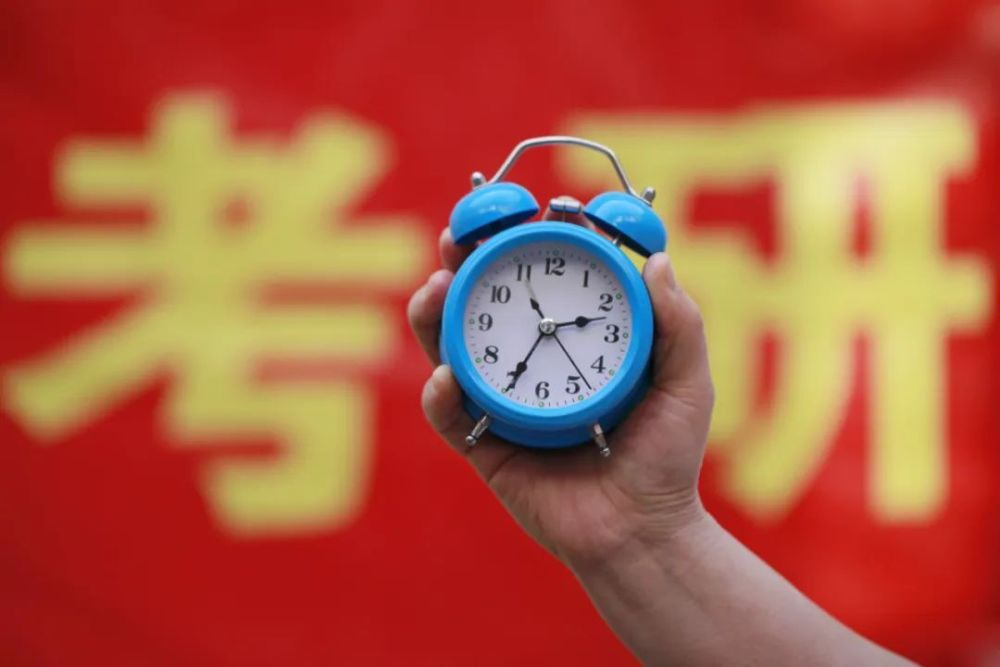

# 考研的人少了36万，国考招录、报名人数今年却仍旧“双涨”

连涨8年之后，考研“降温”了。

近日，2024年全国硕士研究生招生考试报名人数出炉。准备打一场“翻身仗”的考研党们，似乎迎来了一个好消息。

据披露，共438万人报名参加了2024年考研，这一数字不仅没达到此前一些网友和媒体预测的“突破500万”，而且比去年少了36万，系2015年以来连续8年考研报名人数增长后的首度下降。

值得注意的是，2020年全国高考的报名人数同比增长了40万。近年来，考研的热度一年高于一年，突如其来的“冷水”让许多人顿觉不适应了，众说纷纭。

 _图/图虫创意_

**“考研热”降温了？**

考研辅导名师张雪峰又上热搜了。去年12月，他曾在社交媒体上称“个人感觉，明年考研人数可能会下降”，结果预言成真。

“二战三战”、“逆向考研”......距离研究生考试笔试还有一个月，考研党们正在摩拳擦掌。但每年这个时候，报考数据总让他们心里添堵，倍增焦虑。

近年来，“考研热”一直是考研人们习惯讨论的话题。2017年报考人数首次突破200万，2022年就已经突破了400万，2023年更是创了新高474万，十年间增长了298万。

有将近一半的大学毕业生都报名了考研，于是考研又被称为“第二次高考”。与此同时，尽管有一定规模的扩招，据《新东方2023考研报告》，2010-2022年的考研录取比例在13年间降低7.48%。2023年300多万名学子“陪跑”，从数据上看，一些专业的国家分数线甚至超过了400分。

这一话题也引起了众多学者和专家关注。今年两会上，全国人大代表、华东师范大学党委书记梅兵提到，代表国家最高教育水平的研究生教育，目前出现的考研“高考化”趋势需要警惕。

有专家认为，当前，考研已经出现了“高考化”的趋势，给考生以及高等教育发展带来不少新问题。“现在很多本科生都热衷于考研，甚至有的大学还以考研作为目标来组织本科教学。”这位专家担心，围绕考研组织教学，会将大学办简单化。

在专家们看来，“考研热”已是“过热”，这种“热度”正在助推考研“应试化”，并且加剧学历贬值。还有人不禁发问，“我们需要有那么多人考研吗？”

对于今年的报考趋势，此前一些教育机构及媒体继续“看涨”，甚至预测报考人数即将突破500万。

“冷水”突如其来，但并非没有迹象。一位知名考研机构的工作人员向中国新闻周刊分析，从涨幅来看，考研报名人数涨幅有放缓趋势。

该工作人员表示，近6年的考研报名人数涨幅有4年都在20%左右。相比前几年持续创新高的情况，2023年考研报名人数涨幅仅有17万，远低于2022年的80万涨幅，达到历史低点，仅为3.7%。

考生减少36万，虽不足以说明考研已经实实在在地“降温”，但这一波动仍然引发了广泛的热议。有专家提到，报考人数远低于民间预估，显示考生报考渐趋理性。

报考意愿下降的原因可能是多方面的，比如选择出国留学的人增加了。也有学者从研究生招生的结构性变动上找原因。近年来，保研的比例不断增加。此外，学硕规模一再压缩，专硕比例持续扩大。根据教育部的规划，到2025年，硕士专业学位研究生招生规模要扩大到招生总规模的2/3左右。

上述考研机构的工作人员分析，“学硕坑位减少，使得更多人优先考虑专硕。但不少专硕的学费远高于学硕，多所高校延长专硕学制至3年，在经济下滑的大背景下，家庭对考生教育投资的价格敏感度也更高。”

中国教育科学研究院研究员储朝晖认为，考研报名人数减少背后有几个因素，主要影响因素还是就业。当前形势下，更多学生对就业的价值追求要高于考研。

**考公性价比更高？**

考研是为了什么？从近年的“专硕热”不难看出，考研的需求与就业已经牢牢绑定。然而现实是，一些硕士就业能拿到的工作岗位和薪资甚至不如本科毕业生。

这几年，有关“第一学历歧视”的话题反复引发热议。本月，有媒体发布的调查问卷显示，超六成受访者呼吁破除求职中的“第一学历”限制。低起点学历成为“污点”，用人导向存在“唯名校”的倾向。

在学历贬值的情况下，学历对就业的影响更加复杂多元。去年12月，中国国际经济交流中心副理事长、国际货币基金组织原副总裁朱民谈到，现在高校毕业生的就业低于大专毕业生的就业，大专毕业生的就业低于中专和高中生的就业，“学的越多，就业率反而越低”。

在考研话题的相关帖子下，有一条留言提到，尽管研究生持续扩招，但能为就业带来显著帮助的高校、专业招生名额并不多，“即便把985/211高校的大部分专业，一本院校的强势专业，二本院校的万金油专业也考虑在内”。某种程度上，研究生扩招这个就业的“蓄水池”，来到了一个新的节点。

2014年，考研报名人数也曾出现回落，同比减少4万，5年内首降。当时，有媒体调查提到，短期内硕士生收入并无明显优势，加上考研投入时间和费用成本是考研人数下降的主因。相关的话题则是：“考研会影响工作吗？”“考研会拖就业后腿吗？”

这并不是说，学历提升不能对就业带来帮助。麦可思数据显示，学历提升随着毕业时间的推移，可以带来更好的经济回报和就业感受。通过对2016届本科毕业五年后学历提升与未提升人群的月收入对比发现，有过学历提升人群的月收入（11099元）比学历未提升人群（10256元）高843元。

但眼下，一些考研人的心态、观念无疑发生了一些变化。近年来，有关“硕博毕业生挤进县城”的报道不时彰显着一个信号：“考研的尽头也是编制”。

在“考研热”降温的同时，“考公热”仍持续升温。中公教育相关人士表示，国考在今年依旧呈现了招录、报名人数的“双涨”趋势。2024年国考的招录人数为39561，比去年增加2461人，涨幅近7%，根据国家公务员局公布的数据，截至报名资格审查工作结束，共有303.3万人通过招录单位的资格审查，比去年同期增加43.53万人。平均竞争比为77:1，高于去年的70:1。各地公务员招录仍有向应届生倾斜的趋势。

考研从来就不是什么“盲目”的，而是一种机会和成本的权衡。有网友直言：不是研究生高攀不起，而是考公更有性价比。

在储朝晖看来，对于很多本科毕业生来说，如果现在能找到一个就业的岗位，尽快就业相比考研究生来说更现实一些。很多人对读了研究生后再找工作的预期也相对降低了，读研有时间和经费成本。

不过，储朝晖表示，2024年考研报名人数减少的幅度不是太大，降低还是有限的，只是说明在这几十万人心目中发生了变化。

作者：陈威敬

