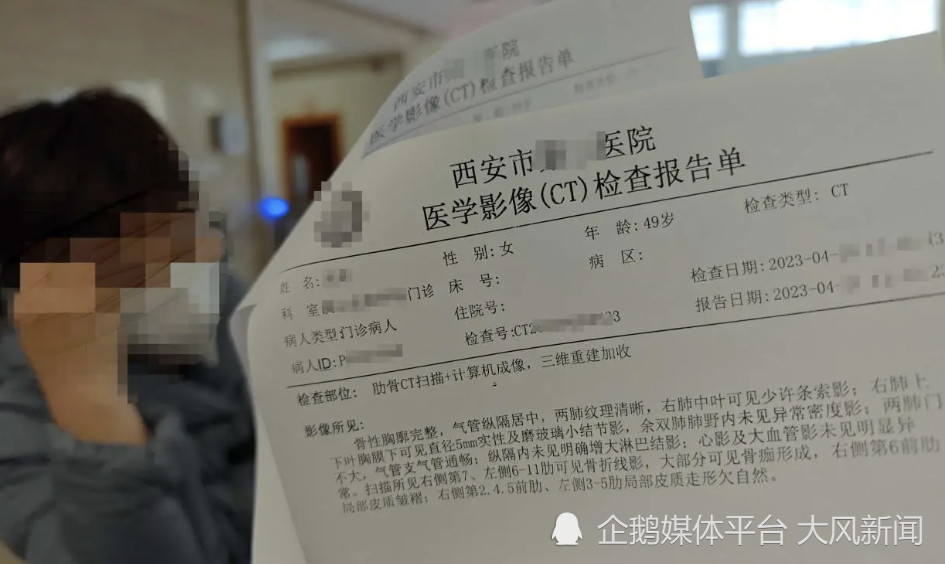
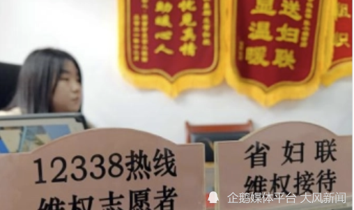

# 被有吸毒史的二婚丈夫打断8根肋骨，49岁阿岚讲述噩梦般的家暴经历

11月25日是国际反家庭暴力日，被称为“国际消除家庭暴力日”。

你第一次听到“反家暴”这个词是在什么场景下？

记者印象里，“家暴”这个词比“反家暴”听到得更早。2001年那部电视剧《不要和陌生人说话》，男主安嘉和对妻子动手的画面简直是童年阴影。荧幕上揭露的“家暴”取材于现实，但揭露不是让观众恐惧，而是呼吁社会“反家暴”。

反家暴的目标是消除家暴，只要有家暴存在，反家暴就一直在路上，这是一个复杂而庞大的问题。被最亲密的人伤害，肉体、精神上承受的痛苦只有受暴者最能体会。同样，一线的行动者谈反家暴才最真实。

“在公共场合被施暴后，我终于有了证据”

正在追寻一线希望的阿岚女士

有一位阿岚女士（化名）站了出来，她遭遇了二婚丈夫近4年的家暴。今年3月某日凌晨，男方在商业区的消防通道殴打阿岚，被高处监控清晰拍到。

有了关键证据，男方今年6月进了看守所。而阿岚几个月来都奔波着离婚，她就想把自己和孩子的户口从男方的户口本上移出来，给孩子一个安全平静的生活环境。以下是她的自述：

“2017年，我44岁，独自带着孩子四年了。我和他是住院认识的，他正在被强制戒毒。最开始他对我特别好，说‘我这么大年龄了（男方当年43岁）也不想要孩子，我会对你的孩子视如己出，咱们好好过日子，一起把孩子养大。’

孩子从小没有爸爸陪伴，能感到情感上有缺失。我想终于有个人能和我一起了。我知道戒毒后不吸的人很多。

他家在南郊的一个村子里，家里有母亲和哥嫂。父亲生前是练武术的，他从小跟着他父亲练。相处几个月后，他说村子要拆迁催着我赶紧领结婚证，把我和孩子的户口迁进去。

2017年底由强戒所管教干部陪同，我们在民政局领了证。2019年他强戒回来，我们常住在北郊，和我妈住同一个单元，有时也回他村住。他有吸毒史不好就业。用我身份注册达达后，疫情时我们就送货。

送货路上我接单慢了或是拿错货，他就打我。第一次是在商场通道里几脚把我踹倒。最初会道歉，说：‘我以后打你，就把我的手剁了。’后来打的时间长、次数多了，他连这种话都不说了。趁他心情好，我就说：‘你打我我不敢还手，你纯粹是欺负人。’他不说话。

2020年开始，他就频繁殴打。回家不睡卧室就睡沙发，把刀片放在茶几上。我不知道他啥心理，抱着孩子睡到卧室，心都抽抽。

他买一些刀片和切割机放家里，微信上点赞杀妻案、灭门案给我看，给家里装监控，打完我就删记录。他不在家就从监控里看我，通过监控喊我，我人不在监控画面里，手机也必须放到监控范围内……

2020年我们去法院离婚，当时有疫情进不去法院，让我们回家网上申请。当晚他就买了一瓶酒，说不回北郊要回村子住。村里的家里有一个铁制棒球棍，他让我跪到地上用棒球棍抡我，抡到身上猛地感觉气上不来。

打完第九天，我从家里跑出来了。先打110报警，再去医院，复查肋骨断了2根。警方调解时他每天给我打电话，保证以后都不会了，他家里人也劝我回去。

我回去不久他又开始了，死亡威胁张口就来……

今年3月的一天晚上，我们和朋友出来吃饭，吃饭时他就喝酒不回家，凌晨1点多散场时，他掐着我往消防通道里走。我心里已经预感不好了，默念着不是打我、不是打我。结果就……

我对断肋骨的感觉太熟悉了。我爬起来推开他，拼命地跑。跑到酒店楼道里，拨通了110。当晚去了医院，断了8根肋骨要交6万元住院。给他妈打电话，他妈让他过来交钱。我没敢，但第三天他还是找到我了。

期间转了一次医院，住院后又发生口角，我跑出来了。当天下着雨，我去了市妇联，妇联的同志说‘对家暴零容忍’，之后帮我联系了法律援助中心。同一天，派出所也打来了电话。

派出所的同志跟着我去现场调了监控视频，这才有了关键证据。5月份伤情鉴定报告出来，轻伤二级。6月中旬，对方被传唤进看守所。目前检察院给出的意见是量刑一年四个月加民事赔偿。但第一次开庭时，他说只有5000元。

从3月被打到6月进看守所，我一直躲着他。6月我在户口所在地法院起诉离婚。离婚是我的唯一希望了……”

阿岚女士自述时，说到了很多细节。精神控制、言语威胁和身体上的暴力，无法一一提及。希冀能遮蔽风雨的丈夫“撕咬”自己后，法律就是阿岚女士的最后盾牌。她希望，法律能护住她和孩子。

陕西省妇女儿童维权服务中心：

2022年陕西省12338热线收到1450个受暴者来电

“我们很少说必须，但建议妇女遭遇家暴第一时间必须报警”

现实里，不止一位“阿岚女士”。2022年，陕西省妇女儿童维权服务中心12338热线接到了1450次自称受家暴者的来电。

2005年，全国妇联设立12338热线，热线服务的对象是妇女、儿童和其他有需要的来电者。2010年左右陕西省的12338热线覆盖到县一级，每个县城的妇联都有12338热线。

热线接听、信访接待、矛盾化解、法律援助、心理疏导、紧急救助，这是12338热线提供的维权服务。电话那头，是求助群体。电话这头，是执业律师、经验丰富的一线接待人员、具有国家资质的心理咨询师。

遭受家庭暴力的女性，很多都是先打12338热线求助的。陕西省妇女儿童维权服务中心主任宁楠的办公桌上就有一部12338热线。

11月21日，记者对话宁楠，请她谈谈如何反家暴。

宁楠：关于家庭暴力要向大众澄清两个误区。第一是“家丑不可外扬”，家暴不是家丑，是社会广泛关注的问题。国家有反家暴法，陕西省也有实施办法，就是说家暴行为有法律和相关部门管。第二是家暴不是家务事，法是要入家门的。澄清这两个误区后，如果妇女第一次遭受家暴就要勇敢拿起法律武器保护自己，打破家暴的循环。研究表明，家暴是一个不断升级的过程，如果没有打破这个过程，受家暴的程度是一次比一次严重的。

记者：遇到家暴，第一步应该做什么？

宁楠：从妇联组织来讲，我们处理家暴，肯定是劝妇女第一时间必须报警。我们一般很少用“必须”这个词，但家庭暴力为什么第一时间必须报警？

首先不管离不离婚，都要让施暴者知道家暴是有代价的，不是说打老婆零成本。其次，你要离婚的话就要保留家暴证据，报警记录就可作为证据之一。警察带着执法记录仪，如果能够及时报警，那就很容易取得对方家暴的证据，毕竟施暴者打人后的状态和正常在家里休息肯定不一样。

公安部门在处理家暴案件中有两种办法。第一种是训诫教育，第二种是出具家庭暴力告诫书。在实践中第一种更多些，但作为当事人，有权利给民警说希望出具一个家庭暴力告诫书。对普通人来讲，如果接收到一个法律文书的话，他心理上会感到害怕。此外，如果他继续有家暴行为，你再次报警的话，民警看到已经有了告诫书还再犯，相当于违反告诫书的内容会进行一个更重的处罚。

记者：除了拳打脚踢等伤害身体的暴力行为，还有哪些家庭暴力？

宁楠：比如夫妻双方已经离婚了或协议离婚、诉讼离婚分居期间，他跟踪你，跟踪到娘家去。到单位骚扰你，发表对你不好的言论。或者什么都不干，就是跟着你给你造成心理压迫，微信、短信上发送过激言论、恐吓你的话语等，只是口头上的威胁，这也在家暴范畴里。女方可以到法院申请人身安全保护令。

记者：怎么理解和处理冷暴力呢？

宁楠：冷暴力一般很难处理。家庭是一个隐私空间，家暴是一个更隐蔽的过程。冷暴力很难界定，对方五天不和你说话算冷暴力，还是一年不和你说话算冷暴力？在妇联组织接到的投诉中，妇女投诉的冷暴力更多时候是一方对另一方的控制。通过隔绝你的社会关系，让他的家庭孤立你，让家人不和你交流把你当作空气。这对家庭妇女的伤害很大。

我们更多通过调解，在调解过程中了解到底发生了什么，是夫妻双方家庭地位的不平等？还是其他具体的矛盾。冷暴力很难甄别，但妇女既然找我们投诉了，那我们就要根据具体的情况具体了解分析，帮助家庭做出改变。

记者：接访时有没有具体的量表，判别家暴的程度？

宁楠：我们有《家庭暴力危险性预测量表》，一般情况下我们不会让妇女来填，她填的时候可能有一些其他的顾虑想法，我们会在询问的过程中，带出量表上的问题。

施暴者有使你不能呼吸的行为或是其他致命行为，属于高危性的话，受暴者如果选择不报警，我们很有可能会代为报警，这个很严重。

记者：当事人离不离婚，你们都能提供帮助吗？

宁楠：处理家暴的过程中，有一条铁律是我们不干预当事人的任何决定，充分尊重当事人的意愿。你想离婚，我们帮助你申请法律援助。你不想离婚，我们尊重你的意愿，帮助你调解婚姻家庭矛盾，并做风险提示。

不是说不离婚就是懦弱，很有可能是各种各样的原因导致她现在没办法离婚，有经济的原因、有孩子的原因。我们也有宣传教育的职能在，还是希望妇女尽量参与到社会事务当中，有一份工作有一份收入，能养活得了自己甚至能养活得了孩子，让自己有多种的选择。

记者：家暴可以调解吗？

宁楠：不是说所有的家暴案件我们都做调解，比较轻微的、由一个简单的家庭矛盾引起的，这种我们可以调解。但严重的家暴，家暴时间长、受暴者住院疗伤，这种我们一般是不做调解的。

调解需要我们基层妇联走访了解情况，并且花时间做双方的思想工作，对于家暴我们也会定期回访。

记者：家暴不仅局限在夫妻关系中，针对未成年人的暴力也存在。实践中，你们会怎么处理？

宁楠：未成年人遭受家暴，我们是一定要介入处置的。第一，我们有强制报告的义务，未成年遭受家暴我们知道了，是要履行强制报告义务的。第二，妇联组织是可以帮助限制民事行为能力人、无民事行为能力人、未成年人代为申请人身安全保护令，这是我们要做的工作。第三，孩子没有实质遭受家暴，但长期目睹家暴的场景，其实对孩子也会产生非常不好的影响，甚至有可能成为家暴的代际传递。

未成年人遭受家暴会更隐蔽，更难发现，这是我们工作中要更加注意的点。村、社区一级的妇联通过走访排查、邻里间了解信息，如果听说某个家长经常打孩子，我们就上门去了解。他人如果目睹未成年人被家暴也要向公安机关、妇联组织进行举报。

记者：你们是否统计过12338热线来电者中，有多少是家暴受暴者打来的？

宁楠：2022年全省的数据是1450个来电。这个数据看起来很小，但其实能打来电话的，只是遭遇家暴群体的一部分。

我们接访过程中，坚决不能问“他为什么打你”。如果这样问，就会让受暴者潜意识里认为是因为自己哪儿做错了，对方才打的她。

不是这样的，家暴是不问原因的。家暴和你做错了什么没有关系，他虐待、殴打家庭成员，干这种事能有什么原因？

实践中，如果家暴的行为发生有一段时间了，没有保留证据。女方的说法被男方否认，这个不难处理，但一般来说谁先动手谁的过错就更大一些。我们还是建议女性遭遇家暴的第一时间就去报警，保留证据。

记者：这1450个来电中，有没有女性明确表明“我要离婚”的？

宁楠：很多。打来电话的女性年龄主要在26岁～45岁之间。妇女维权意识不断提高，很多年轻女性打来电话很直接地表明“我要离婚”。其实，信访量的增多并不等于社会不安定了，有一部分的原因是大家的维权意识强了。如果在恋爱同居期间遭受家暴也可以拨打12338求助。

采访结束。

“家暴不问原因”“尊重当事人意愿”“不论离不离婚，建议遭遇家暴第一时间必须报警”……这些一线接访员的“反家暴”介入原则，值得再重申一次。

有家暴证据能顺利判离吗？

当事人如何通过法律保护自己？

——关于家暴，一线律师谈

有女性将自己的遭遇发布在网上。遭遇丈夫家暴后，她拿着证据到法院提起离婚诉讼，但男方对离婚有异议，家事案件中法官自由裁量权很大，第一次起诉离婚失败。不愿等分居一年视为感情破裂，6个月后，女方二次起诉最终判决离婚。

法律上，到底是如何规定的呢？记者采访了陕西省妇女儿童维权服务中心的志愿律师、北京大成（西安）律师事务所律师张小娟。

记者：当事人有明确的证据证明对方家暴，能顺利判离婚吗？

张律师：2020年民法典颁布后，过去的婚姻法被纳入到民法典婚姻家庭编里。家庭暴力是民法典规定的判决离婚的法定情形之一。

我国《反家庭暴力法》第2条明确规定“家庭暴力是指家庭成员之间以殴打、捆绑、残害、限制人身自由以及经常性谩骂、恐吓等方式实施的身体、精神等侵害行为。”

显然，法律上的家庭暴力和我们平时所说的暴力行为是两个不同的概念。法律上认定为家庭暴力的核心是权力和控制。也就是说，施暴人通过实施暴力行为以达到控制受害人的目的，其发生与发展呈现周期性，通常会导致受害人身体或精神受到严重损害。如果说当事人有明确的证据能够证明对方存在家庭暴力，那么法院是应当判决离婚的。

记者：为什么实践中有些受害妇女明明受到了家暴，但法院仍不判决离婚？

张律师：这是因为家庭暴力具有一定的隐蔽性，加之当事人取证意识不高等原因，未能及时有效的保留相关证据，这就会导致受家暴力一方无法证明对方存在家庭暴力，给法院判决离婚造成了很大难度。

其次，我国《反家庭暴力法》虽然规定了家庭暴力的概念，但由于没有一个可以量化的客观标准，加之不同的法官对于法条理解不同等因素的影响，导致家庭暴力的认定难。这些都是法院无法判决离婚的原因。

记者：当受害人遭受到家庭暴力，该如何保护自己？

张律师：首先，报警并保留相关证据。我国《反家庭暴力法》第十五条
规定“公安机关接到家庭暴力报案后应当及时出警，制止家庭暴力，按照有关规定调查取证，协助受害人就医、鉴定伤情。”其次，可以要求公安机关对加害人出具告诫书。我国《反家庭暴力》第十六条规定“家庭暴力情节较轻，依法不给予治安管理处罚的，由公安机关对加害人给予批评教育或者出具告诫书。”第十七条规定“公安机关应当将告诫书送交加害人、受害人，并通知居民委员会、村民委员会。居民委员会、村民委员会、公安派出所应当对收到告诫书的加害人、受害人进行查访，监督加害人不再实施家庭暴力。”

第三，可以向法院申请人身保护令。我国《反家庭暴力法》第二十三条规定“当事人因遭受家庭暴力或者面临家庭暴力的现实危险，向人民法院申请人身安全保护令的，人民法院应当受理。”

记者说话：对家暴零容忍 让遭受家暴者不再害怕

遭受家暴的当事人、一线反家暴的行动者、常年受理家暴离婚案件的律师，他们的讲述都是为了让遭受家暴者不再害怕，勇敢行动；让施暴者有所忌惮，及时停手。

反家暴是一个复杂、庞大的问题，反家暴的路上，公检法、医生、社工、法律从业者、妇女儿童组织都在努力前进。只有社会各界形成合力，对家暴零容忍，才能一起保护遭受家暴的妇女儿童。

**华商报大风新闻记者 常彭朵/文 赵彬/图 编辑 董琳**

