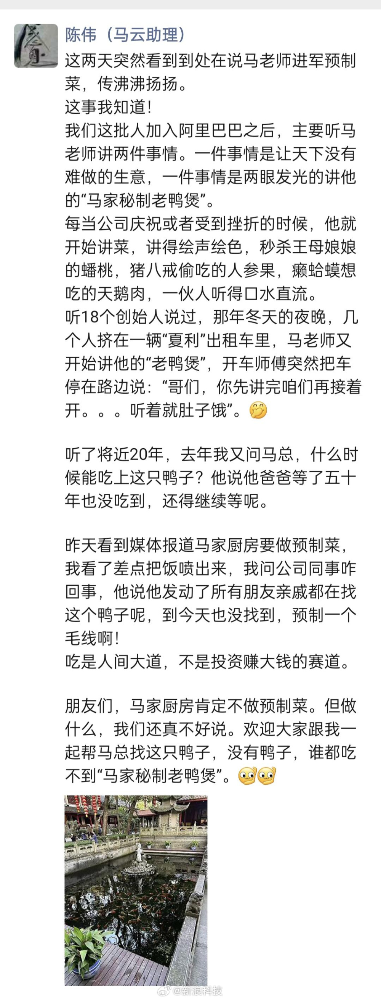
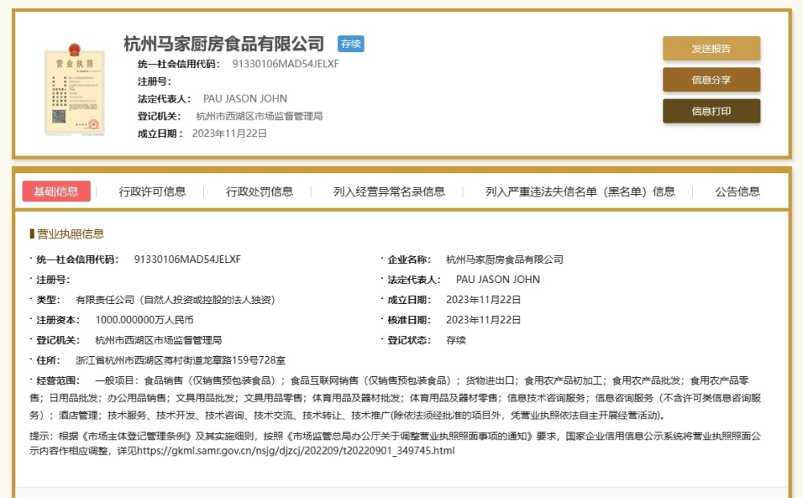

# 马云前助理回应马家厨房：肯定不做预制菜

【马云前助理回应马家厨房：不做预制菜】财联社11月25日电，记者获悉，马云前助理陈伟今天在朋友圈称，与外界的解读不同，马家厨房不做预制菜。据记者了解，陈伟没有透露马家厨房的具体业务，但明确称，吃是人间大道，不是投资赚大钱的赛道。（蓝鲸记者
高梦阳）

**此前报道：**

[马云斥资千万成立“马家厨房”，主营范围包括预制菜、农产品加工和批发等](https://news.qq.com/rain/a/20231123A07VKG00)

据最新工商信息显示，11月22日，由马云持股99.9%的杭州大井头贰拾贰号文化艺术有限公司新增一家子公司，主营预制菜、农产品加工和批发等。

该子公司名为杭州马家厨房食品有限公司（下称“马家厨房”），法定代表人为PAU JASON
JOHN，注册资本1000万人民币，经营范围包括食品销售（仅销售预包装食品）、货物进出口、食用农产品批发、日用品批发、酒店管理、技术服务等。

此外新消费日报注意到，马家厨房的监事徐诗，曾在马云公益基金会担任高管，目前也兼任多家马云旗下艺术管理公司、咨询公司高管。

