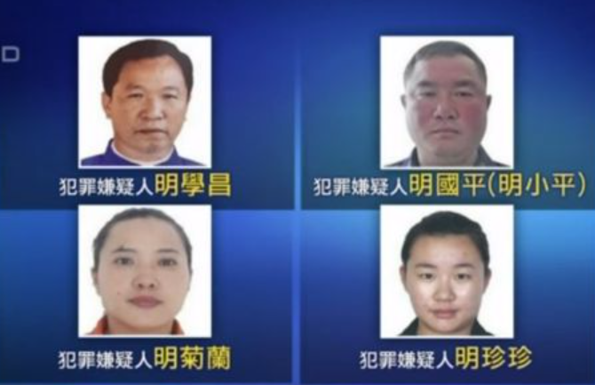
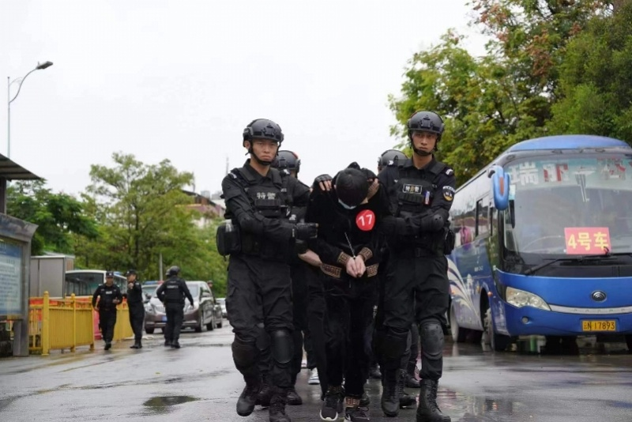

# 专家释疑：明家电诈头目如何判？缅北归国数万嫌疑人如何罚？

近日，中国警方发布境外通缉令后，缅北果敢电诈集团首犯明学昌自杀身亡，“明氏家族”3名核心成员已捉拿归案，其家族创办的电诈基地“卧虎山庄”也随之瓦解。

公安部发布消息称，11月18日，德宏公安机关边境警务执法合作取得重要突破，缅北木姐地区执法部门将571名电信网络诈骗犯罪嫌疑人陆续移交中国公安机关。截至目前，缅北相关地方执法部门共向我方移交电信网络诈骗犯罪嫌疑人3.1万名，其中幕后“金主”、组织头目和骨干63名，网上在逃人员1531名。

公安部通缉令显示明菊兰、明珍珍户籍在云南临沧，网传明学昌之子明国平为缅甸国籍，外籍人士能否适用中国刑法？从缅北移交回来的电诈犯罪嫌疑人可能涉及哪些罪名？对被迫从事电诈的人员，又能否“网开一面”？

近日，察时局从多位法律人士处了解到，按照刑法规定，外籍犯罪头目针对中国公民犯罪，应适用中国法律，如涉嫌故意杀人罪或将判处死刑。一般从事电诈的人员可能涉及“诈骗罪”“偷越国（边）境罪”等。

对于从犯，2016年“两高一部”就电诈犯罪相关问题出台文件，明确规定时间内自首等从轻处罚的情形。但专家也谈到，司法实践中如何认定从犯，争取从轻处罚存在一定难度。

_被警方通缉的明家四人，明学昌畏罪自杀身亡，其余三人被缉拿归案。_

**明家三人最高或将面临死刑，外籍人士对中国公民犯罪也将受制裁**

11月12日，以明学昌为首的缅北果敢“明氏家族”共4人因组织开设诈骗窝点被中国警方通缉。11月15日，明学昌畏罪自杀，其亲属明国平、明菊兰、明珍珍被缉拿归案，三人未来如何定罪量刑受到各界关注。

公安部发布的公告显示，以明学昌为首的犯罪集团实施针对中国公民的电信网络诈骗犯罪活动，诈骗数额巨大，同时涉嫌故意杀人、故意伤害、非法拘禁等多种严重暴力犯罪。

北京周泰律师事务所合伙人张缙认为，从通缉公告和公开报道可以看到，明家三人除了涉嫌诈骗罪外，还可能涉嫌故意杀人、故意伤害、非法拘禁罪等多种严重暴力犯罪，依据中国刑法可能判处死刑、无期徒刑或者十年以上有期徒刑。

其中值得关注的是，明菊兰、明珍珍的户籍在中国云南临沧，而明国平网传为缅甸国籍，能否适用中国刑法？

张缙介绍，中国刑法的适用范围首先遵守的是“属人管辖”原则，对于两位云南籍的犯罪嫌疑人，中国依法具有管辖权；而对于缅甸籍犯罪嫌疑人，刑法规定“外国人在中华人民共和国领域外对中华人民共和国国家或者公民犯罪，而按本法规定的最低刑为三年以上有期徒刑的，可以适用本法，但是按照犯罪地的法律不受处罚的除外。”她分析称，明国平涉及罪名的最高刑为死刑，因此可以适用刑法。

察时局了解到，2016年，“两高一部”专门针对电诈案件的犯罪地和管辖权问题，出台了《关于办理电信网络诈骗等刑事案件适用法律若干问题的意见》（以下简称《意见》），规定电诈犯罪案件一般由犯罪地公安机关立案侦查，同时明确犯罪地的涵义。根据《意见》，犯罪地包括犯罪行为发生地和犯罪结果发生地。如诈骗电话、信息、电子邮件等的拨打地、发送地、到达地、接受地，均属于犯罪行为发生地；犯罪结果发生地则包括被害人被骗时所在地、诈骗所得财物的实际取得地等。

从这个角度来说，缅北果敢电诈集团所从事的电信诈骗，犯罪地已涉及到中国境内，因此中国警方具有管辖权。

察时局还注意到，为打击电诈犯罪，公安部曾多次发布对外籍人士的通缉令，如10月12日发布对涉嫌开设电诈窝点的缅甸佤邦建设部部长鲍岩板等人的悬赏通缉。

张缙介绍，当外籍人士侵犯了中国及其公民的合法权益构成犯罪，且所犯罪行最低刑不低于三年有期徒刑时，即可对其发布通缉令。

察时局还了解到，此类通缉一般是由地方公安机关向上汇报后，由公安部进行发布，比如此次对“明氏家族”的公开通缉是由浙江温州市公安局发出，由公安部刑侦局发布。

_缅北电诈犯罪嫌疑人被押解回国。据公安部_

**一般电诈人员涉诈骗罪、偷越国（边）境罪，从犯自首可从轻处罚**

明氏家族的势力被铲除后，其创办的果敢规模最大和最早的电诈基地“卧虎山庄”也迅速瓦解。

而据公安部消息，今年9月以来启动的对缅北诈骗的打击中，缅北相关地方执法部门共向中国警方移交电诈犯罪嫌疑人3.1万名，其中幕后“金主”、组织头目和骨干63名，网上在逃人员1531名。

对于遣送回国的犯罪嫌疑人，首先交由各地公安机关进行审查，其中涉嫌违法犯罪的将被行政拘留或刑事拘留，一些犯罪情节较为严重的人员，还需经检察院进一步调查。

南都记者了解到，近日已有归国电诈人员亲友表示收到警方刑事拘留通知书，当事人罪名涉及“诈骗罪”或“开设赌场罪”“偷越国（边）境罪”不等。

根据此前对缅北电诈“回流”人员的侦办和查处，上海警方曾总结了缅北电诈集团的一些特点：呈现“公司化运作”模式，“金主”“主管”“代理”“组长”“组员”等5个层级间相互独立又相互协作，组织结构严密，诈骗窝点中绝大多数成员都为组员身份。

曾代理过缅北电诈人员案件的四川斌鼎律师事务所律师李崇辉也告诉南都记者，组织者、骨干分子等主犯除了诈骗罪外，还可能涉及故意杀人罪或故意伤害罪等。“从犯”可能主要涉及诈骗罪、偷越国（边）境罪或帮信罪等。根据刑法，诈骗罪的起刑为三年以下有期徒刑，最高刑为十年以上。偷越国（边）境三次以上属于刑法第三百二十二条规定的“情节严重的”，处一年以下有期徒刑；涉及多种罪名的实行数罪并罚。

梳理以往公开报道可见，此前曾有一些人被“高薪工作”骗去缅北，在犯罪团伙殴打、关“水牢”等暴力手段胁迫下参与电信诈骗。他们回国后面临的处罚也各有不同。

张缙介绍，对于境外电信诈骗的从犯及胁从犯，因其参与程度较浅或存在被迫情节，往往处罚较轻或可免于处罚。

北京京师律师王希彬也告诉南都记者，司法实践中对于胁从犯的认定，主要是考察当事人是不是在被胁迫的状态下实施犯罪行为。通过“人身自由受限程度”“是否遭受诈骗集团暴力对待”以及“是否在诈骗中获利及获利情况”等方面，判定犯罪嫌疑人是否属于被胁迫参与犯罪的情形。

据了解，2016年“两高一部”《意见》中也明确规定了从轻处罚的情形：对犯罪集团中起次要、辅助作用的从犯，特别是在规定期限内投案自首、积极协助抓获主犯、积极协助追赃的，依法从轻或减轻处罚。

不过值得一提的是，实践中为从犯争取从轻处罚，还存在一定难度。李崇辉向南都记者介绍了一个案例：一名当事人误信虚假招聘广告，被骗至缅北卧虎山庄电诈集团，其主动联系国内公安机关表示想要回国，后来其亲人用几十万将其赎回，但最终法院没有认定其有自首情节，按诈骗罪定罪量刑。

“这类案件中，不少犯罪嫌疑人即便在主观意愿上不想实施电诈，但实际上，大部分从犯、胁从犯都实施了电诈。且除了犯罪嫌疑人供述外，也很难找到其他证据证明其属于被迫实施诈骗。”李崇辉介绍。

**诈骗数额不清的，可依据“发送诈骗信息五千条以上”认定诈骗罪**

跨境电信网络诈骗涉及人数众多，交易错综复杂，在侦查、审理过程中，取证难度高、跨境办案难度大成为现实挑战。

王希彬告诉南都记者，实践中，司法机关大多通过电话、短信等通讯记录、转账流水和犯罪嫌疑人口供等证据认定诈骗行为实施情况。对于骨干成员身份的认定，则往往通过诈骗集团的管理规章、人员职务认命、会议记录等文件等犯罪集团运营管理的证据，结合犯罪嫌疑人对于犯罪集团运营情况的供述来予以认定。

南都记者也梳理了多份涉缅北电诈的裁判文书发现，有犯罪嫌疑人被认定为“诈骗罪（未遂）”。比如，一例案件的裁判文书便显示，被告人与他人拨打诈骗电话累计超过5000次以上，法院据此援引刑法第二百六十六条规定的“其他特别严重情节”，将其认定为诈骗罪（未遂），判处有期徒刑四年六个月。

多位律师谈到，此类案件中，对境外诈骗人员涉嫌的诈骗数额认定也是一大难点。现实中可能存在犯罪嫌疑人实施诈骗但没有骗到任何金额，或者诈骗数额达不到3000元的够罪标准。

而根据2016年两高一部《意见》规定，诈骗数额难以查证，但存在“发送诈骗信息五千条以上的，或者拨打诈骗电话五百人次以上的”或“在互联网上发布诈骗信息，页面浏览量累计五千次以上的”
属于刑法第二百六十六条规定的“其他严重情节”，以诈骗罪（未遂）定罪处罚。

中国政法大学教授刘静坤曾就此撰文解释称，根据这一规定，即便诈骗数额未能查证，根据“其他严重情节”也可对有关电信诈骗行为以诈骗罪定罪处罚。

而对于偷越国（边）境罪的认定。张缙介绍，根据刑法和《意见》，偷越国（边）境3次以上或3人以上结伙偷越国（边）境的，即达到“情节严重”，处1年以下有期、拘役或管制。因此，在对境外诈骗人员涉嫌的罪名认定中，除了不符合偷越国（边）境行为的，对于没有达到情节严重标准的，往往不认定偷越国边境罪。

缅北电诈人员移交回国接受法律的惩处后，未来社会各方应如何帮助其开始新的生活、避免再次走上电诈犯罪道路？

张缙建议考虑多方面入手，比如加大对违法行为的打击力度、加强对电信诈骗行业的监管和管理。“更要重视对相关人员的心理干预和辅导，帮助他们克服犯罪心理和行为习惯，防止再次走上犯罪道路。还可以通过建立健全的社会支持体系，包括就业帮助、家庭支持、心理咨询等，为他们提供必要的支持和帮助，让他们能够顺利回归社会。”

采写：南都记者 郭若梅 蒋小天 刘嫚 发自北京

