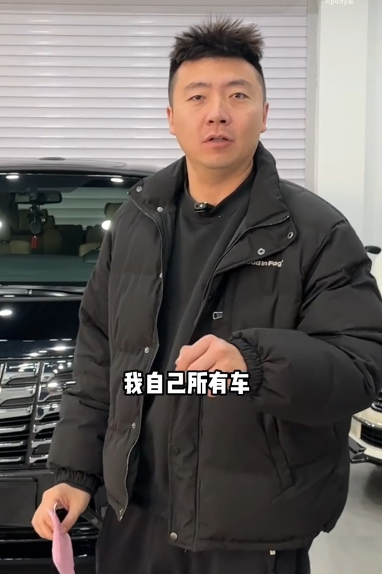
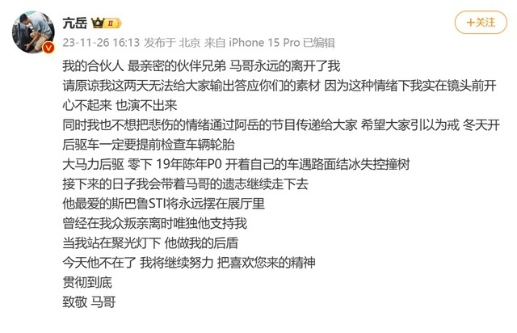
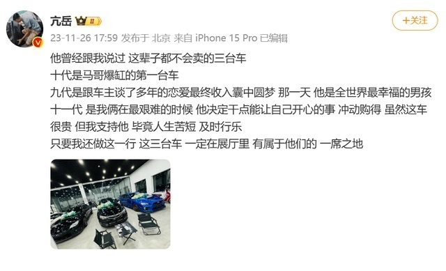
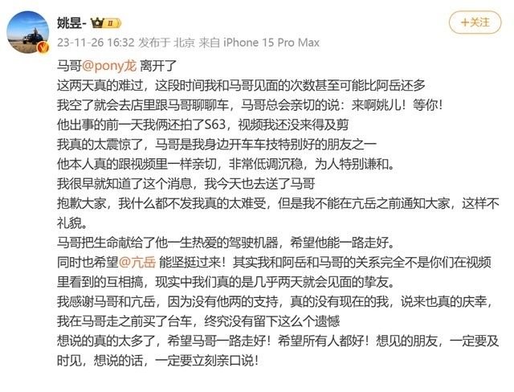
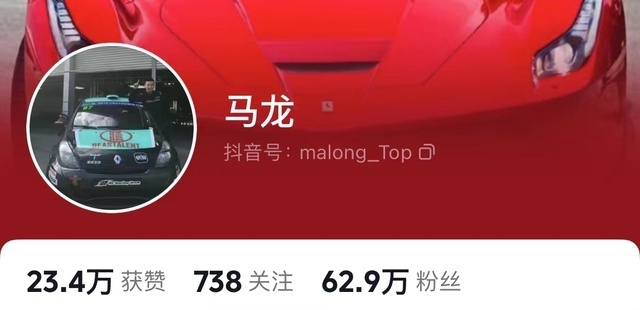

# 汽车博主马哥车祸去世，好友发文：开车遇路面结冰失控撞树，提醒大家冬天开后驱车一定要检查轮胎

11月26日，汽车博主“亢岳”发文称，其合伙人马哥车祸离世。“我的合伙人，最亲密的伙伴兄弟马哥永远的离开了我。希望大家引以为戒，冬天开后驱车一定要提前检查车辆轮胎。”

_图源：马哥社交账号_

“亢岳”表示，“大马力后驱，零下，19年陈年P0 开着自己的车遇路面结冰失控撞树 。接下来的日子会带着马哥的遗志继续走下去
，他最爱的斯巴鲁STI将永远摆在展厅里。曾经在我众叛亲离时唯独他支持我，当我站在聚光灯下，他做我的后盾。今天他不在了，我将继续努力
把喜欢您来的精神贯彻到底。”

随后，“亢岳”再发文称，马哥曾经跟他说过 ，这辈子都不会卖的三台车，十代是马哥爆缸的第一台车
，九代是跟车主谈了多年的恋爱最终收入囊中圆梦，那一天他是全世界最幸福的男孩，十一代是我俩在最艰难的时候，他决定干点能让自己开心的事，冲动购得。

“虽然这车很贵，但我支持他。毕竟人生苦短，及时行乐。只要我还做这一行 这三台车 一定在展厅里 有属于他们的一席之地。”

此外，另一位汽车博主也证实了马哥的离世。“我真的太震惊了，马哥是我身边开车车技特别好的朋友之一。抱歉大家，我什么都不发我真的太难受，但是我不能在亢岳之前通知大家，这样不礼貌。马哥把生命献给了他一生热爱的驾驶机器，希望他能一路走好。同时也希望亢岳能坚挺过来！其实我和阿岳和马哥的关系完全不是你们在视频里看到的互相搞，现实中我们真的是几乎两天就会见面的挚友。”

据悉，马哥在社交平台上以聊车为主，发表作品231条，其粉丝有62.9万。

在得知他离世的消息后，网友纷纷表示，“天呐，冬天结冰开车太危险了，好可惜啊… ”

“还记得马哥每次见到我们乐呵呵的样子，不敢相信，他居然走了....”

“太让人难过了… 你永远不知道明天和意外到底哪个先来。活好当下，保持热爱”

**【来源：九派新闻综合】**

