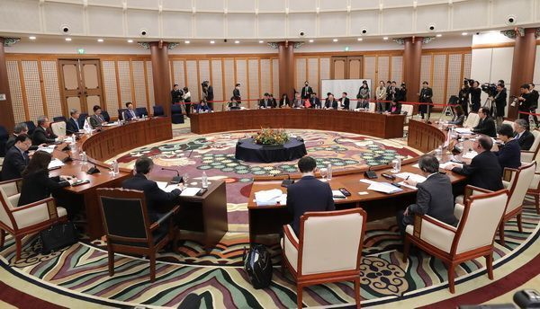

# 王毅出席第十次中日韩外长会

新京报讯
据外交部网站消息，当地时间2023年11月26日，中共中央政治局委员、外交部长王毅在韩国釜山同韩国外长朴振、日本外相上川阳子共同出席第十次中日韩外长会。

王毅表示，中日韩合作已成为东亚地区机制化程度最高、覆盖领域最广、内涵最丰富的多边合作架构，切实服务了三国发展，造福了地区人民。中日韩合作发展历程表明，三国合作具有深厚基础、强劲需求、巨大潜力和广阔前景。面对百年变局加速演进、世界经济复苏缓慢，中日韩应以更进取姿态，为促进地区和全球发展发挥积极作用。中方将继续本着与邻为善、以邻为伴方针，同韩方和日方共同努力，推动三国合作重回正轨，保持健康稳定可持续发展，为地区和世界和平繁荣做出新贡献。

王毅指出，在重整行装再出发之际，有必要重温中日韩合作历程和成果，坚守初心、锚定方向，坚持将《中日韩合作未来十年展望》等领导人共识落到实处。重中之重，是继续本着正视历史、面向未来精神，尊重彼此发展道路及核心利益，妥处敏感问题，维护良好双边关系，为推进三国合作全面重启、行稳致远打下坚实基础。放眼长远，我们还要结合新形势、新格局、新环境，赋予合作新内涵、新使命、新抓手。

王毅强调，三国要坚持倡导互利共赢，尽快重启中日韩自贸协定谈判，保持区域经济一体化势头，完善多渠道、多层次的地区自贸安排，为迈向亚太自贸区这一共同目标做出贡献。要坚持深化科技创新，加强大数据和区块链、人工智能等前沿科技领域合作，共同维护产供链稳定畅通并优化升级，提升区域生产网络韧性。要坚持加强交流互鉴，扩大人文交流规模，加大便利人员往来，增进三国民众特别是青年人的理解和友谊。要坚持提升发展韧性，加大应对老龄化等领域交流合作，携手应对气候变化，打造新的增长点。要坚持带动共同发展，继续本着自愿、平等、开放、共赢、透明和可持续原则，同周边等有需要的国家和地区打造更多“中日韩+X”合作项目，带动区域内外共同和可持续发展。

朴振、上川阳子积极评价中日韩合作取得的进展，认为三国是搬不走的邻居，三国合作具有重要意义和巨大潜力。面对新形势，三国应重温合作初衷，加强沟通交流，促进各领域合作，为三国人民带来更多可视成果。三方可在经贸、科技和数字化转型、人文交流、环保、老龄化等领域开展面向未来的实质性合作，不断扩大共同利益。中日韩合作可以超越东北亚，为地区与世界的和平繁荣发挥积极作用。以开放的姿态积极推动“中日韩+X”合作，造福更多国家和地区。

三方同意为中日韩领导人会议创造条件，加紧相关筹备工作。

三方就共同关心的国际和地区问题交换意见。王毅指出，中日韩作为亚太地区重要国家，面对变乱交织的国际形势，要立足亚太和平发展和地区人民利益，深化区域合作，共同应对风险挑战，维护地区和平与繁荣。要当好东亚合作的“领头羊”，以三国合作带动东亚合作，坚持开放的区域主义，反对以意识形态划线，抵制将区域合作阵营化。要当好维护地区和平安全的“稳定器”，践行共同、综合、合作、可持续安全观，坚持通过对话协商、以和平方式解决分歧和争端。要当好解决热点问题的“减压阀”。朝鲜半岛局势持续紧张不符合任何一方利益，当务之急是给形势降温，为重启对话创造必要条件，为此采取有意义行动。

会议期间，王毅还分别同韩国外长朴振、日本外相上川阳子举行双边会见。

编辑 邓淑红

