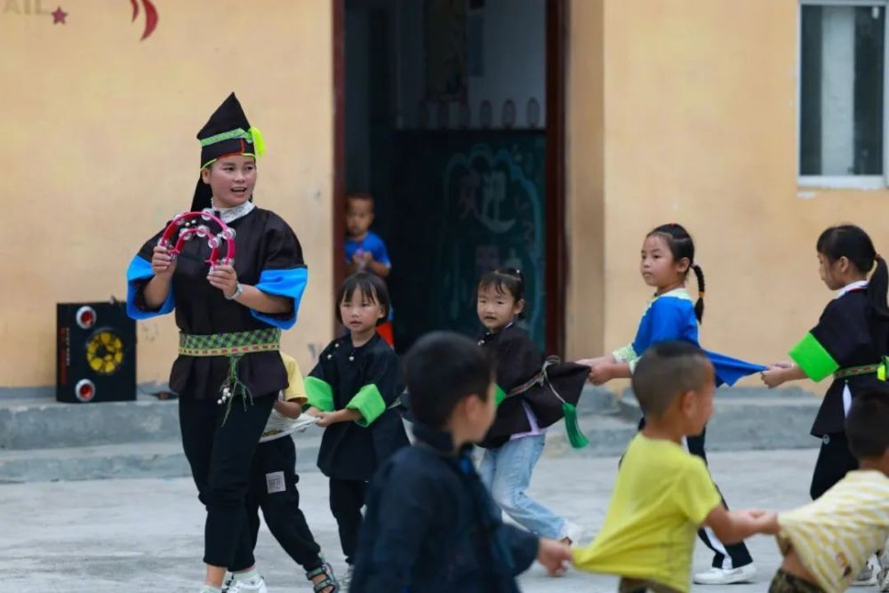
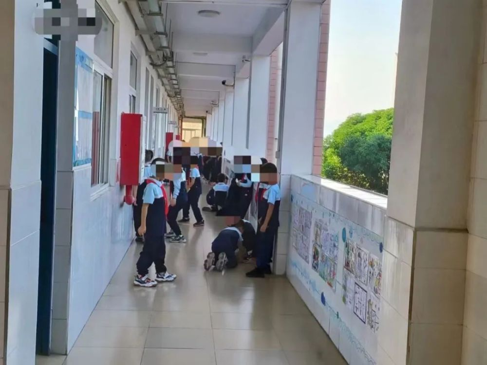
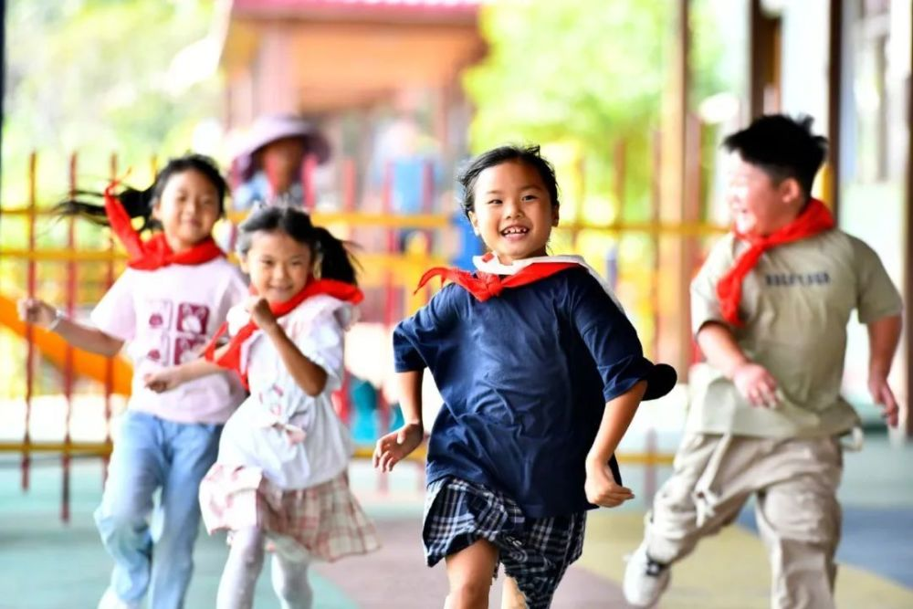
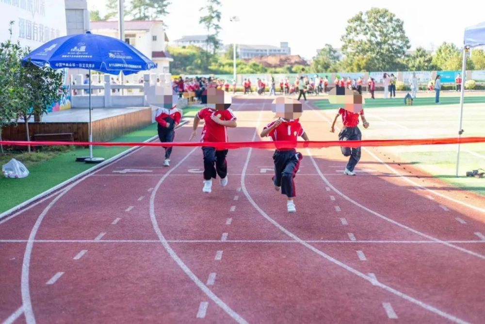
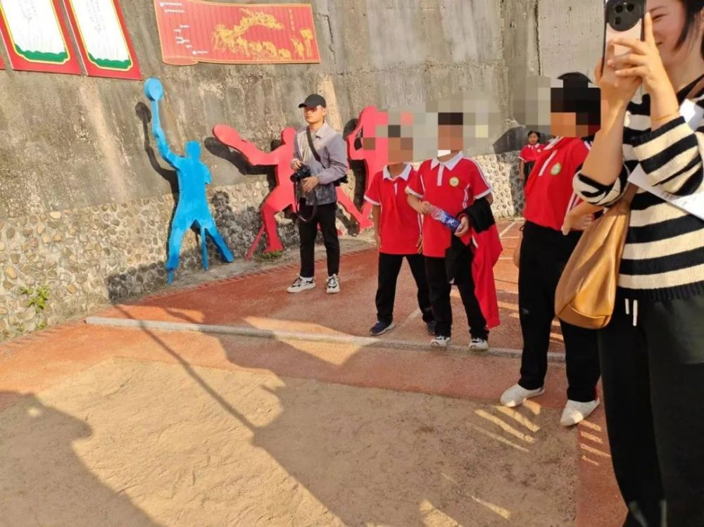

# 社交“VIP房”！失去了课间十分钟的孩子们，流行起了“厕所社交”

争议之下，课间十分钟成了一场“安全”和“自由”之间的博弈。在一桩桩校园意外背后，学校的责任如何界定和划分？安全事件之外，老师的非教学任务越来越多，如何更好地看护孩子的安全？也延伸出对学校空间的讨论：学校这个空间，应该承载何种意义？

**全文7330字，阅读约需19分钟**

**新京报记者 周思雅 编辑 陈晓舒 校对 吴兴发**

_▲9月7日，在贵州省榕江县两汪乡，柳吉小学教师带领学生在课间玩游戏。新华社记者 刘续 摄_

在四年级学生邓凯的世界里，“课间十分钟”这个词汇，特定地指向了教室里的“纸蛙大战”和“橡皮大战”这两项活动。

他常常会在书包里备七八块橡皮，各种尺寸大小的都有。一到了下课，他就和班上同学在座位上互相扔橡皮，互相闪躲。

如果课间要去厕所，只能两点一线地来回。若是被老师或是值日的同学看到在走廊上逗留太久，被记了名，就得写一份检讨书。

他有时候会听大人提起，过去的“课间十分钟”，可以到操场踢毽子、跳皮筋、打篮球。他并没有很羡慕，他已经习惯了课间不出教室。有时候，上厕所看到有男生在厕所里泼水玩，邓凯也会稍稍关注一下“战况”。

近日，“课间十分钟”的话题屡屡冲上微博热搜。多地学生家长反映，学校不允许学生课间出教室，有的甚至不允许学生离开座位，上厕所则需要打报告。这也引发了新的现象：学生开始“厕所社交”。

不少人呼吁“把课间十分钟还给孩子”。新华社评论称，学校应当把立规定则的心思，更多地用在关爱学生、提升管理水平上，而不是牺牲孩子的课间休息时间，更不能剥夺孩子到操场上跑跳的权利。

争议之下，课间十分钟成了一场“安全”和“自由”之间的博弈。在一桩桩校园意外背后，学校的责任如何界定和划分？安全事件之外，老师的非教学任务越来越多，如何更好地看护孩子的安全？也延伸出对学校空间的讨论：学校这个空间，应该承载何种意义？

**━━━━━**

**“厕所社交”**

在河北上小学的叶天天经历过一次长达一个月的“圈养”。五年级，同班同学在课间嬉闹时膝盖着地，摔出了淤青。自那以后，叶天天所在的班级同学每节下课只能待在教室，除了打水和上厕所，不能离开座位。

不能出教室的时间里，叶天天有时在座位上看几眼书，有时看看表，或者偷偷吃零食，剩下大多数时间，都在发呆。不能活动，叶天天就变着法换姿势坐着，半躺着坐，歪着坐，跷二郎腿，或者靠在椅背上双腿尽可能向前叉开。坐最后一排的同学则是被艳羡的对象：最后一排脚能伸开的空间大。

后来，叶天天发现可以以上厕所的名义出去活动，他就和几个玩伴每节下课都约着出教室。担心被老师发现，叶天天和同伴之间还建立了暗号。有时是咳嗽一声，彼此对看一眼，心照不宣；有时指指厕所的方向，几人默契地起身离座。

但上厕所也有次数限制。每节课间只能申请去一次厕所，会有老师或是班长在教室里记录出教室的同学名单，一旦回到教室，名单上的名字会被画钩，也意味着这次课间没法再以上厕所的名义出教室。

一个月里，几乎每节下课，即便不是真的要上厕所，叶天天也会和同学去厕所待着。厕所旁有一间开了窗的小隔间，平时堆些建材，隔间的墙刚好隔开了楼道，外头行走的人看不见隔间里的人，叶天天和三四个同伴就靠在小隔间的墙上，聊最近玩的游戏，等到了快上课的时间，再往回走。

叶天天发现，那段时间，班上几乎每个课间都空了大半——都以上厕所或打水为名外出透气。相比自由出入教室时，大家在不被允许自由出入时更想到外头走走。

后来，限制出入教室的规定被取消。能够自由出入教室后，叶天天会在走廊上和同学玩弹笔游戏。以走廊的一块方块地砖大小为边界，各自把笔放里头，用自己的笔弹别人的笔，被弹出方块者判输。或是玩盲人摸象，一个人闭着眼，去摸特定区域里的其他人。这些活动在教室里没法完成，一是空间太小，二是老待在教室，叶天天觉得“没意思”。

 _▲厦门一小学，学生课间在走廊上活动。受访者供图_

**━━━━━**

**举措背后是“安全”**

厕所社交背后，是学校限制课间十分钟的举措。举措背后，受访者提到最多的是“安全”二字。

邓凯在北京城区一所小学上四年级。在他小学的四年里，课间十分钟无法出教室已经成了一种常态。学校还规定每天进了校门到教室的这段路不能说话，平日，有值周生在校园各个区域监督，若是被发现，会被广播通报。楼梯处没有值周生，这是邓凯为数不多可以和上学路上遇到的同伴聊上几句话的空间。

邓凯说，老师强调这是为了让同学们走路时专注，避免分心发生危险，“老师从一年级开始一直强调到四年级，走路不要说话，要注意安全。”

让他苦恼的是，他妈妈希望他在学校能多看看户外保护眼睛，这成了一项有点难完成的任务。有一次，他下了课准备打开窗户看看风景，被窗户的金属栏杆磕碰流了很多血，此后他便避开窗户走，也很少有机会在课间远眺户外了。

邓凯的妈妈李玲表示，曾经有家长向学校提出意见，希望恢复课间十分钟的活动，增加学生的户外时间。学校的答复是，每天的40分钟体育课和午休时间的30分钟上操时间，加在一起的70分钟已经满足了教育部规定的小学生所需要的“一个小时”户外时间。

教育部办公厅于2023年9月开展第7个全国近视防控宣传教育月活动，根据教育部发布的通知要求，各地中小学校需保障学生每天校内、校外各1个小时体育活动时间，鼓励有条件的学校学生校内户外活动达到2小时。

“学校的解释里，70分钟的户外时间，还超过了规定的一个小时。这好像也合理，也没法再多说什么。”李玲说，但她从孩子的口中得知，孩子目前的体育课只有一周三节，有时午休时间也并没有户外活动，“家长没法跟着孩子上学，也没法取证，证明没到一个小时。”

在北京一小学老师陈静婷看来，被限制出入教室后，对于逐渐需要更多私密空间的孩子而言，厕所成了另一个去处。厕所社交出现后，甚至又出现了厕所社交的“VIP房”：越靠里的位置越好，因为空间更私密。“从孩子的年龄性格特点上来讲，他们不希望大人过度地干预生活，希望有自己的私密小空间。但教室就这么大的空间，跟别人说个悄悄话都能被听见。”

虽然陈静婷所在的学校没有限制学生的课间活动，但她认为，“安全”是当下所有学校在教学之外必须考虑的问题。而不少学校存在学校面积太小等客观问题，或许是一些学校限制课间出教室背后的原因。

陈静婷所在的学校是一个上世纪60年代的老校区，一共有五层楼，四层以下是学生教室。课间，学生一般在走廊上玩。学校会建议学生下课不要到操场上玩，一来一回时间太久，也增加了磕碰的风险。陈静婷说，老师会不断提醒课间活动不伤害他人是最基本的行为准则，但推推搡搡和疯跑是避免不了的，碰撞几乎每天都会发生。“有室内推搡的，也有在楼道推搡的。”

陈静婷解释，由于北京多数学校使用的仍是上世纪的老校区，不少校区的面积仅能容纳过去人口数量的大小。而这几届的学生和以往相比明显增多。“那个年代一个年级可能就三四个班，但现在已经是6个班甚至是8个班。怎么能解决这些（空间不足的）问题是客观存在的事情。”

为了增加学生的户外时间，陈静婷所在的学校设置了中午午休后的大课间让学生们到操场活动，“但仅仅是玩一玩我们都得错峰。”陈静婷说。

“学校的安全教育反复提，不管是晨检，还是午检。但孩子天性就是跑，就是要撒欢。这两个是悖论。”陈静婷说。

在她看来，课间限制出教室的学校，真正担心的是，意外发生后，学校应有的权益没受到保护。“一朝被蛇咬，十年怕井绳，不得已才会做出的选择。”

_▲9月5日，在山东省济宁市微山县高楼乡渭河小学，孩子们在课间做游戏。新华社记者 郭绪雷 摄_

**━━━━━**

**谁的责任？**

叶天天爸爸叶伦说，自己一定程度上能够理解学校的做法。事故一旦发生，有部分家长会选择要么起诉学校，要么整点事儿，“学校除了正常教学任务，还得兼顾这些。”

而在叶伦成长的年代，一下了课，所有人像开了闸的水一样涌到楼外的空地上。那时候孩子皮实，也不会出什么事都找学校，有的课间活动玩单杠时一头摔下来，额头肿一个大包，“自己认，回家自己抹点红药水就行了，没人说为了这个找学校。”

叶伦觉得，和过去相比，如今的家长维权意识过强。“学校因为这种突如其来的意外，被家长告上法庭，或者是没事来学校维权来指责老师的，多一事不如少一事。”

学生在学校出事以后，责任如何判定？根据《中华人民共和国民法典》第一千二百条规定：“限制民事行为能力人在学校或者其他教育机构学习、生活期间受到人身损害，学校或者其他教育机构未尽到教育、管理职责的，应当承担侵权责任。”

然而在实际案件中，教育、管理之责很难明确。记者发现，在学校发生的意外事件中，学校没有尽到安全教育和及时发现意外、及时采取措施的案件中，学校需负担40%至70%的责任。如学校在事前进行了充分的校园安全教育，在事发后及时发现意外并及时送医处理，学校最终需要担责的部分较少，但最终认定学校不担责的案件仍在少数。

据广东省吴川市司法局发布的案件，2021年，六名五年级学生在玩“背人”游戏时，将走廊上另一名同学撞倒致其受伤，最终该同学右股骨骨折，被送至医院住院治疗15天。后受伤同学将六名同学和学校告上法庭，要求其共同赔偿医药费、伙食补助费等合计十万余元。最终，法院根据当事人过错程度，酌定六名同学共同承担50%的赔偿责任，被告学校承担50％赔偿责任，赔偿原告五万余元，其中25000元由学校购买的校园意外责任险支付。

法院认为，并非所有案件中学校都被判担责，学校举证证明尽到教育、管理职责，可不承担责任。在该案中，被告学校在课间休息时对学生的管理缺乏相应的措施，事故发生后没有第一时间履行救助义务，且未能证明安全管理制度执行到位，故需承担一半的赔偿责任。

在湖南一起两名小学生碰撞致一人牙齿断裂的案件中，学校提供了学校的管理手册、日常安全教育宣传照片等证据，证明其尽到了对学生的安全管理和安全教育职责，且事发后，班主任及时与学生家长取得联系并告知事发情况，多次组织双方家长沟通。故原告起诉学校承担赔偿责任的诉请，法院最终不予支持。

但学校不担责的案件很少。厦门一小学老师刘静表示，从实际情况来看，事故只要发生在学校，无论事故如何发生，学校都要担责。“即使是意外。只是说监管到位了，学校可能要担的责任会少一些，但不会说没有责任。”

而一旦有一起意外事件发生，学校需要花很长时间处理。刘静说，但凡有一两个家长较真儿，或者比较有自己的看法，学校就要花非常多的精力来解决这些非教学性的事情。“即便走诉讼渠道，最后学校不用担主要责任，但整个过程学校也会受到一定影响。”

在诉讼案之外，刘静认为，学校采取课间十分钟“一刀切”的举措背后，也存在家校之间沟通不够充分导致不信任从而对立的问题。

刘静所在的学校曾因家长拨打投诉电话而被迫解聘保安。事情的起因是，学校安排了保安在不同放学时段守在门口照看学生。其中一名保安由于受到小朋友的喜爱，经常被小朋友围着聊天。后来有家长打热线投诉称“保安太爱聊天”，各级主管部门都要求对该事件做出回应。最终，学校只能将保安解聘。

让她觉得不解的是，如果家长希望解决问题，应该先和班主任及学校沟通，沟通无法解决再投诉，而不是直接使用投诉这样从上往下的方式。而当下这样家校沟通不畅的现象较为普遍。

陈静婷认为，但凡存在一位家长和学校的沟通不良，就会给老师增添更多非教学任务。她介绍，教师从早上七点到傍晚，在学校的工作几乎一刻也不能停下。从上课到课间看护，其中还需包含判作业和备课。午餐期间学生和老师共同用餐，为了避免孩子出现安全事故，中午下课以后老师就一直在食堂看护。有的班主任有固定的开会时间，有时还得准备公开课。“正常下班时间是4点，但是我从来没有4点下过班，托管班就到5点半，讲课结束以后还要在教室里做卫生消杀。”

即便下班离开了学校，也会有家长来沟通学生在校情况，“私立学校有生活老师和教学老师，非教学任务和教学任务可以分开，但公立学校的老师则必须两者兼顾，在非教学任务的挤压下，老师常常没有充分的时间和精力完成教学任务。老师的责任像是被无限放大了。”陈静婷说。

_▲课间活动，一小学学生正在进行跑步比赛。受访者供图_

**━━━━━**

**课间十分钟下的身心健康**

在受访者的描述里，课间十分钟的作用包含提升学生专注力、心理健康、视力和社交能力等。在课间十分钟的讨论背后，也延伸出对学校空间功能的讨论。

在陈静婷看来，课间10分钟可以让孩子大脑得以休息，身体得以活动，缓解上节课的疲劳。“孩子是无法做到40分钟完全注意力集中的。所以40分钟的课堂之后，更要有时间让眼睛和大脑休息。”

心理咨询师蓝莉长期为多所学校提供学生心理健康支持工作，在她看来，课间的运动让身体的骨骼肌肉都能够活动起来，对于身体来说是非常好的放松。在这个过程中，身体会产生多巴胺，可以帮助学生缓解焦虑和压力的情绪，让身心感到愉悦。

此外，课间的户外光照也会对孩子产生积极的影响。蓝莉介绍，一项英国的生物医学研究对白天光照对心理健康的影响进行了研究，有8.7万受试者的数据显示，白天暴露在大量光线下的人，患抑郁症等心理疾病的风险降低了20%。“如果白天（暴露在）足够户外光线的话，可以促进青少年的心理健康，降低抑郁等其他心理风险。”

在蓝莉看来，学校不仅是青少年学习的空间，也是成长的空间。在课间与同龄人进行充分的社交，有助于让孩子和同龄人产生更多联结。“在跟同龄人的游戏中，甚至是吵架、打架的过程中，孩子开始在旁人的影响下学会谦让和尊重，学着处理情绪，才会慢慢理解规则、遵守规则，和他人产生更多的情感联结，才能更多慢慢地了解这个世界。”蓝莉说。

在李玲看来，如今孩子对课间外出活动不再抱期待这件事，让她觉得有些“凄凉”。傍晚在小区玩，邓凯总是待到最晚，同伴全都回家了才离开。而如今他不再觉得课间出教室是件重要的事，和篮球班的同学即使在课间上厕所时见了面，也只是点头之交，“他再也没有这种想去操场上活动的习惯，班里的活动永远比不上户外。”

相比外出磕碰受伤，李玲更担心孩子的视力。邓凯目前读四年级，已经近视150度了。根据国家卫健委的公开数据显示，2018至2021年，我国儿童青少年总体近视率分别为53.6%，50.2%、52.7％、52.6%。科学研究显示，每天额外增加40分钟的户外活动时间可以减少三分之一近视发病风险，而每天户外活动时间大于3小时的儿童青少年，近视新发风险显著降低。

但除了体育课和上操的时间，邓凯几乎没有其他时间在户外活动。“外出玩磕碰只是概率问题，课间无法外出导致视力下降却成了必然的问题。”李玲说。

 _▲课间活动，小学生们在沙堆旁玩耍。受访者供图_

**━━━━━**

**“把课间十分钟还给孩子”**

“厕所社交”现象在社交平台上讨论火热的同时，呼吁“把课间十分钟还给孩子”的声音也陆续出现。新华社发布时评称，怕孩子出问题，怕被追责，就采取限制学生课间外出活动这种“省事儿又保险”的方法，实则是一些地方教育主管部门懒政。在中办、国办印发《关于进一步减轻义务教育阶段学生作业负担和校外培训负担的意见》中，明确提出要遵循教育规律，着眼学生身心健康成长，保障学生休息权利。而保证孩子享有课间十分钟，改变课间“圈养”现象，需要相关部门和家长互相理解，携手合作。

在安全事故隐患下，不少地区的学校为了保障学生课间十分钟的活动，做了积极的尝试。

刘静所在的学校位于厦门某区的一座山坡上，全校有24个班，每个年级四个班，在厦门的学校面积里是中等大小。学校采取的方法是课间导护：在每个楼层都安排了楼层导护的老师，如果看见冲跑得太用力的学生，老师会及时制止。

下了课，学生们有的会在教室里玩象棋、汉诺塔、24点，也有同学会到走廊上靠着墙聊天，或是在走廊的瓷砖上玩跳格子，也有一些学生爱在走廊上追跑。在刘静提供的照片中，学校走廊大约有两米宽。

学校有两栋教学楼，但凡有学生活动的楼层、操场，都会有至少一名老师导护。即便在学生出现得不多的教学楼架空层，每个课间也都会有一名老师看护。即便如此，刘静说，这也无法杜绝冲撞摔倒的现象。老师在一旁，也只能起到监管的作用，“杜绝是很难的。因为小朋友本身就是好动的。”

按照学校的规定，全校60多个老师都要排班，一天五个课间，有7层楼需要看护，加上操场和架空层的看护，一周五天，每位老师一周基本都会轮到一次。如果有老师导护当日恰巧要出去调研，则要在此之前和别人换班，确保这个时段有人。“我们也会有巡岗的行政人员，会看每个楼层是不是有老师。”刘静说。

刘静表示，虽然这项工作并不计入教师的日常任务评分中，但大家都默默遵守规则，没人敢轻易试探缺席的代价。“这是固定排好的，是教师工作范围之内，必须要做的事情。”

在刘静看来，课间导护的办法，不仅是保护学生，也是保护学校和老师，是学校在力所能及范围内能做的有效尝试。“你尽到了保护的职责，就能避免很多事情。比如说你导护发现小朋友摔倒了，能立即有相应的措施，不会出现空当的时间。”

此外，也有一些学校采取了分批次下操场的办法，由老师带领着不同年龄段的学生在不同课间下楼，到操场活动。

在刘静看来，学校的任何一个角落都应该出现学生的影子。如果学生长期被“圈养”在班级里，在学校里隐私很少，并不利于孩子的成长。“如果6年里没有去走过学校的各个地方，没有留下痕迹，不知道学校各处的装饰，不知道学校的完整模样，孩子和学校之间的联结是很少的。对学校的印象只有教室上课，我觉得（校园生活）是不完整的。”

刘静和同学产生友谊的时刻，也都来自课间一起去卫生间、小卖部。这样的友谊延续下来，久而久之，就成了多年的朋友。

李玲记得，自己学生时期的课间，远比现在孩子的课间要丰富。下课铃一响，整个班的同学都冲到操场上玩耍，跳橡皮筋、抓人的游戏，总是要待到上课铃响再回班级。

在刘静的学校里，有许多高大的芒果树和龙眼树，每个课间，都会有孩子站在树下观察树的模样，也有孩子静静地趴在走廊上看远处的海沧大桥堵车，看着如蚂蚁般大小的汽车一点点地挪动。在刘静看来，这是他们理解和观察世界的窗口。

（应受访者要求，文中叶天天、邓凯、叶伦、陈静婷、刘静、李玲为化名）

**值班编辑 古丽 李加减**

**本文部分内容首发自新京报公号“剥洋葱people”**

**未经新京报书面授权不得转载使用**

