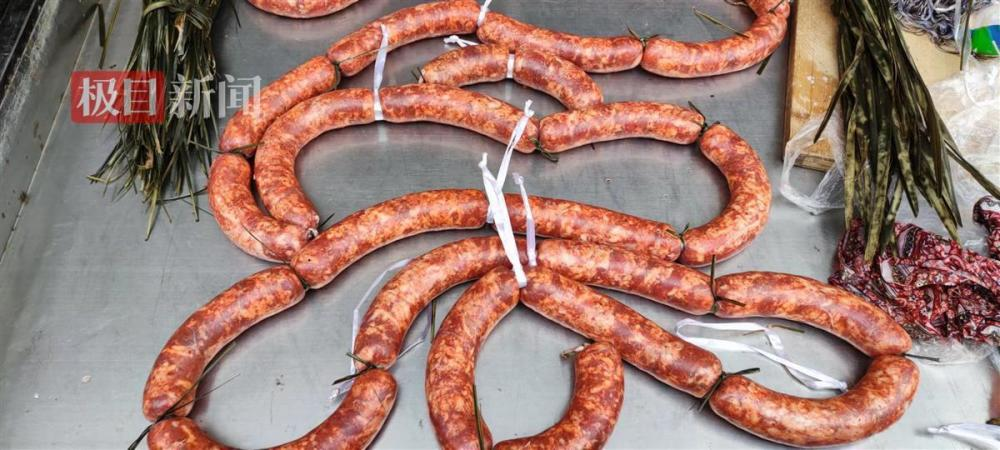
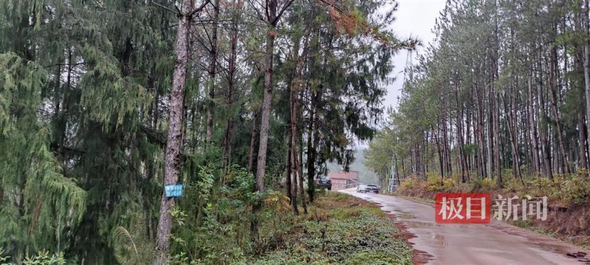
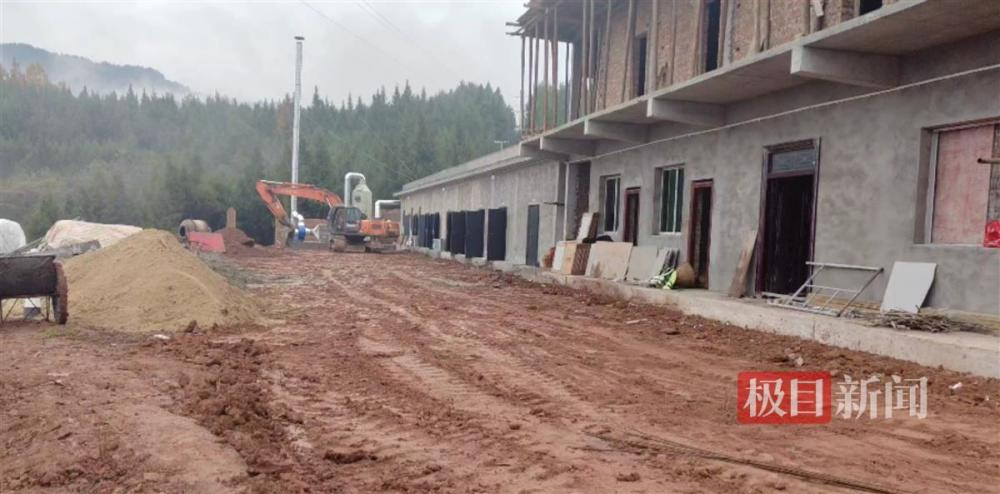
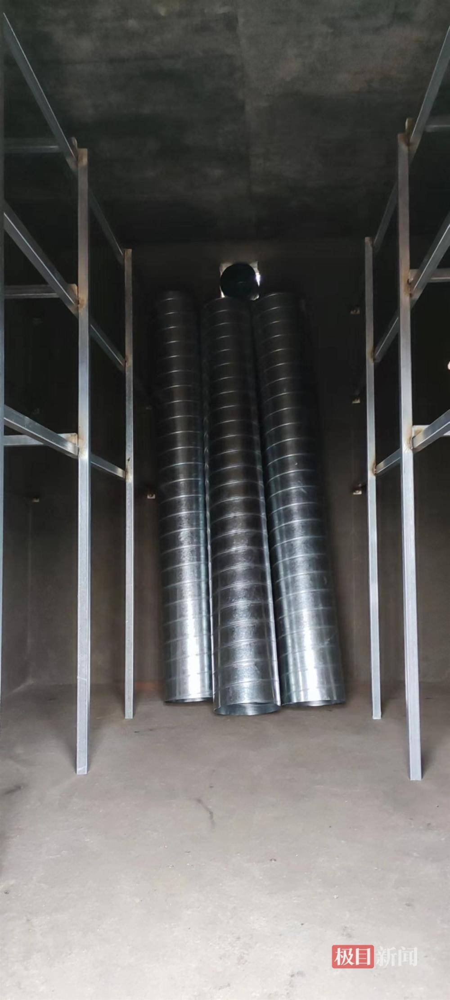
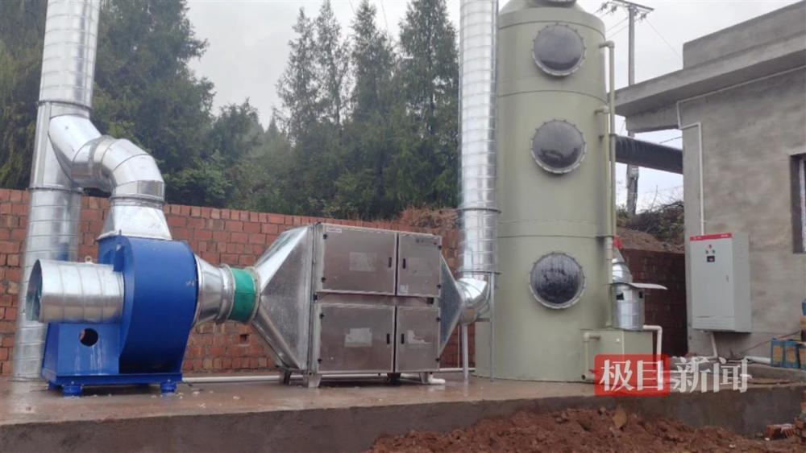

# 禁私熏腊肉的四川通江：集中熏制点装净化烟雾设备，熏制费每斤1.6元

极目新闻记者 谢茂 杜光然

近日，四川巴中市通江县、南江县发布通告称，城区禁止私自熏制腊制品，熏制腊肉、腊肠等需送到指定的集中熏制点，此事引发争议。

11月25日，极目新闻（报料邮箱：jimu1701@163.com）记者现场走访发现，通江县一处集中熏制点尚在建设中，暂未营业，建成后的熏制加工费为每斤1.6元；另一处集中熏制点，居民可以拿腌好的肉过来免费熏制。

集中熏制腊肉在川渝已有多地施行，按照施行地官方说法，这有利于环保及减少火灾隐患。有从事环保工作方面的专家表示，如果空气净化落实到位，集中熏制对城区居民也算是一种可行的办法，但前提是相关配套措施要做好，且不能成为高价垄断，要让传统“有地安放”。

**两地禁止城区私熏腊肉**

11月15日，四川省巴中市通江县发出通告称，城区禁止私自熏制腊制品，熏制腊肉、腊肠等需送到指定的集中熏制点。11月20日，巴中市南江县也发出类似通告。

通告指出，“熏制产生的烟尘将污染空气，影响市民生产、生活，并存在火灾安全隐患……县城区腊制品实行定点集中熏制。”

两县通告发出后，在社会上引发热议。11月23日晚，通江县综合行政执法局发出一封致歉信，信中称，腊制品熏制是川东北地区长期以来的民俗，利用焚烧新鲜柏树枝产生的烟雾熏制腊肉成为熏制的主要方式，产生的烟尘会严重影响环境空气质量。为改善提升城区环境空气质量，消除安全隐患，本着既减轻污染保障人民群众身体健康，又满足生活实际需要，特设置腊制品集中熏制点。熏制点位于熏制管控区域外，均配置喷淋、过滤等相关环保设备，收取成本费用。

 _致歉声明（网页截图）_

该局解释，壁州街道城东村一社熏制点已完成建设，正在进行设备调试，11月25日可投入使用。另外，原通告中“熏制限于在该公司购买的肉制品”的表述反映出当地把关不严、工作存在失误。经与企业协商，巴山牧业熏制点同步面向社会开放。

通江县城一位司机向极目新闻介绍，以往曾有城区居民在屋顶或是沟坎边搭建简易棚子熏制腊肉，但近年来在城区很少见到。当地常见的熏腊肉方式，是在城里买肉腌制好后，拉回农村老家熏制，完成后再带回城里，“在家熏的腊肉味道感觉更好，而且熏制时间一般比较久，我们家都是腊月初拉回去，快过年才算熏制结束。”

 _通江市区出售的新鲜香肠_

另一通江县居民称，自己家人想吃腊肉一般都会从农村老家拿，或者在市面上购买，价格还算合理，她觉得自己熏制太麻烦了，现在县城内也不允许私熏腊肉。印象中，往年县城各家集中私熏腊肉时，空气中经常弥漫着烟味。

**一处集中熏制点正在建设**

11月25日，极目新闻记者实地探访了通江县官方公布的集中熏制点。城东村一社集中熏制点位于通江县县城北面的山上，从山脚抵达熏制点约3公里，有公路直达。在前往熏制点的途中，设有多处森林防火的指示牌、标语。

 _熏制点附近的防火提示牌_

记者在熏制点现场看到，一处办公用房及一处生产用房已大致完成建设，现场有多位工人在施工，熏制点还未投入使用。其中生产用房包括了多个熏制间、一个成品间、一个清洗间和一个厨房。熏制间内已搭建好铁架，连接了排烟管道，部分熏制间内还摆放有管道等设备。

_熏制点施工现场_

在生产用房旁边，有机器设备及烟囱。现场工人介绍，这些设备主要是用于净化烟雾并排放，“烟雾从熏制间通过管道出来，经过水塔降尘，再经过烟雾净化机，最后排出去的烟雾没有那么大污染。”

城东村熏制点老板表示，他们在城区设点收肉，再拉到工厂熏制。如果居民将已腌好的肉送来熏制，加工费每斤1.6元；未腌的肉进行腌制和熏制，加工费每斤4元。如果是单位有熏制需求，双方需要签订协议。此外，该公司并不卖肉。

通江县综合行政执法局发布的致歉信中写道，城东村熏制点已完成建设，11月25日可投入使用，但记者走访发现该熏制点仍在施工。对此，通江县综合行政执法局工作人员表示，信中所写的建成时间系企业承诺时间，“正在抓紧建设，应该快了。按惯例，居民都是冬月过后开始熏腊肉，我们也会督促企业尽快完工。”他还称，文中所提到的另一处巴山牧业熏制点，已有齐全的场所和设备，可以接收熏制腊制品。

该工作人员还表示，建设熏制点是为了方便县城的居民熏制腊制品，县城以外（农村）的居民可以在家熏制，没有相关要求。

 _熏制间内部_

**一集中熏制点可免费为市民熏制**

通江县巴山牧业熏制点位于春在工业园高坑电站旁，据官网介绍，该公司成立于2011年5月，注册资金4140万元，专业致力于青峪猪保种及全产业链开发。

25日下午，极目新闻记者在该熏制点门口见到了前来买肉的市民，他们表示，打算在这里购买肉品后拉回农村自行熏制。

记者咨询巴山牧业相关工作人员，对方表示，熏制点目前可以对市民开放。“我们基本上是公益的，城区市民把自己腌制的腊肉拿过来，登记过后免费熏制，不过我们是用电或气熏制。”上述工作人员表示，如果顾客选择购买他们的肉并在他们这里熏制，熏制同样是免费的，但腌制需要顾客自己进行，“每家口味不一样。”

不过上述工作人员也提到，这个是针对通江城区居民，要确认前来熏制的顾客是城区居民身份。但具体如何确认身份，具体多少斤以内免费，这些细则还在商讨中。

大量肉类的熏制该如何收费呢？上述工作人员表示，他们自己的相关订单比较多，目前暂不接收这类订单。

**巴中市区去年已有先例**

记者注意到，2022年12月13日，巴中市综合行政执法局、巴中市生态环境局也发布过《关于在巴中市中心城区集中熏制腊制品的通告》，其中提到，巴中市中心城区腊制品实行定点自行熏制和统一收集、集中熏制市场化运营两种模式，并公布了10个集中熏制点。

巴中综合行政执法局微信公众号2022年发布的一篇推文中写道，腊肉集中熏制点运行以来，按照环保要求和市民群众需求不断改造升级，升级的10处腊肉集中熏制点，采用“传统工艺+现代环保设备”方式，既延续了传统口感，又达到了环保要求，还细化了防火措施，做到环保、安全、习俗三不误。其中一处所提到的设备升级包括，安装了水雾降尘、活性炭吸附、油烟净化三台环保机器。

_通江县熏制点的空气净化设备_

11月25日，记者联系了巴中市区的一家集中熏肉点。老板告诉记者，他的熏肉点建设已有四五年时间，熏制主要是在封闭的熏制房间内，燃烧以柏树枝叶为主的材料，烟雾会通过管道连接到净化设备，最后排放。

该老板介绍，如果是市民自行把腌制好的肉送去熏制，是1.3元每斤；如果由他们进行腌制和熏制，则是3.5元每斤。一间熏制房可同时熏制上千斤肉，一般三天可熏好，市民取回熏制过的肉后挂着即可，不必再特意晾晒或风干。

“通江的一个集中熏肉点老板还来学习过。”上述老板介绍，如今仍有零星市民前来熏制，往年最集中的时间还是在农历冬月、腊月。

集中熏制腊肉在川渝地区并不罕见。2022年，重庆荣昌、四川泸州、四川达州、四川广安、四川夹江等多地都曾发布过类似集中熏制腊肉的通告。收费标准各有不同，其中如重庆荣昌、达州大竹县、乐山夹江县等是免费为市民熏制，泸州龙马潭区集中熏制点则是“每斤收取1元成本费”，四川广安则是每人次可免费熏百公斤肉。

_通江县城_

**专家：办法可行但要做好配套**

在各地在发布集中熏肉的公告中，大多都提到集中熏制可以更环保、更安全、更方便。巴中恩阳区政府官网于2022年9月发布的《城区秋冬季大气污染专项整治工作实施方案》，其中重点任务之一是规范腊肉熏制。

长期致力于环境保护工作的江苏师范大学贾广惠教授告诉极目新闻记者，熏制腊肉是川渝地区的长久传统，传统和环保之间应当取得平衡，不能“一刀切”，且生活污染对大气污染而言占比只是很小的一部分。

贾广惠教授介绍，如果集中熏制点设有空气净化设备，那么对城区居民而言，这也算是一种可行的办法。首先，通江县是河谷城市，如果城区熏制的人太多，污染扩散比较缓慢；其次，城区居民缺少熏制腊肉的环境，还有火灾隐患。但是，集中熏制腊肉应该是一项惠民措施，而不能成为高价垄断，价格一定要合理，不然不是便民而是增加负担。

贾广惠教授表示，对集中熏制的企业而言，环保设备不仅要有，而且一定要用起来，不能成为摆设，这中间政府应当发挥监督职能。对政府而言，在行政命令外，还不能忽视服务职能，对居民的集中熏制要加强教育引导，处罚要尽可能减少，同时还要做好集中熏制的配套工作，让市民能得到方便、实惠，让传统“有地安放”。

（除注明外，图片均为极目新闻记者杜光然摄）

（来源：极目新闻）

