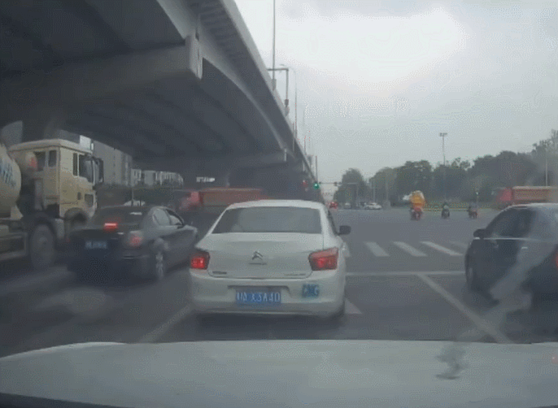
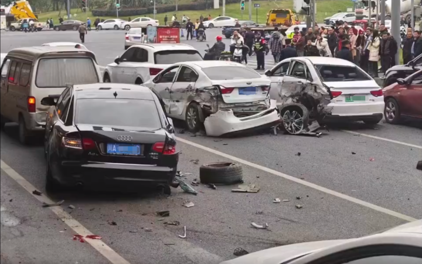

# 网传成都一特斯拉连撞11车 警方：3人受轻伤，驾驶员已被控制

近日，网传一段视频称“成都特斯拉连撞11车”：

一段行车记录仪视频显示，事发地靠近十字路口。

现场多辆车受损。

昨晚（11月25日）成都龙泉驿公安通报：

2023年11月25日15时许，我区成洛大道发生一起交通事故。一小型轿车在成洛大道十陵立交匝道往西河方向行驶时，在十陵地铁站路口与前方车辆发生碰撞，
**事故致3人受轻伤，均在医院接受治疗。**

接报警后，公安机关迅速开展处置工作，驾驶员已被当场控制，事故正在进一步调查处理中。

