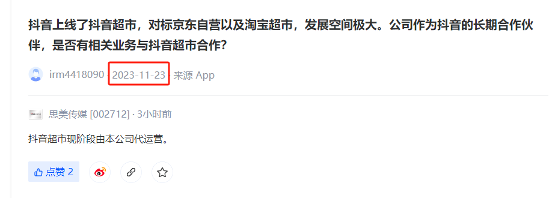
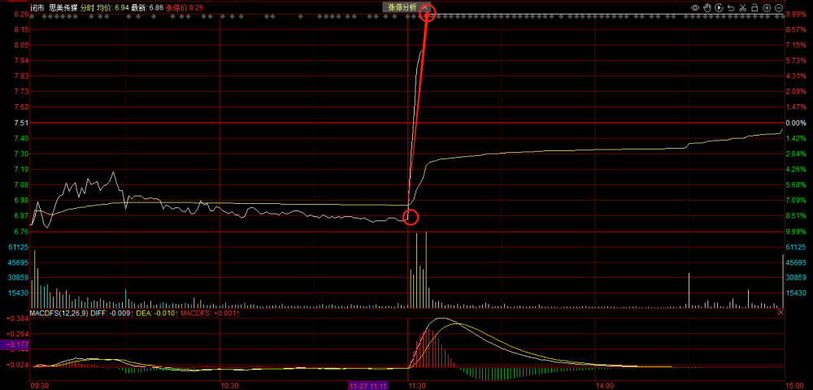
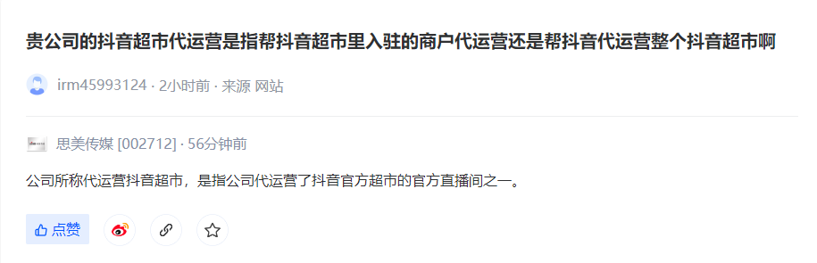
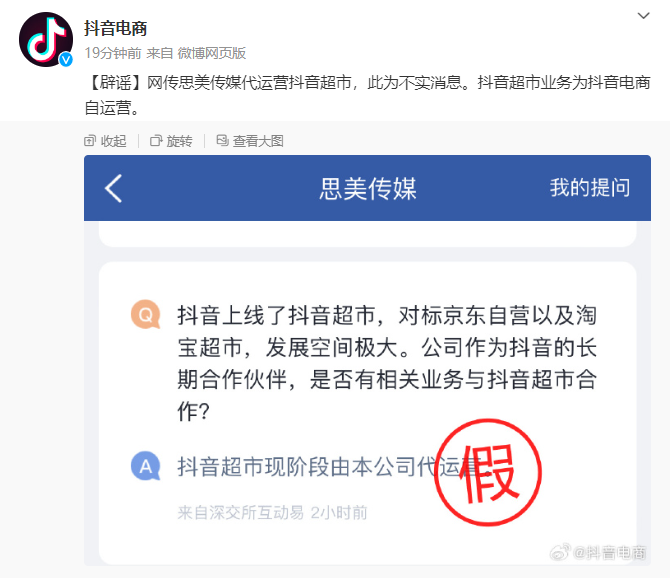

# 代运营抖音超市？思美传媒强势涨停 盘后却遭抖音“打脸”

**财联社11月27日讯（蓝鲸 沈超）**
抖音电商今日盘后辟谣称，网传思美传媒代运营抖音超市为不实消息。值得注意的是，就在今日A股收盘后，思美传媒也对其在今日午间在互动平台上发表的
**“抖音超市现阶段由本公司代运营”** 的相关回复进行了更正说明。

**代运营抖音超市？今日思美传媒两度表态**

在互动平台放“利好”，思美传媒今日午后直线涨停。回顾事件始末，要从11月23日有股民在互动平台上的一则留言说起，该股民提问思美传媒称，抖音上线了抖音超市，对标京东自营以及淘宝超市，发展空间极大。
**思美传媒作为抖音的长期合作伙伴，是否有相关业务与抖音超市合作？**

**时隔四日后，也就是今日午间12点50分** ，思美传媒在互动平台回应称， **抖音超市现阶段由本公司代运营。**

受到此番回复影响，A股市场思美传媒午后股价出现直线拉升，成功封板，涨幅达9.99%。

值得注意的是， **在收盘后的15点01分，思美传媒又在互动平台表示，公司所称代运营抖音超市，是指公司代运营了抖音官方超市的官方直播间之一。**

**抖音电商辟谣：网传思美传媒代运营抖音超市为不实消息**

抖音电商官方微博今日下午辟谣称，网传思美传媒代运营抖音超市，此为不实消息。抖音超市业务为抖音电商自运营。

（蓝鲸 沈超）

