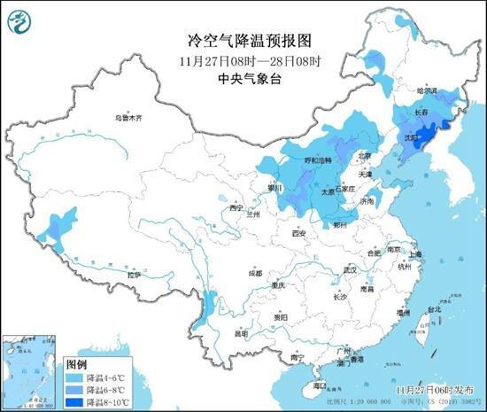
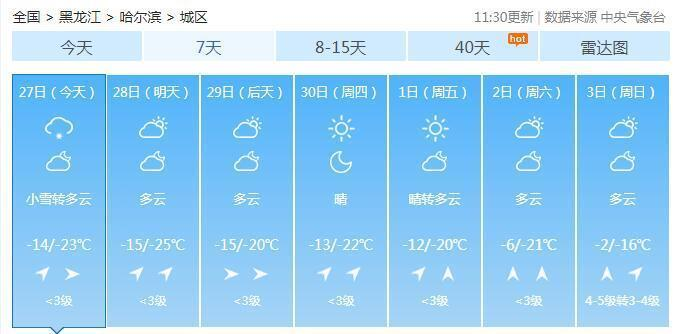
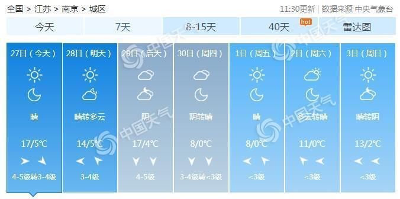

# 冷空气组团来袭！北方多地冷如三九，冰冻线南压至长江下游

时值11月底，冷空气活动愈发频繁，上周寒潮影响刚刚结束，本周又有两股冷空气将接连来袭。其中今明天（11月27日至28日），前一股冷空气主要影响北方，降温过后，部分地区寒冷程度堪比三九。后天起，后一股强度更强、影响范围更广的冷空气将无缝衔接，影响我国中东部大部，届时，江淮、长江中下游多地气温将上演“对半砍”，一夜入寒冬。

**冷出新高度！东北多地气温较常年同期偏低超10℃**

在刚刚过去的这个周末，我国大部地区天气晴朗，气温回升，迎来了短暂的冷空气间歇期。但北方地区大部已是寒冬，升温速度比较缓慢，最高气温仍普遍在个位数。

本周，将有两股冷空气无缝衔接影响我国，其中第一股较强冷空气今日“发货”。中国天气网气象分析师张娟介绍，今明天的较强冷空气将主要影响北方，东北、华北是降温的核心区域，尤其是东北东南部降温可达8至12℃。后天，第二股冷空气接踵而至，它强度更强、影响范围更大，降温可波及中东部大部地区，江南、华南等地也将出现气温下滑。降温过后，最低气温0℃线会南压到长江下游附近。

在这两轮冷空气过程中，东北降温最为显著，多地的寒冷程度或达常年三九甚至四九的水平。省会级城市中，哈尔滨今明天的最高气温将再创今年下半年来气温新低，仅有-15℃，最低气温也将跌至-25℃，天寒地冻一整天。

 _△哈尔滨未来7天天寒地冻_

除了东北，江淮及江南等地的降温幅度也将十分明显。受第二股冷空气影响，江淮、长江中下游一带的最高气温将从20℃出头降至10℃，刷新今年下半年来气温新低。像银川，29日的最高气温将降至-1℃，在下半年首次跌破冰点。南京29日的最高气温还有17℃，30日就将跌至8℃，经历断崖式降温，这也是当地最高气温首次在下半年跌至个位数。

_△南京最高气温将经历“断崖式”下跌_

在两股冷空气的持续打压下，中东部大部地区气温将长时间保持低位运行，尤其是东北部分地区将较常年同期偏低超10℃，天寒地冻，公众需加强保暖工作，外出从头到脚捂严实，居家采取科学取暖的方式，注意用火用电安全。

**东北降雪明显偏多 山东半岛多地将连遭两轮强降雪过程**

冷空气不仅会带来明显降温，还将给东北、山东等地带来降雪过程。今天，东北多地就已出现降雪，不过降雪较分散，雪量较小。明天，黑龙江西北部、吉林东部等地部分地区有小雪或雨夹雪，局地有中雪。东北此轮降雪已经是今年11月来第5轮降雪过程，哈尔滨、沈阳、长春等地累计降水量是常年同期的4倍之多。

_△11月23日，强降雪过后，哈尔滨市主城区积雪较厚_

为何东北今年的降雪如此多？“冷空气频繁影响东北，高空形成高空槽或冷涡系统，同时有地面气旋配合，为降雪提供了良好的动力条件；地面气旋又能将日本海、黄海等海域的水汽输至东北，为降雪提供了充沛的水汽条件。动力、水汽条件都较好，造成了今年11月东北降雪频繁，且强度较强，累计降雪量大。”张娟介绍。

受冷空气南下影响，本周山东半岛也将经历两轮强降雪天气。其中第一股冷空气将给山东北部带来中雪，27日夜间至28日上午为降雪核心时段，烟台和威海等地都会飘落雪花，局地有暴雪来袭，新增最大积雪深度或达10至12厘米。随后，受第二股冷空气影响，29日夜间至30日夜间，山东半岛将再次出现降雪过程，且降雪强度更强，大部地区有中到大雪，局地暴雪。

张娟介绍，山东半岛此次降雪过程为冷流降雪，是当地特有的天气现象，易出现强降雪，这和当地的地理位置有关。山东半岛临海，水汽条件充足，当冷空气南下，海上的暖湿空气上升，就会被凝结成雪花，从而形成降雪。

近期，东北、山东等地降雪频繁，尤其是东北部分地区屡遭强降雪侵袭，目前黑龙江中东部、吉林东南部等地积雪深度都在20厘米以上，部分地区甚至达到30至40厘米，且天气十分寒冷，一整天气温都在冰点之下，积雪不易融化，即使处于降雪间歇期，道路仍较滑，公众外出行车需保持安全车距，谨防发生侧翻事故。

