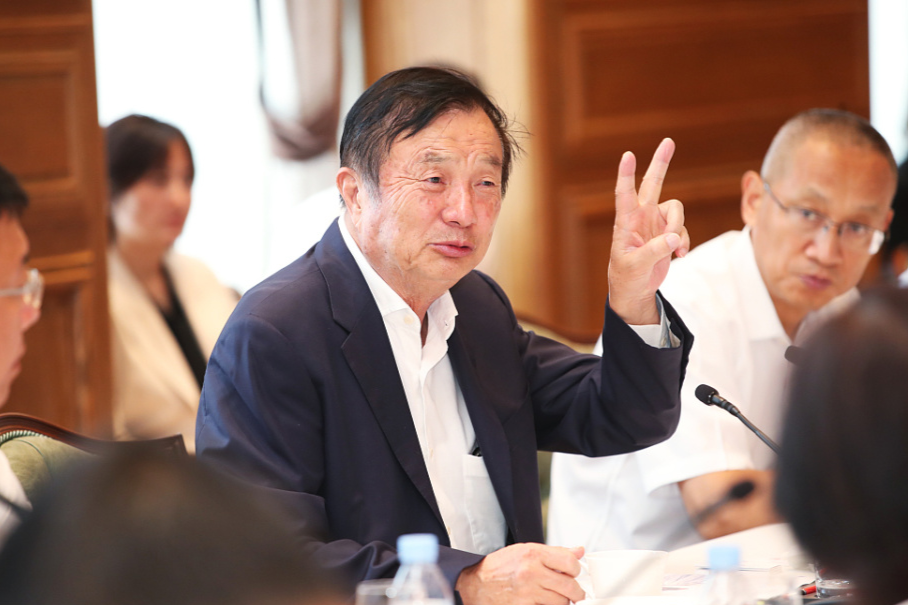

# 华为历史重大变革：任正非放手一搏，汽车业务分拆独立融资

作者 ｜ 程潇熠

编辑 ｜ 康晓

出品 ｜ 深网.腾讯小满工作室

华为做出了一个极为罕见的决策，将承载汽车场景重任的一级部门——智能汽车解决方案BU（以下简称华为车BU）分拆为独立新公司，并放出至多40%的股权对外融资。

11月26日下午，A股上市公司长安汽车发布公告称，已与华为签署《投资合作备忘录》。根据备忘录，华为拟将华为车BU的核心技术和资源整合至新公司，长安汽车及关联方将有意投资该公司。

**这一操作堪称华为历史首次。**

华为非上市公司，公司股份100%掌握在创始人任正非及全体员工手中，核心业务如ICT、终端、华为云、数字能源、海思（半导体）均为100%控股。即便为筹集资金，华为也是选择发债融资，而非稀释股权。

华为车BU自2019年5月成立，便被摆在与华为云同等重要的战略位置上。然而励志要做“智能汽车的超级供应商”的华为车BU，摸索近5年，研发投入上百亿元后仍未找到最合适的商业路径。

与华为车BU深度合作HI（Huawei
Inside）模式的三家车企：广汽在今年3月宣布广汽埃安AH8项目终止引入华为HI的联合开发模式，转由广汽自主开发；北汽合作推出极狐阿尔法S
HI版一款车型后再无下文，今年8月已改为合作智选车模式；与长安汽车合作的阿维塔品牌今年月销量未曾超过4000辆。

华为常务董事、智能汽车解决方案BU董事长余承东在今年4月曾坦言华为车BU的困境：
**“蔚来、理想等造车新势力有自己的追求，我相信基于市值等原因，他们不太可能在智能化上选择华为。传统的车企当中，如果怕失去‘灵魂’的，也不会选我们。”**

困境未破，但留给华为车BU试错的时间不多了。

去年8月，任正非在《整个公司的经营方针要从追求规模转向追求利润和现金流》文件中点名华为车BU，称其“不能铺开一个完整战线，要减少科研预算，‍‍加强商业闭环，研发要走模块化的道路，‍‍聚焦在几个关键部件作出竞争力，剩余部分可以与别人连接。”

**言下之意，要求华为车BU收缩战线、提高效率，尽快赚钱养家。同年12月，余承东直言华为车BU是华为唯一亏损的业务，并立下了2025年华为车BU实现盈利的目标，**

华为车BU的变革从今年2月以COO王军停职为开始，到今年8月减少非核心业务投入（如高精地图等）、大幅减少内部赛马项目、王军回归华为车BU为阶段性中止，期间华为多次被爆有意推动车BU独立运营。如今尘埃落定，华为管理层为车BU安排了一条新的道路：成为一个由汽车产业共同参与的电动化智能化开放平台。

**华为放手，打消“失去灵魂”顾虑**

华为不上市，但任正非已做出巨大让步和改变，并不抗拒部分业务对外融资，甚至走入资本市场。

任正非曾在2021年3月的干部管理工作思路沟通会上警示干部不要说假话、做假账，“如果将来一部分业务慢慢走上资本市场，做假账可能就不是纪律问题，而是涉及法律问题。”这被认为是任正非为公司部分业务进入资本市场松了口。

华为车BU独立水到渠成。余承东在签约现场称，除长安汽车外，华为车BU分拆独立后的新公司将邀请更多车企合作。“我们一直认为，中国需要打造一个由汽车产业共同参与的电动化智能化开放平台，一个有‘火车头’的开放平台。”

**《深网》获悉，与华为合作AITO问界车型的赛力斯集团已收到华为新公司的投资邀请。**

据备忘录披露，新公司相关核心信息如下：

**1.定位：** 新公司定位“汽车电动化智能化开放平台”，华为将把华为车BU的汽车智能驾驶解决方案、汽车智能座舱、智能汽车数字平台、智能车云、AR-HUD
与智能车灯等相关技术、资产和人员（约7000人）注入新公司。华为智选车、智能电动业务等仍在华为体系内。

**2.话语权：** 新公司仍为华为控股，持股至少为60%，其他投资者持股比例之和不超过40%。具体股权比例、出资金额及期限由双方另行商议。

**3.合作原则：**
华为原则上不从事与新公司业务范围相竞争的业务，即在剥离业务成立新公司后，华为原则上不会在内部另起炉灶、成立团队做与新公司相同的业务。新公司运作不与华为对齐，将采用市场化的惯例体系和薪酬激励框架。

**4.最终交易时间：** 计划在本备忘录签署日之后6个月内签署最终交易文件，包括股权购买协议、股东协议，对2023年经营成果不产生重大影响。

该备忘录发布约6个小时后，赛力斯集团发布情况说明，称车BU本次战略调整，不影响双方合作关系，不影响对赛力斯的零部件供货关系，也不影响AITO问界后续的产品推出和车主服务。

华为车BU目前有三条营收渠道：1.为车企提供电动化智能化增量零部件，如AR-
HUD、智能座舱方案、华为MDC智能驾驶计算平台等，截至2022年底，华为已经发货近200万套部件；2.华为HI模式，华为提供鸿蒙车机与自研车载计算芯片在内的全套HI解决方案，并授权在使用华为自动驾驶技术的车身上使用
HI 标识；3.为智选车业务提供相关产品。

HI模式是华为车BU寄予厚望但推进难度最大的模式。因为在HI模式下，汽车“除了底盘、轮子、外壳和座椅，剩下的都有华为技术”，整车厂几乎沦为“代工”角色，这对于大型车企来说难以接受。

“这好比一家公司为我们提供整体的解决方案，如此一来，它成了灵魂，上汽成了躯体。对于这样的结果，上汽是不能接受的，要把灵魂掌握在自己手中。”上汽集团董事长陈虹2021年时曾说道。

如今华为愿意出让股权，邀请车企加入，让车BU成为股权多元化的公司。相当于交出一部分话语权，减轻车企对于“失去灵魂”的顾虑。

**华为进一步坐实“不造车”**

华为进入汽车领域后，造车传言一直未断。知情人士曾告诉《深网》，“华为内部为造不造车纠结过很久，少壮派支持造车，最后是任正非拍板决定不造车。”2018年，华为管理团队在三亚开会，正式明确了不造车的决定。

但纵然华为管理层不厌其烦的再三强调“华为不造车，帮助车企造好车、卖好车。”业界仍难完全排除华为造车的可能性。

其一是一向口不对心的华为早有“前科”。2002年，曾拍着桌子反对做手机的任正非，很快就改弦易辙拿出了10个亿。如今，号称“不造手机”的华为成了全球手机巨擘。

其二是华为高层一直有支持造车的“钉子户”余承东。一位知情人士告诉《深网》，华为内部曾组织过投票，3位轮值董事、1位董事长、3位常务董事7人投票，只有余承东一个人举手。华为轮值董事长徐直军也曾表示，“余承东不服气，但他只有一票。”

今年初华为智选车业务的“换标风波”似乎更是为华为造车提供了有利的证据。于是，今年三月华为2022年报发布会上，华为副董事长、轮值董事长徐直军直言要清理整顿问界汽车物料，严禁华为品牌logo冠在任何汽车品牌logo之前，并再次重申华为不造车，“华为不造车的年限不是五年，而是华为文件的有效期只有5年，5年之后还有5年。”

对于华为车BU的此次独立，多家券商机构认为华为在更加明确自己Tier 1（一级汽车零部件供应商）的定位。

广发证券认为，从华为来看，此次合作显著弱化了“新型OEM”的角色定位疑虑，一定程度上减少了华为在汽车行业的竞争阻力。

“车企完全自研智能化技术未必是最优选项。”平安证券在其研报中称，随着今年下半年问界M7、问界M9、智界S7、阿维塔12的上市，华为在汽车行业的存在感将日益增强，预计未来会有更多车企选择华为的智能车技术。

平安证券认为华为新公司有营收规模达千亿元级别、净利润规模达百亿元级别的潜力。依据是：短期来看，新公司配套车型年销量有望达100万辆左右，长期来看，假设国内乘用车市场规模达3000万辆，单车配套价值2万元，对应年收入达1500亿元，若净利润率在15%-20%，则净利润约为225亿-300亿元。

