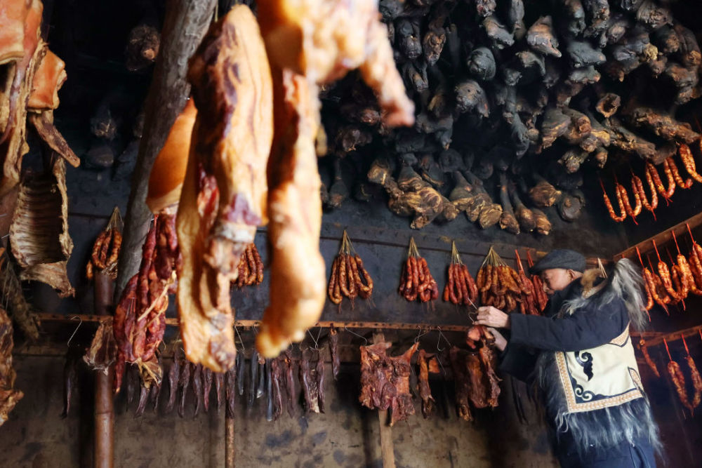
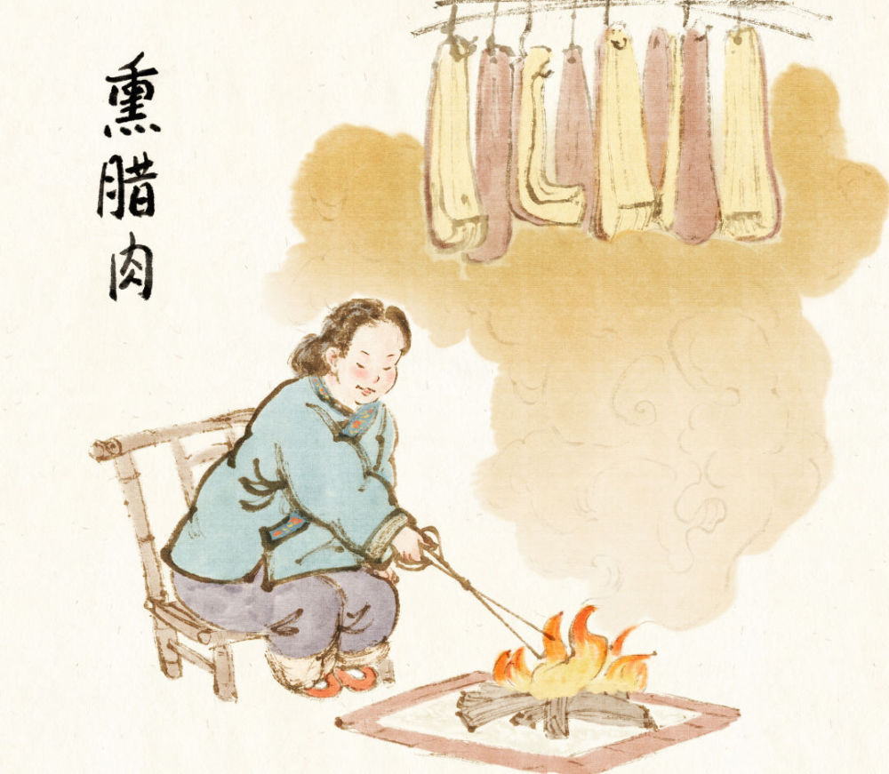

# 扶持招商引资企业？四川通江指定集中熏肉点，是什么来历

_2023年1月18日，四川绵阳石椅村，村民家里挂着2000余斤香肠、腊肉，腊味飘香迎新年。图文无关。视觉中国_

2023年11月15日，四川省巴中市通江县发出通告称，城区禁止私自熏制腊制品，熏制腊肉、腊肠等需送到两处指定的集中熏制点。11月23日晚，通江县综合行政执法局发出致歉公告。

不过，致歉仅针对通告中“熏制限于在该公司购买的肉制品”的表述，并未撤销禁止居民私自熏肉的规定。

南方周末记者发现，“定点熏腊肉防止大气污染”的做法，在四川部分地区已实行多年，必要性、有效性一直存在争议。而此次通江的通告引起关注，部分原因在于政府指定的集中熏制点还关联着企业。

“他们的收费标准不算低。”钱安是通江县人，在当地从事信息类自媒体工作。他从政府了解到，这两家企业都是当地招商引资项目。

熏肉价格遭质疑

引起争议的第一份公告发布于11月15日。公告称，随着熏制腊制品高峰期到来，熏制产生的烟尘将污染空气，并存在火灾安全隐患，为尊重传统、方便市民，同时保护生态环境、保障熏制安全，将禁止在县城区农贸市场、居民小区院内、楼道、阳台、屋顶以及岩坡旁、路边、河沟等非指定地点熏制腊制品；禁止在县城区内擅自搭建腊制品熏制设施；县城区腊制品实行定点集中熏制。

公告列出两处指定熏制点的地址和联系方式，其中，第二处熏制点特别指出，“熏制限于在该公司（巴山牧业）购买的肉制品”。

“太远了。”收到禁止私自熏肉的消息后，通江县一位居民的第一反应是不方便，因为家里有老人、孩子需要照顾，如果是专门为熏腊肉来回跑，时间顾不上。之后，他注意到其中一处集中熏制点不允许自带肉，他认为有捆绑销售、强制买卖的嫌疑。

“原通告中‘熏制限于在该公司购买的肉制品’的表述反映出我们把关不严、工作存在失误。”在11月23日的致歉公告中，通江县综合行政执法局修正了这一规定，称经过与企业协商，该熏制点同步面向社会开放。该公告还解释，集中熏制点位于熏制管控区域外，均配置喷淋、过滤等相关环保设备，收取成本费用。

南方周末记者拨打了通告公布的两处集中熏制点的联系电话，询问收费标准，未获回复。据央广网报道，第一处集中熏制点的价格分为两种，自己带腌制好的肉，按照一斤1.6元-2元左右价格收取；如果需要腌制，按照一斤4元左右收取。

钱安了解到，巴山牧业熏制腊肉的加工费为每斤3.5元，包装费另算。“光熏就要3块5一斤，一头猪有时候两三百斤的肉，熏一次的话，那就将近上千块钱，是挺贵的。”

通江全县常住人口约50万，其中县城人口约20万。针对居民反映指定熏制点距离较远，致歉公告提到，第一处集中熏制点设5个便民揽收点。

_冬季民间习俗熏腊肉。视觉中国_

“想扶持下我们的企业”

根据通江县的通告，第一处集中熏制点位于壁州街道城东村一社，占地2000平方米，建有熏房、管理用房、油烟净化设备及相关配套设施，建筑面积约600平方米，日熏制腊制品量约5000公斤，目前已完成建设，正在进行设备调试，11月25日投入使用。

南方周末记者查询工商信息发现，该处熏制点所留手机号码，是龙泉驿区大面街办金豫建材经营部的注册电话。该企业注册于成都，主业为建材、五金。

“我们是一家公司，熏肉是其中一个业务。”11月24日，南方周末记者致电该号码，对方回复称，熏制点刚刚建好，还没有完全投入使用，就其规模而言，能够满足附近居民的要求；他们提供上门揽收服务，居民也可以拿着肉自行前往。

“很多人打电话跑来骂我，上来就骂。真的很害怕。”该名公司负责人说，最近几日，他遭受了网络暴力，给自己造成很大困扰。“他们（网友）可能有什么误会，是另外一家公司说，要买他们的肉才可以（熏制）是吧？”

通告中的另外一处集中熏制点位于春在工业园高坑电站旁，为巴中市巴山牧业股份有限公司（简称巴山牧业）自建腊制品熏制点，日熏制腊制品量约2000公斤。

巴山牧业是当地一家龙头农牧企业，已经在新三板上市。公司官网显示，巴山牧业成立于2011年5月，总部位于通江县工业园区，专业致力于青峪猪保种及全产业链开发，建立了从保种、扩繁、养殖到屠宰加工、冷链物流、市场营销、品牌创建全产业链标准和体系。

为何指定这两家公司为居民熏肉？钱安咨询了通江县综合行政执法局，并向南方周末记者提供了录音。

钱安称，通江县综合行政执法局回复，指定熏制点属于政府招商引资项目，是招商引资企业。“（巴山牧业）这个企业是对地方经济发展作出卓越贡献的。我们地方政府从感情上来说，也想扶持下我们本地的企业，现在企业也不好发展。”录音中，该局一名工作人员说。

南方周末记者未查询到通江县设置集中熏制点的公开招标信息；多次拨打通告上的举报电话及通江县综合行政执法局电话，均未接通。

熏腊肉是川渝地区的一项传统，有两千多年历史，近些年来面临污染空气的质疑。早在2015年，四川达州环保局称“熏腊肉是空气质量差主因”后，当地就曾在中心城区设置集中熏制点。当时媒体解释，集中熏制并非以集中污染取代炊烟四起，其最大好处是便于政府发现问题、规范管理。

西华大学食品与生物工程学院教授车振明则认为，家庭式、小规模、小作坊的熏制腊肉不会对环境造成太大影响。他向央广网表示，因为空气是流动的，特别在巴中这样人口并不密集的城市，就算有一些污染出现也会迅速消散。但如果进行工业化、规模化的熏制腊肉，其对大气污染防治的影响有待重视。

南方周末记者 李在磊 南方周末实习生 白娟霞

责编 谭畅

