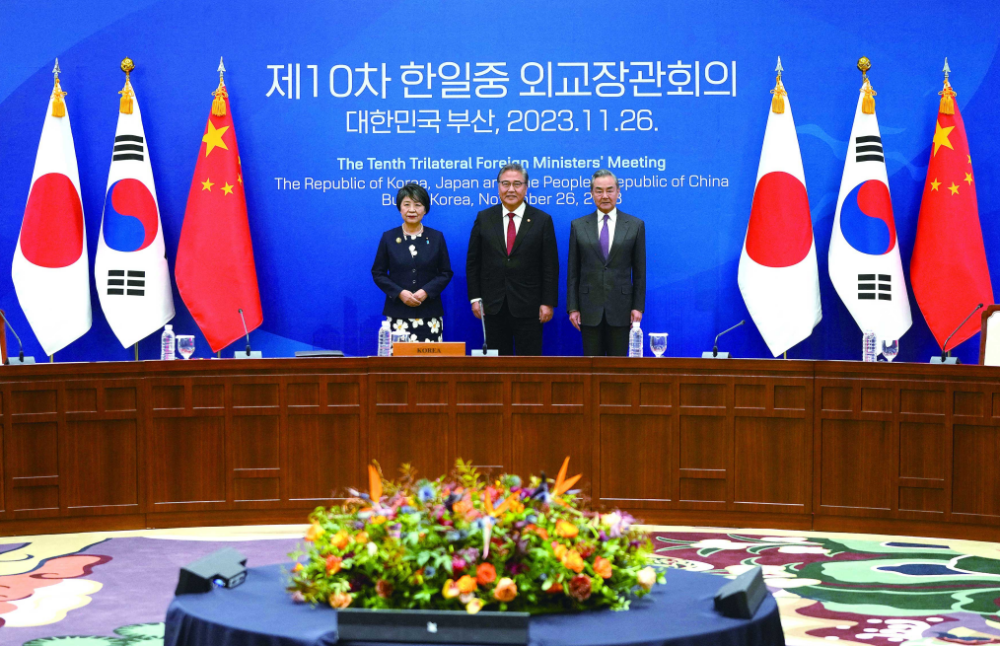

# 推动合作重回正轨，不断扩大共同利益，中日韩外长时隔四年再聚首

【环球时报综合报道】26日，中共中央政治局委员、外交部长王毅在韩国釜山同韩国外长朴振、日本外相上川阳子共同出席第十次中日韩外长会。三方同意为中日韩领导人会议创造条件，加紧相关筹备工作。王毅在会上表示，中日韩合作已成为东亚地区机制化程度最高、覆盖领域最广、内涵最丰富的多边合作架构，切实服务了三国发展，造福了地区人民。中日韩合作发展历程表明，三国合作具有深厚基础、强劲需求、巨大潜力和广阔前景。中方将继续本着与邻为善、以邻为伴方针，同韩方和日方共同努力，推动三国合作重回正轨，保持健康稳定可持续发展，为地区和世界和平繁荣做出新贡献。王毅25日和26日分别同上川阳子和朴振举行双边会见。接受《环球时报》记者采访的学者表示，三国均认识到，进一步推动三国交流合作并且以务实行动解决现有问题的必要性。但也有分析称，尽管三国表达出求同存异、管控分歧、扩大共识的意愿，但只要日韩继续受到美国“印太战略”的牵引，两国同中国关系的改善就存在局限。

_26日，中共中央政治局委员、外交部长王毅在韩国釜山同韩国外长朴振、日本外相上川阳子共同出席第十次中日韩外长会。（法新社）_

**这次三国外长会“更有价值”**

王毅在三国外长会上表示，在重整行装再出发之际，有必要重温中日韩合作历程和成果，坚守初心、锚定方向，坚持将《中日韩合作未来十年展望》等领导人共识落到实处。重中之重，是继续本着正视历史、面向未来精神，尊重彼此发展道路及核心利益，妥处敏感问题，维护良好双边关系，为推进三国合作全面重启、行稳致远打下坚实基础。王毅强调，三国要坚持倡导互利共赢，尽快重启中日韩自贸协定谈判，保持区域经济一体化势头，完善多渠道、多层次的地区自贸安排，为迈向亚太自贸区这一共同目标做出贡献。

朴振、上川阳子积极评价中日韩合作取得的进展，认为三国是搬不走的邻居，三国合作具有重要意义和巨大潜力。面对新形势，三国应重温合作初衷，加强沟通交流，促进各领域合作，为三国人民带来更多可视成果。三方可在经贸、科技和数字化转型、人文交流、环保、老龄化等领域开展面向未来的实质性合作，不断扩大共同利益。

“时隔4年，中日韩外长再聚首”，韩联社26日称，在国际局势加剧动荡之际，三个国家外交部长共聚一堂本身就具有重要意义。希望此次会议能成为强化地区和平稳定、推动新合作的动力。韩国《每日经济》刊发社论称，中日韩外长会“部分扶正了韩国以韩美日为中心的外交路线”，从这点看“意义重大”。当前外界对东北亚安全担忧日渐加剧，因此这次中日韩外长会显得更有价值。《日本经济新闻》称，俄乌冲突爆发以来，国际局势发生深刻变化，中国寻求在日中韩框架下探索共同利益，并在美国主导的对华遏制中“打下楔子”。

黑龙江省社会科学院东北亚研究所研究员、东北亚战略研究院首席专家笪志刚26日对《环球时报》记者表示，近期，中美、中日在旧金山实现领导人会晤，为此次外长会奠定了基础，也创造了三方相向而行的舆论和民意氛围。虽然中日韩在双边、多边层面还存在历史与现实问题，但通过此次外长会，三国表达出求同存异、管控分歧、扩大共识的意愿。三国均认识到，进一步推动三国交流合作并且以务实行动解决现有问题的必要性。

**呼吁日韩维护产供链稳定畅通**

此次中日韩外长会期间，中日、中韩外长会晤也吸引媒体高度关注。王毅会见上川阳子时强调，重建战略互惠关系，一要树立正确相互认知，明确双方互不构成威胁、互为合作伙伴，各自坚持和平发展。二要尊重彼此正当关切。日方应在台湾问题上信守承诺，切实恪守一个中国原则，不得干涉中国内政。福岛核污染水排海事关海洋安全和民众健康，中方反对日方的不负责任作法。当前需要建立各利益攸关方全面、有效、独立推进的长期监测机制。三要加强互利合作，共同抵制逆全球化和保护主义，切实维护产供链稳定畅通。上川阳子表示：“日方在台湾问题上的立场没有变化，愿本着建设性态度，通过对话寻找解决核废水排海问题的适当途径。”

日本时事通讯社26日称，此次日中外长会见是上川阳子今年9月就任外相以来，首次与中国外长举行会见。日本《产经新闻》称，王毅在会见时强调“重建战略互惠关系”，并呼吁“切实维护产供链稳定畅通”，这是中方希望阻止日方跟随美国对华“脱钩”。日本《读卖新闻》称，日中两国在福岛第一核电站核污染水排海问题上仍有分歧，并未取得重大进展。

王毅会见朴振时表示，中韩已成为利益高度融合、产供链高度互嵌的合作伙伴。中国具有完备产业体系和超大规模市场，将实施更高水平开放，这将持续为中韩互利合作提供新机遇。双方应共同抵制经济问题政治化、科技问题工具化、经贸问题泛安全化的倾向，维护产供链稳定畅通，推动两国经贸合作取得更大发展。朴振表示，韩国政府重视韩中关系，认为韩中战略合作伙伴关系符合两国和两国人民的利益，愿持续向前推进，这是韩方的明确立场。

韩国外国语大学国际关系学院教授黄载皓表示，韩国实际上希望通过这次中日韩外长会为韩中领导人会谈铺路。他表示，这次三方外长会存在“双轨”，其一是韩中日合作，另一个很重要的部分就是修复韩中关系。香港《南华早报》称，经济是推动恢复三国外长会的主要因素，三国在促进贸易方面有着共同的利益。数据显示，2022年中韩、中日贸易额分别为3623亿美元和3574亿美元，中国一直是韩日最大的贸易伙伴，远高于韩日与美国的贸易额。

**日韩对华关系受到美国制约**

“中美元首会晤后，中日韩外长会显得尤为重要”，《南华早报》援引新加坡南洋理工大学学者迪伦·卢的话称，三国外长会紧随中美元首会晤之后，这一点值得注意，因为日本和韩国都是美国的盟国，“这将带来一些积极的外交和政治势头”。报道同时认为，目前日韩在华盛顿的“印太战略”中发挥着关键作用，迫于压力，两国对华政策难以出现大幅改变。

韩联社称，中美元首会晤表明，两国寻求稳定的双边关系，避免冲突。中日韩也需要进一步加强合作与交流。由于过去的种种原因，中日韩之间的政治和安全合作进展缓慢，但经济上的相互依存度仍然很高。中日韩不仅在相互交织的经贸、社会、文化等领域，而且在地区安全和福岛核污染水排海问题上都需要密切沟通合作。不过，韩国世宗研究所中国研究中心主任郑载兴说，如果韩国想改善与中国的关系，就必须作出政策上的改变，然而“这种改变并非韩国独自可以作出的，最终还是要与美国沟通”。韩国汉阳大学学者文兴镐称，“从根本上来讲，只要韩美日合作这种格局持续，韩国和日本同中国关系的改善就存在局限”。

辽宁大学美国与东亚研究院院长吕超26日对《环球时报》记者分析称，此次三国外长会有两个值得注意的背景：一方面，美日韩不断加强军事合作，在亚太地区炫耀武力，特别是明确将矛头指向中俄，试图在亚太地区打造“小北约”；另一方面，中美两国元首不久前在旧金山会晤，两国关系在止跌企稳，这对日韩这两个美国盟友的对华政策和议程产生影响。吕超表示，中日韩合作对于地区乃至全球都有重要意义，这一合作应以三国民众福祉为出发点，而不是被某些域外大国所操控。

【环球时报驻韩国、日本特约记者 林森 曾雨辰 环球时报记者 赵觉珵 赵瑜莎 环球时报特约记者 甄翔】

