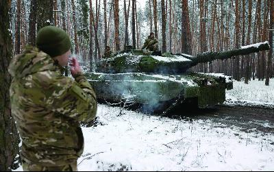
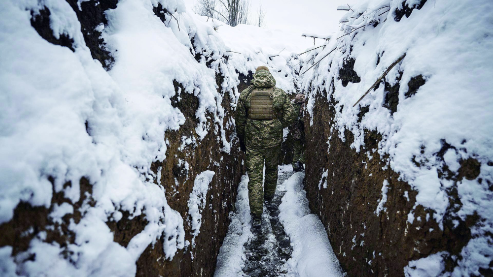

# 无人机大量出动，阵地战环境恶劣，俄乌再度开启冬季进攻模式

【环球时报特约记者
晨阳】随着寒冬降临，持续了一年多的俄乌冲突遭遇第二个冬天，但双方都没有停下来休整，而是在企图利用冬季特殊环境组织新的进攻。乌军称，俄军于25日对基辅发动了“俄乌冲突以来最大规模无人机袭击”，意图利用寒冬摧毁乌克兰抵抗意志。不少西方分析家承认，“乌克兰今冬将面临比去年冬季更为严峻的局面”。

_乌军“豹2”主战坦克在冬季森林里行驶。_

**“最大规模无人机袭击”**

美国有线电视新闻网（CNN）25日称，俄军当天对乌克兰首都基辅发动了自俄乌冲突爆发以来最大规模的无人机袭击。乌克兰空军在社交媒体上表示：“共有75架自杀无人机从两个方向来袭——普里莫尔斯科-
阿赫塔尔斯克和库尔斯克地区。它们的主要目标是基辅市。”乌军宣称，此次袭击出动了“创纪录数量”的无人机，但乌防空部队成功拦截了其中75架。乌军向当地居民发出警告：“大量敌方无人机正从不同方向进入基辅！我们敦促你们留在避难所，直到解除空袭的警报响起！”基辅市军事管理局发言人沙曼诺夫称，这已是本月基辅遭到的第四起无人机袭击。乌克兰能源部表示，这次袭击造成基辅近200栋建筑断电。乌克兰中部地区电力公司的主要架空输电线路和配电线路遭到破坏。此外还有报道称，俄罗斯当天也对苏梅、扎波罗热、尼古拉耶夫和基洛沃拉德等地区进行了空袭。

美国“动力”网站25日称，在25日的最新袭击中，俄军使用的部分无人机被漆成黑色，显然是为了降低它们在黑夜中被发现的概率，甚至可能喷涂了能降低雷达探测的新型涂料。

俄罗斯《观点报》25日援引俄军事专家尤里·克努托夫的话称：“使用无人机是最便宜的，但同时也是对抗敌人的极其有效的方法。显然，并非所有乌克兰防空系统都能应对这样的攻击。”俄专家认为，大规模自杀无人机攻击不但可以摧毁乌军重要目标，还可以借机发现乌军防空系统的漏洞。

乌克兰随即也用无人机空袭作为回击。俄罗斯卫星网26日称，莫斯科市市长谢尔盖·索比亚宁在社交媒体上表示，俄防空部队当天凌晨击退了乌克兰无人机的大规模袭击。根据俄国防部发布的战报，俄防空部队在莫斯科州、图拉州、卡卢加州和布良斯克州击落11架乌军无人机。

**乌军应对空袭难度更大**

“动力”网站注意到，俄军对乌克兰的无人机袭击是今年冬季攻势开始的标志。报道提到，乌克兰发出警告称，俄罗斯对乌克兰关键基础设施发起新一轮攻击，尤其是冬季来临之际的能源网，“俄罗斯去年也采取了类似的策略，导致广泛的破坏”。乌克兰著名经济学家谢尔盖·福尔萨表示，“看来今晚我们听到了序曲——冬季的序曲。”美国《纽约时报》援引乌克兰官员和专家的话说，乌克兰能源系统比一年前更加脆弱。目前，乌克兰许多能源设施受损，维修工作尚未完成，备用设备很少。

报道认为，对于俄军利用冬季对乌克兰基础设施发动的攻势，乌克兰方面的应对能力有限。相比去年冬季，乌军的拦截能力明显下降。尽管从西方获得了“国家先进地对空导弹系统”和IRIS-
T等少量先进防空系统，但它们的数量远不足以弥补过去一年乌军防空系统的损耗。这些陆基防空系统还需要保护正在乌克兰东部和南部发动反攻的乌军部队，这给数量相对有限的西方防空系统以及老旧的苏联防空系统带来了更大的压力，它们甚至不足以保护所有能源基础设施。而且相对便宜的自杀无人机正在以惊人的速度消耗乌军防空导弹库存，相比之下，无人机的单价约数万美元，但IRIS-
T等防空导弹的价格可达数十万甚至上百万美元。在紧迫的防空压力下，乌军甚至只能用高射机枪等临时措施加强对无人机的拦截。同时，乌克兰空军日益减少的苏联时代战斗机也不太适合对付缓慢且低空飞行的俄军无人机。同时按照最乐观的估计，援助乌克兰的F-16战斗机最早要到明年才会飞上天空，乌克兰飞行员预计要到2027年才能达到足够规模的熟练作战程度。

乌克兰空军发言人尤里·伊格纳特在接受乌克兰国家电视台采访时也警告称，预计今年冬天俄军无人机的袭击将达到创纪录的数量。“动力”网站称，得益于伊朗设计的自杀无人机，与俄乌冲突爆发初期零星使用的弹道导弹及巡航导弹相比，“俄罗斯如今能以更便宜的方式持续对远离前线的乌克兰目标进行无情攻击”。而且俄军现在也开始生产同类无人机，为这些空袭提供了更直接的武器来源。乌克兰空军报告称，今年9月俄军针对乌克兰目标发射了500多架自杀无人机，“这本身就是一个新纪录”，相比之下，俄军在去年冬季总共才使用约1000架自杀无人机。

**乌南部方向或有转机？**

更多无人机袭击只是今年冬季俄乌冲突中的标志之一。此前数周，由于持续秋雨天气的到来，乌克兰前线陷入泥潭，并不利于大规模攻防。但随着寒潮的降临，11月22日基辅已经迎来今冬的第一场降雪。

乌军士兵接受西方媒体采访时承认，寒冬可能带来不同的作战环境，前线部队需要更多的取暖设备、更好的防寒装备，甚至需要应对老鼠和虱子的困扰。同时，由于森林树木的叶子已经掉落，隐藏其中的乌军防空导弹、火炮等重装备失去了天然庇护所，更容易被俄军无人机发现，因此需要得到更多的隐蔽设备。

_冬季的战壕是非常恶劣的作战环境。_

不过寒冬带来的挑战对于俄军而言同样也是问题。在乌克兰南部，寒冬的影响可能对于乌军行动更有利。乌克兰总统泽连斯基近日表示，尽管乌军在东部地区已经转入守势，但仍在南部战线发起反攻行动。他将防御态势归因于冬季的寒冷天气，而不是俄罗斯军队最近几周在阿夫杰耶夫卡、巴赫穆特、库皮扬斯克和马里夫卡发动的一系列反击。他在社交媒体上表示，“天气恶劣，利曼、巴赫穆特、顿涅茨克和阿夫杰耶夫卡前线的防御非常困难。进攻行动集中在南部地区。”

乌克兰国防部此前宣布，乌海军陆战队已在赫尔松地区的第聂伯河东岸建立了一个桥头堡，俄乌双方正在该地区展开激烈争夺。美国智库战争研究所表示，“俄军在当地没有建造广泛可见的防御工事……并且似乎选择在距离前线更远且更分散的地方修建防御阵地。”“然而，赫尔松远离前线的这些防御阵地，只有在保持隐蔽的情况下才可能完全有效。随着秋冬季来临，树叶和天然植被的消失会暴露俄军的部分隐蔽位置。”此外，当前乌军需要依靠小型船只横渡第聂伯河运送人员和物资，但随着寒冬季节的到来，一旦河面结冰厚度达到一定程度，将有利于乌军大规模调动兵力直接跨冰面发动进攻。

**美德支持态度开始改变？**

自俄乌冲突爆发以来，美欧提供的海量资金和物资援助是乌克兰方面得以维系战局的关键因素之一。随着寒冬季节的到来，西方的支持力度却开始出现转变的苗头。在美乌密集商讨冬季战事之际，越来越多的西方专家和舆论认为，乌军在前线相对处于困境，冬季可能无力再发动进攻，因为“乌克兰今冬将面临比去年冬季更为严峻的局面”。

德国《图片报》24日援引消息人士的话称，德国目前寻求确保乌克兰在与俄罗斯可能进行的对话中处于“战略上有利的谈判地位”，而美国也持相同态度。一名德国政府消息人士表示，预计这将促使泽连斯基得出结论：他的国家无法在军事上获胜，而是需要与俄罗斯进行和平谈判。乌克兰国家安全与国防委员会秘书奥列克谢·丹尼洛夫近日也担忧地发现，在与俄罗斯谈判及停火的必要性问题上，某些伙伴国家的讨论“越来越多了”。

