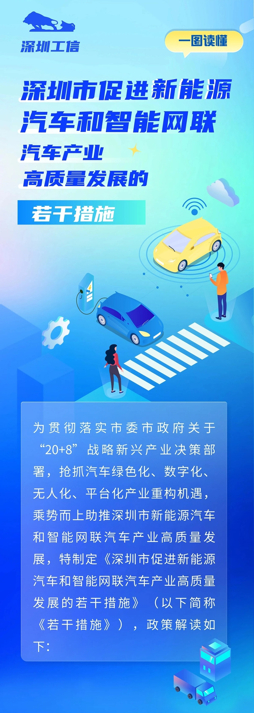
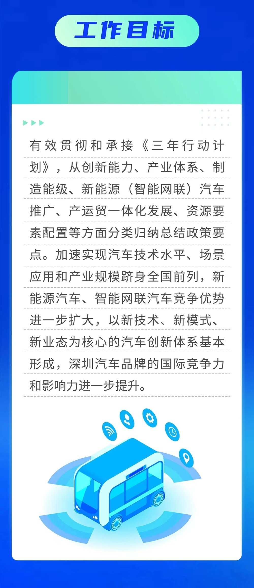
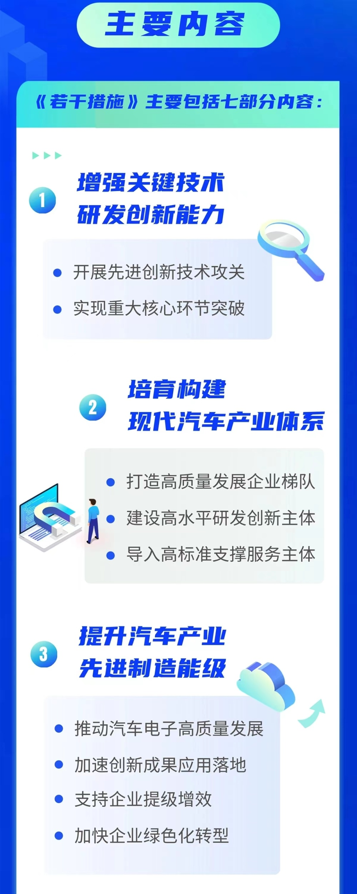

# 深圳：鼓励高端微控制器、计算芯片等汽车芯片实现自主突破

财联社11月27日讯，深圳八部门联合发布《深圳市促进新能源汽车和智能网联汽车产业高质量发展的若干措施》。其中提到，提升电动化及清洁化水平。延续和优化新能源汽车车辆购置税减免等政策，鼓励淘汰“国Ⅳ”及以下排放标准的普通小汽车，支持老旧汽车更新消费。鼓励新能源汽车下乡，进一步优化汽车限购措施。巩固公交及出租领域全面电动化成果，延续执行网约车运输证管理政策。加快“电力充储放一张网”建设，支持通过换电、虚拟电厂、光储充一体化等多种创新模式助推公共领域车辆电动化。对燃油动力更新置换为LNG动力的重型货运车辆(含港口内拖车)，按规定给予购置补贴，对港区内使用LNG拖车按规定予以运营资助。探索开展纯电动短途运输、城建物流以及矿场等特定场景重型货车运营示范。对符合条件的氢燃料电池汽车按照广东省奖补政策予以购置补贴和车辆运营补贴支持。

其中还提到，实现重大核心环节突破。围绕车规级芯片、车用操作系统、中央计算平台、新体系动力电池等产业核心领域和重要环节，支持针对重大技术系统、重大工程、重大装备等进行重点攻关，按项目总投资的一定比例予以不超过3000万元资助。采用“赛马制””“揭榜挂帅”等方式，鼓励高端微控制器
(MCU) 、功率器件、电源控制模拟芯片、车内/车间通信芯片、高算力主控芯片、计算芯片、系统级芯片 (SOC)
等汽车芯片实现自主突破。支持围绕先进动力电池、电机电控系统等电动化领域，激光雷达、毫米波雷达、车载摄像头、高精度地图与定位、域控制器等智能化领域，车用无线通信、云服务终端等网联化领域，操作系统、智能驾舱、电动化平台等共性基础技术领域，以及汽车功能安全、信息安全等领域开展关键技术及关键零部件攻关，根据项目评审结果予以不超过1000万元资助。

全文如下：

深圳市促进新能源汽车和智能网联汽车产业高质量发展的若干措施

为抢抓汽车绿色化、数字化、无人化、平台化产业重构机遇，推动汽车产业高质量发展，根据《深圳市加快打造“新一代世界一流汽车城”三年行动计划（2023-2025年）》《深圳市培育发展智能网联汽车产业集群行动计划（2022-2025年）》等文件，结合我市实际，制定本措施。

一、增强关键技术研发创新能力

（一）开展先进创新技术攻关。支持围绕先进动力电池、电机电控系统等电动化领域，激光雷达、毫米波雷达、车载摄像头、高精度地图与定位、域控制器等智能化领域，车用无线通信、云服务终端等网联化领域，操作系统、智能驾舱、电动化平台等共性基础技术领域，以及汽车功能安全、信息安全等领域开展关键技术及关键零部件攻关，根据项目评审结果予以不超过1000万元资助。（责任单位：市科技创新委、工业和信息化局）

（二）实现重大核心环节突破。围绕车规级芯片、车用操作系统、中央计算平台、新体系动力电池等产业核心领域和重要环节，支持针对重大技术系统、重大工程、重大装备等进行重点攻关，按项目总投资的一定比例予以不超过3000万元资助。采用“赛马制”“揭榜挂帅”等方式，鼓励高端微控制器（MCU）、功率器件、电源控制模拟芯片、车内/车间通信芯片、高算力主控芯片、计算芯片、系统级芯片（SOC）等汽车芯片实现自主突破。（责任单位：市科技创新委、工业和信息化局）

二、培育构建现代汽车产业体系

（三）打造高质量发展企业梯队。针对具备核心竞争力的新能源乘用车及商用车企业、系统解决方案企业及零部件企业，重点推动其制造、研发、采购、结算等业务总部落户，对符合条件的企业予以资金补贴、用地用房保障、人才奖励等多维度政策支持。依托新能源汽车产业基金加强实业与产业资本联动，支持设立国内外整车龙头与解决方案、核心零部件企业的合资实体，探索开展新型汽车联合生产制造模式。鼓励在关键核心领域培育专精特新“小巨人”企业、专精特新中小企业、制造业单项冠军企业，按规定予以支持。（责任单位：市工业和信息化局、发展改革委、财政局、国资委、中小企业服务局）

（四）建设高水平研发创新主体。推动高校和职业技术院校设立车辆工程学科以及汽车与能源、交通、信息通信、城建等领域的交叉学科。鼓励企业联合市内外高校和职业技术院校探索“订单式”人才培育模式，围绕前沿领域打造一批博士后科研工作站、博士后创新实践基地、校企联合培养基地。鼓励建设一批市级重点实验室、工程研究中心、企业技术中心，针对关键领域布局市级及以上产业创新中心、制造业创新中心以及技术创新中心。支持新能源整车企业落地研发机构，按规定比例给予不超过500万元资助。（责任单位：市工业和信息化局、教育局、人力资源和社会保障局、发展改革委、科技创新委）

（五）导入高标准支撑服务主体。积极引进国内外大型新能源汽车和智能网联汽车检验检测及认证机构，支持相关主体大力提升新能源汽车和智能网联汽车检验检测能力，建设集设计、开发、测试、交易、服务于一体的数字化集散中心，对符合规定的公共服务平台，予以不超过1000万元资助，项目运营期按其上年度审定费用的一定比例给予最高不超过500万元资助，运营期累计资助不超过三年。（责任单位：市工业和信息化局、科技创新委、发展改革委、市场监管局，各区政府、大鹏新区管委会、深汕特别合作区管委会）

三、提升汽车产业先进制造能级

（六）推动汽车电子高质量发展。推进车用操作系统、车规级芯片、自动驾驶算法、域控制器、智能座舱、智能传感器等产业链核心领域汽车电子业务发展，鼓励企业采购自主可控的汽车电子产品，对于通过管理体系、功能安全认证以及可靠性测试等车规级产品认证或汽车行业专属管理体系认证的企业，按认证费用的一定比例予以资助，单个企业最高不超过2000万元。（责任单位：市工业和信息化局、市场监管局）

（七）加速创新成果应用落地。围绕新一代模块化高性能整车平台、车身一体轻量化、底盘一体化、线控底盘集成化、多能源动力系统集成、基于域控制器的新型电子电气架构以及能量管理为核心的智能控制等整车技术；先进电池材料、电池结构优化、固态电池、燃料电池等新一代电池技术；新型驱动电机、多合一电驱动总成、第三代功率半导体、轮毂电机等电机电控前瞻技术；车规级芯片、“车能路云”一体化应用、工业设计软件、通用大模型等智能化技术加速实现创新成果转化，按项目总投资的规定比例予以不超过1500万元资助。（责任单位：市工业和信息化局、发展改革委、科技创新委）

（八）支持企业提级增效。鼓励企业采用新技术、新工艺、新设备、新材料对现有设施、工艺条件及生产服务等进行改造提升。引导整车及零部件以高端化、智能化、绿色化、融合化为主攻方向实施技术改造活动，按现行政策，根据项目总投资一定比例给予事后资助。（责任单位：市工业和信息化局、发展改革委）

（九）加快企业绿色化转型。选取充电桩、动力电池等链条龙头企业率先开展碳足迹核算应用，逐步带动全产业链企业开展产品全生命周期碳足迹评价。支持产业链企业绿色化升级转型，通过绿电交易、节能减排服务等创新模式打造绿色园区、绿色工厂，对符合条件的企业按规定予以支持。（责任单位：市市场监管局、生态环境局、发展改革委、工业和信息化局）

四、加大新能源（智能网联）汽车推广力度

（十）提升电动化及清洁化水平。延续和优化新能源汽车车辆购置税减免等政策，鼓励淘汰“国Ⅳ”及以下排放标准的普通小汽车，支持老旧汽车更新消费。鼓励新能源汽车下乡，进一步优化汽车限购措施。巩固公交及出租领域全面电动化成果，延续执行网约车运输证管理政策。加快“电力充储放一张网”建设，支持通过换电、虚拟电厂、光储充一体化等多种创新模式助推公共领域车辆电动化。对燃油动力更新置换为LNG动力的重型货运车辆（含港口内拖车），按规定给予购置补贴，对港区内使用LNG拖车按规定予以运营资助。探索开展纯电动短途运输、城建物流以及矿场等特定场景重型货车运营示范。对符合条件的氢燃料电池汽车按照广东省奖补政策予以购置补贴和车辆运营补贴支持。（责任单位：市工业和信息化局、发展改革委、商务局、交通运输局、机关事务管理局、财政局、城管和综合执法局，深圳市邮政管理局）

（十一）完善补能基础设施网络。鼓励企业开展智能有序充电、柔性充电、超级快充等新型充电模式和光储充一体站、新能源汽车和电网双向充放电（V2G）等融合新技术的示范应用。引导社区采用“统建统服”模式，实现充电基础设施有序接入。加大配电网络建设和支撑力度，强化超充设施专项规划与电网、市政设施及管网规划有效衔接。加快“电力充储放一张网”建设，推动与虚拟电厂双向联动，助力建设源网荷储友好互动的新型电力系统。支持综合能源补给站（氢、油、电）、换电站及多功能智能杆建设，对符合建设条件的项目予以支持。制定出台加氢站管理办法，对建成并投入使用且日加氢能力500公斤及以上的加氢站，按照相关政策予以支持。（责任单位：市发展改革委、工业和信息化局，深圳供电局）

（十二）鼓励开展智能网联试点示范及商业运营。加快建设功能齐全、特色突出的智能网联交通测试场，打造智能网联汽车与智能交通全面融合的测试环境，支持企业参与智能网联交通测试场测试。有序开放街区、道路、机场、港口等作为智能网联车辆示范及商业化应用场景，鼓励在场景内开展自动驾驶出租车、短途接驳、清扫车、物流运输等形式的应用。（责任单位：各区政府、大鹏新区管委会、深汕特别合作区管委会、市前海管理局，市交通运输局、工业和信息化局、发展改革委、公安交警局）

（十三）丰富汽车消费体验场景。支持使用权交易、融资租赁、“车电分离”等新型汽车消费服务模式。壮大二手车交易市场，优化经销模式，研究制定二手车出口扶持计划，对二手车经销额按照规定比例给予奖励。支持华强北片区、光明国际汽车城片区、罗湖笋岗片区、福田交通枢纽等区域打造汽车产业特色街区。鼓励企业开展汽车改装示范、汽车影院、汽车露营基地、汽车文化俱乐部等相关文化活动，打造深圳汽车文化IP。（责任单位：市商务局、工业和信息化局、文化广电旅游体育局）

（十四）搭建动力电池回收利用网络。支持新能源整车企业、动力电池回收企业及资源再生企业协同发展，鼓励动力电池回收行业市场化、专业化、集约化发展，推动完善动力电池回收利用体系，支持开展成套化先进技术设备推广应用，推进动力电池规范化梯次利用和资源再生利用。（责任单位：市工业和信息化局、商务局、发展改革委、公安交警局、交通运输局）

五、支持汽车产运贸一体化发展

（十五）推动企业开拓国内外市场。统筹建立新车和二手车、整车和散装件、集装箱和滚装船的全方位产运贸体系，稳步扩大汽车贸易规模。扶持培育汽车批发零售企业（集团），积极引进汽车出口龙头企业，推动国际国内汽车制造企业在深设立出口贸易公司或授权在深贸易主体。积极招引滚装船公司，保障深圳港汽车滚装船基础运力。对通过深圳港水路运输（含滚装、集装箱方式）至其他港口的汽车，按照相关规定给予资助。支持企业通过中欧班列等陆路运输以及海路运输、多式联运等形式出口新能源汽车，对汽车外贸滚装航线，按航次予以资助。对企业新增（含新建、新购、新转）的汽车滚装船舶给予一定奖励。（责任单位：市交通运输局、商务局、工业和信息化局）

（十六）提高国际化合作交流水平。鼓励国际汽车行业组织在深设立分支机构或办事处，搭建企业海外发展服务平台。支持企业、机构和社会组织在绿色低碳、智能网联、基础设施等领域主导或参与国内外标准制定及修订，单项标准给予最高不超过100万元资助。鼓励企业加快海外业务布局，推动海外生产基地建设，在政策咨询、法律服务、海外融资、签证办理等方面予以支持。鼓励符合条件的企业参加国内外大型展会，按相关规定予以资助。支持举办高规格新能源汽车和智能网联汽车国内国际展会、论坛及赛事，对具有影响力和行业带动力的活动，按相关规定予以资助。（责任单位：市工业和信息化局、市场监管局、商务局、交通运输局、文化广电旅游体育局，市政府外办）

六、优化产业资源要素配置

（十七）优化产业空间布局。鼓励创新“深圳总部+飞地生产”新发展模式，支持国际总部、研发及母工厂项目落地深圳，推动本地企业在市外飞地合作共建汽车产业园。支持建设一批新能源汽车和智能网联汽车产业园区，优化产业用地战略空间储备库。提高工业空间利用效率，依托各区优质厂房资源，鼓励汽车电子等产业实现“工业上楼”。（责任单位：各区政府、大鹏新区管委会、深汕特别合作区管委会、市前海管理局，市工业和信息化局）

（十八）强化资金服务支撑。设立汽车消费金融机构，为新能源汽车消费提供专业化、集成化金融服务。发挥财政资金引导作用，积极吸引龙头企业、产业投资基金和投资机构，建设新能源汽车产业基金体系，完善多元化投融资体系，创新推出“车电分离”等专项融资产品，制定补短板项目金融政策，推动基础设施REITs试点，鼓励保险企业优化商业保险保障服务等，建立“零部件原材料-
整车生产-
终端应用”全产业链金融支撑体系。完善“一核双心多区”产业发展格局，支持深汕建设世界级汽车制造城，围绕优化产业空间及配套服务、招引新能源汽车产业链重点项目、推动重点企业提质增效等方面设立深汕汽车城专项资金。（责任单位：市财政局、地方金融监管局，国家金融监管总局深圳监管局，各区政府、大鹏新区管委会、深汕特别合作区管委会）

七、附则

本措施由市工业和信息化局负责解释，主要面向新能源汽车和智能网联汽车等相关产业主体，包括研发、生产和服务的企业以及其他事业单位、社会团体、民办非企业等机构。经市政府批准的重点企业和重大项目，支持比例和资助额度不受上述标准限制。

各责任单位自本措施生效日起3个月内制定出台实施细则或操作规程。鼓励各区政府、大鹏新区管委会、深汕特别合作区管委会、市前海管理局根据各自产业规划布局特点独立制定补充配套措施。本措施与本市其他同类优惠措施，由企业自主选择申报，不重复资助。

本措施自2023年11月27日起生效，有效期3年。《深圳市关于支持智能网联汽车发展的若干措施》（深发改〔2020〕297号）同时废止。

