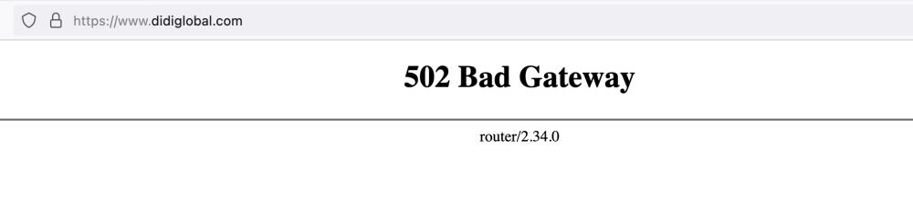

# 滴滴就APP“崩了”致歉：系统故障，目前正陆续恢复中

腾讯科技讯
11月27日消息，滴滴出行发布微博公告：非常抱歉，由于系统故障，今天晚间滴滴App服务出现异常，经技术同学紧急修复，目前正陆续恢复中。无法锁车的骑行用户无需原地等待，到达终点无法结账的乘客可正常下车回家，无需担忧因故障造成的车费问题，请大家耐心等待后续通知，后续都会妥善处理。

此外，滴滴官网页面呈现“502 Bad Gateway”空白页面状态、无法正常显示。

**此前报道：**

[“滴滴崩了”上热搜，多地用户反馈滴滴出行APP无法使用](https://news.qq.com/rain/a/20231127A0BJ6E00)

