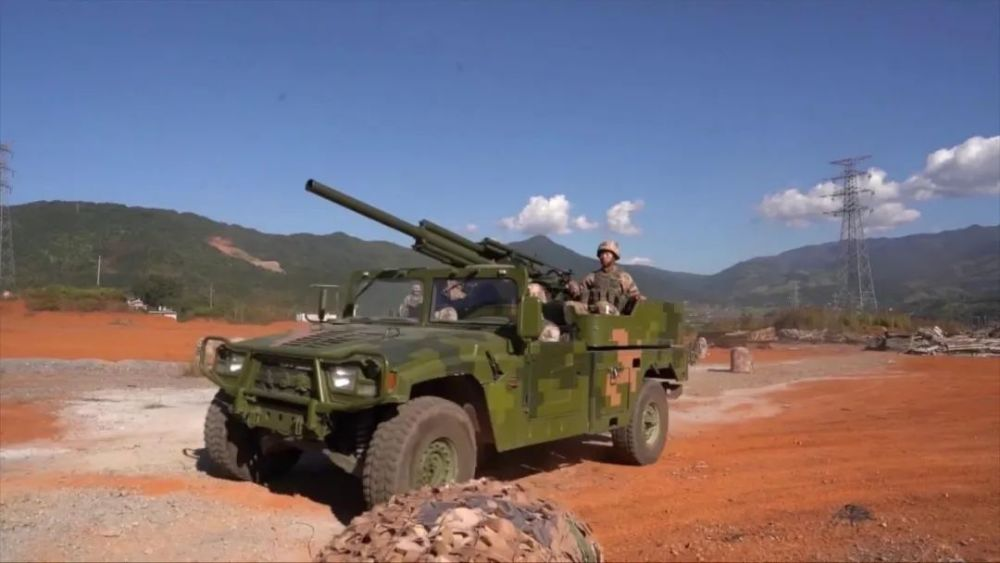
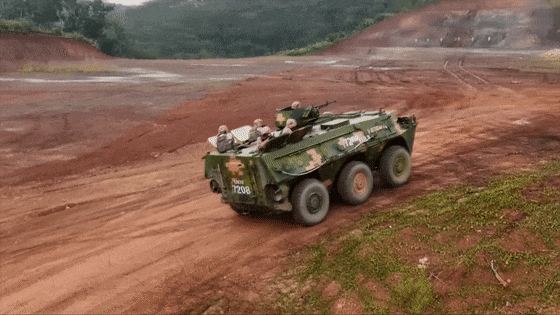
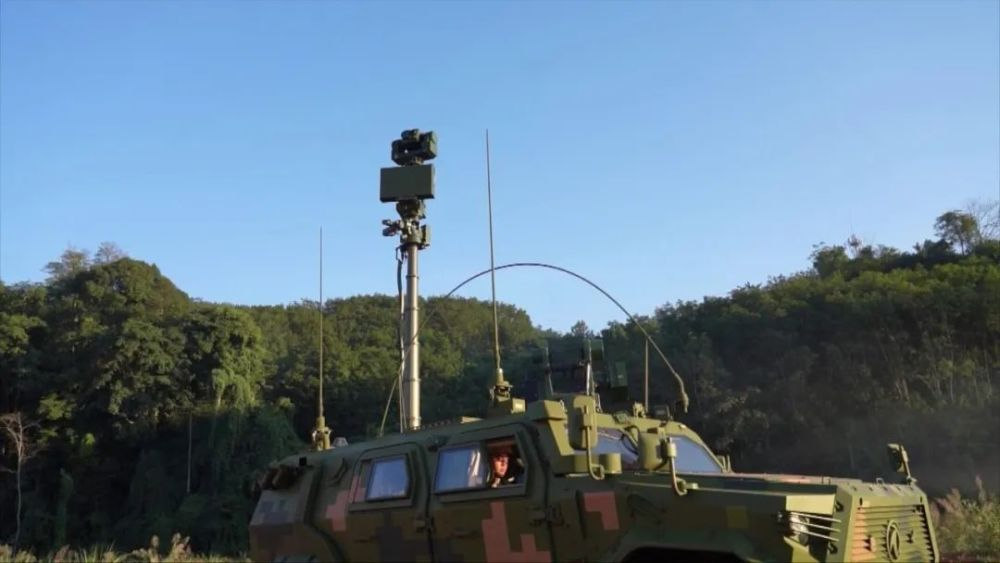
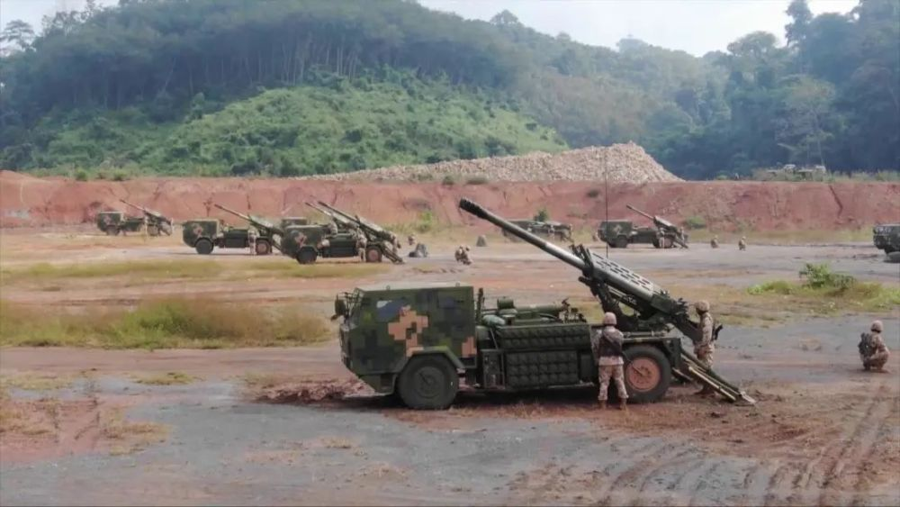
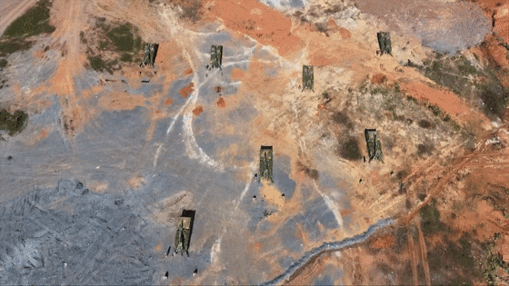

# 现场画面！南部战区位中缅边境我方一侧实战化演训

根据部队年度训练计划，从11月25日起，中国人民解放军南部战区组织战区陆军部队，位中缅边境我方一侧，举行为期3天的实战化演训。

重点检验战区部队快速机动、边境封控、火力打击等作战能力。

参演部队快速机动至演训地域，分区域、分方向、错峰错时开展实兵实弹演练。在战区的统一指挥下，各参演兵力按照作战编组，体系出击、协同作战，筹划组织边境封控等实战化演练。同时，多个火力打击群快速进入预设阵地，对临机指示目标进行分批次、多方向火力精确打击。

由轮式步战车组成的装甲突击分队，在精准情报信息引导下，快速向预设阵地机动，扫雷排爆分队迅即前出排爆。

道路障碍清除后，装甲突击分队迅速占领阵地，同步发射烟雾弹，掩护步兵分队对临机指示目标实施打击。车载速射火炮和迫击炮等各型火器交替发挥火力，分批次、多方向，对隐藏在山岳丛林中的火力点实施精准打击。

演习中，我方利用炮位侦测雷达，精确获取目标方位信息，自动分发至炮兵群火力终端，引导车载榴弹炮分队对目标实施猛烈火力压制。

多枚炮弹呼啸而出，扑向目标阵地，经过多轮火力打击，精准摧毁目标。

据现场指挥员介绍，此次实战化演训，预设多种情况，实兵实装拉动，远程快速机动，多天连贯实施，重点检验部队快速机动、火力打击等多种作战能力，展示了解放军坚决捍卫国家主权、边境稳定和人民生命财产安全的决心意志、胜战能力。

来源：CCTV-7《军事报道》

