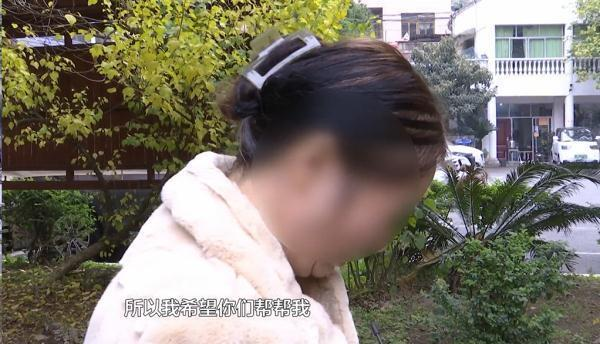
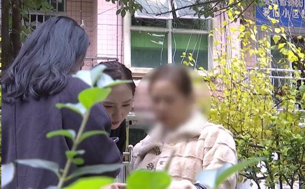
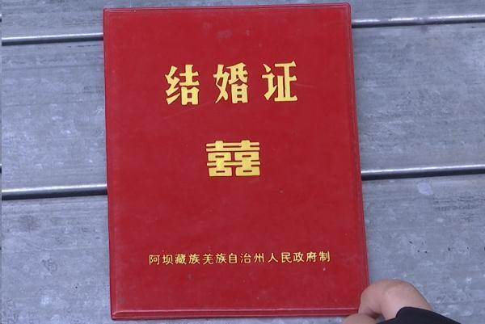
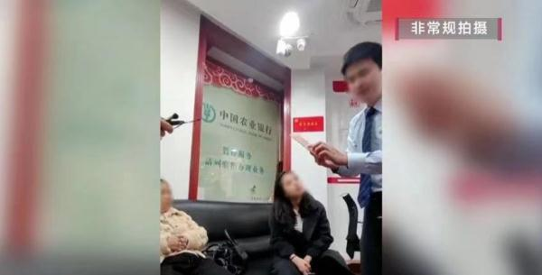
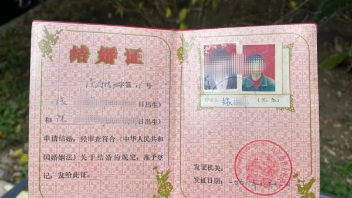
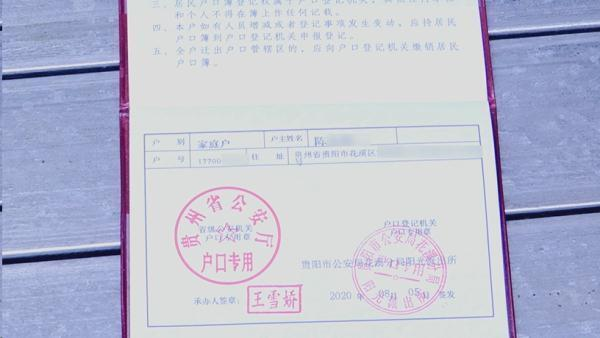
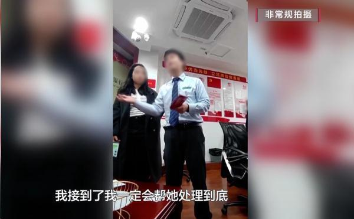
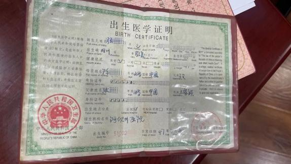

# 结婚证不能证明夫妻关系？女子到银行取亡夫资产被拒后悲痛又焦急

前段时间，陈女士的丈夫因意外不幸离世。突如其来的变故，让陈女士陷入悲痛当中。办完丈夫的后事后，一个更大的难题摆在她的面前。

陈女士：我真的是没办法了，希望你们帮帮我......

一见到记者，陈女士的情绪就失控起来，眼泪止不住地往下掉。

陈女士说，这几天她刚刚强忍悲痛打理好丈夫的后事，现在又因为取丈夫抚恤金的问题，被弄得六神无主。

陈女士：单位要打抚恤金和丧葬费到我丈夫的银行卡上，但是我不知道密码，要改完密码才能取这笔钱，银行要我出证明，证明我和丈夫的夫妻关系。然后我去居委会和派出所，他们都不给我开这个证明。

原来，陈女士的丈夫有一笔抚恤金和丧葬费，陈女士如果要拿到，必须凭借有效证明修改密码后才能取出。按照银行工作人员的说法，陈女士询问了辖区派出所和居委会，双方都表示，根据目前规定无法开具相关证明。

而让陈女士更加感到疑惑的是，她明明有与丈夫的结婚证，为什么银行却不认可呢？

11月24号，记者陪同陈女士来到了位于花溪区的中国农业银行，工作人员针对此事作了解释。

中国农业银行贵阳清溪路支行
工作人员：因为她和已故配偶，不在一个户口本上，结婚证虽然能证明，但是结婚证上只有名字没有证件号，不能证明是同一个人，如果她把钱取走了，真正的张某来找我们，我们要负法律责任的。

原来，陈女士与丈夫是在1996年领取的结婚证，由于属于老版证件，上面并没注明双方的身份证号。而丈夫张某早些年分配到新疆工作，户口也随之迁到工作地。因此，陈女士户口本上并没丈夫的信息。所以导致银行在确认流程上存在一定的认定困难，无法办理陈女士的诉求，而陈女士也因为一时拿不出有效证据，焦虑万分。

中国农业银行贵阳清溪路支行工作人员：派出所也不能开，居委会也不能开，就陷入一个死循环，那么我只能咨询我的上级银行。其实就算你们电视台不来，陈女士的事情我也一定会帮她处理到底。

在现场，记者和银行工作人员不断地翻阅相关规定，并询问陈女士各种证件的办理情况，试图找到一些蛛丝马迹。陈女士也在不断地提醒和交流中，突然想到了女儿的出生医学证明上标注有丈夫的身份证号，由此可与结婚证交叉印证其夫妻关系。在银行工作人员查看后，表示此材料证明有效，现场帮助陈女士办理了相关业务。

陈女士：非常感谢《百姓关注》的记者，同时也感谢银行工作人员积极地帮我处理这个事情。

记者 | 邓昕 黄学裕 黎妮（见习）

来源：百姓关注

