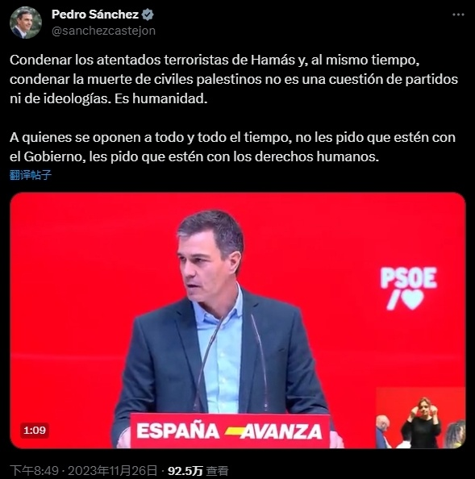

# 西班牙首相：谴责以军杀害加沙平民，无关意识形态，关乎人性

（观察者网讯）西班牙和以色列之间的“外交嘴仗”仍在继续。据西班牙《世界报》报道，当地时间11月26日，西班牙首相桑切斯在马德里举行的工人社会党（执政党）集会上表示，谴责以军“在加沙地带肆意杀害巴勒斯坦人”，与意识形态或政党无关，“这是一个人道问题”。

此前两天（24日），桑切斯同比利时首相到访接加沙和埃及的拉法过境点，期间，桑切斯谴责以军“不分青红皂白地杀害无辜平民”。此事件令西以两国外交争端升级，双双召见对方大使予以抗议。

_桑切斯26日重申：谴责以军“在加沙地带肆意杀害巴勒斯坦人”，关乎人性_

集会有超万名工人社会党成员参加。面对支持者，桑切斯重申了自己在访问中东地区时表达的观点。

桑切斯表示：“谴责像哈马斯之类的恐怖组织的卑鄙恐怖袭击，同时谴责在加沙不分皂白地杀害巴勒斯坦平民，这不是政党或意识形态的问题，而是一个人道问题。”话毕，桑切斯赢得在场所有支持者的掌声。

随后，他补充说，西班牙反对派不必在所有问题上与他领导的政府站在一起，“但我会要求他们支持人权，这就是我们所捍卫的权利”。

《世界报》称，桑切斯日前指责以军行为的表态，惹怒了以色列，同时在西班牙国内获得了巨大支持。其中，西班牙前首相萨帕特罗26日表示，西班牙在巴以问题上的立场将“被铭记为勇敢的”。萨帕特罗还说，自卫的权利绝不能针对无辜的儿童、平民，在任何国家，在任何时候，“杀戮就是杀戮”。

但与此同时，并非每个西班牙人都同意桑切斯的观点。26日，西班牙反对派人民党领导人阿尔贝托·努涅斯·费乔指责桑切斯引发了外交冲突，“让西班牙在国际上成为不太值得信任的国家”。

当地时间11月23日和24日，西班牙首相桑切斯和比利时首相德克罗结伴出行中东地区，先后会见了以色列总理内塔尼亚胡、以色列总统赫尔佐格和巴勒斯坦总统阿巴斯。

24日，二人来到拉法过境点，并举行新闻发布会。会上，桑切斯再次呼吁在加沙地带实现持久的人道主义停火，“以扭转加沙人民正在经历的灾难性局面”。他指出，以色列的军事行动没有遵守人道主义法，“不分青红皂白地杀害无辜平民，包括数千名儿童”，“这是完全不可接受的。”

德克罗表达了相似观点，称“停火刻不容缓，解决冲突的唯一途径是对话”。他表示：“现在需要停止杀害平民，已经有太多人伤亡了……对加沙的破坏是不可接受的。我们不能接受一个社会正在被毁灭。”

_西班牙首相桑切斯（左）和比利时首相德克罗24日访问拉法过境点，图自视觉中国_

然而，西班牙和比利时领导人的表态，引起了以色列方面的强烈不满。当日晚些时候，内塔尼亚胡办公室发布声明，表示“强烈谴责”。以色列外交部长则在一份声明中指责桑切斯和德克罗的“虚假声明”“助长了恐怖主义”，并表示他已召见两国大使，要求他们对这些言论进行解释。

对于以色列的怒火，西班牙选择据理力争。西班牙外交大臣阿尔巴雷斯（Jose Manuel
Albares）24日发布视频声明，称以方的指控“是错误的，是不可接受的”，西班牙“断然拒绝”。他还说，他已经召见了以色列驻西班牙大使，要求对方解释以色列政府的指控。

自本轮巴以冲突以来，西班牙多次指责以军罔顾加沙地带平民的人权。

早在10月17日，西班牙社会权利和2030议程大臣、左翼政党“我们能”党领导人贝拉拉（Ione
Belarra）便发布声明，呼吁西班牙政府向国际刑事法院申请，以战争罪起诉内塔尼亚胡和哈马斯。11月初，贝拉拉再次斥责以色列“有计划的种族灭绝”，呼吁西班牙及其他国家应与以色列断交，并实施制裁。

**本文系观察者网独家稿件，未经授权，不得转载。**

