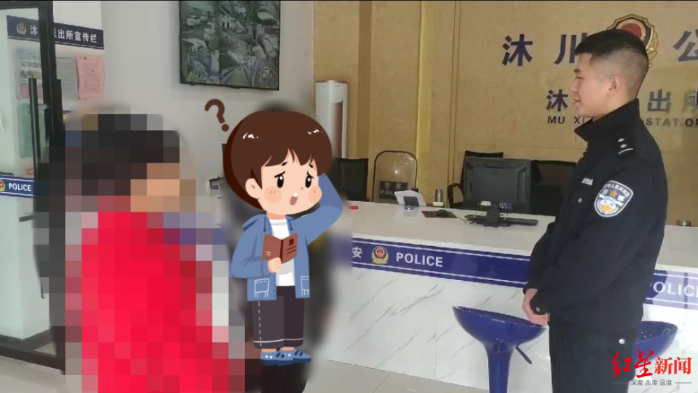

# 11岁男孩多次偷拿家里钱被妈妈带去派出所“自首”引热议 专家：不宜采用创伤性教育

近日，四川乐山一位妈妈带着经常偷拿家里钱的儿子去派出所“自首”，让警察帮忙教育孩子的新闻引发网友热议。事实上，近年来被父母“送进派出所”教育的孩子并非少数。有不少网友发问，总找警察帮忙教育孩子，真的好吗？

对此，心理专家和从事未成年人教育工作的专业人士认为，引导孩子正确行为的方法不仅仅是教育和惩罚，父母应以理解、耐心、温暖、说理的方式来伸以援手，而不宜采用粗暴的、恐惧的等创伤性行为。父母首先应该引导他们去思考问题的根源，激发他们对错误的认识，并培养他们改正错误的勇气和决心，要相信孩子有自我成长和自我纠正的能力，并给予他们足够的时间和空间去成长。

**特殊“投案人”：**

**11岁孩子因偷拿家里钱**

**被妈妈带到派出所“自首”**

“怎么了，小朋友？”“我偷拿了家里的钱，妈妈让我来自首……”近日，乐山市沐川县公安局沐溪派出所值班室，来了一位特殊的“投案”人——一名11岁的小学生，这到底是怎么回事呢？

_▲11岁男孩被妈妈带去派出所“自首” 图据沐川公安_

这位小朋友表示，自己好几次悄悄拿了家里的钱买东西，现在来投案“自首”。得知事情的来龙去脉后，民警对小朋友进行了法制教育，让他明白到盗窃是违法犯罪的行为，做错了事就需要承担相应的后果。

最终，在民警的一番耐心说教下，小朋友意识到了自己的错误，一字一句写下保证书，保证不再偷拿家里的钱，并向妈妈道歉，妈妈也温柔耐心地教育了孩子。

“谢谢警察叔叔，我以后不会做这种事了 ！”小朋友向民警道别，然后拉着妈妈的手回家了。民警表示，希望这一次的经历，能成为这位小朋友成长道路上“最珍贵的一课”。

**并非个案：**

**多地父母将孩子“送进派出所”**

**寻求警察帮助，原因多样**

红星新闻记者搜索发现，近年来，被父母“送进派出所”的孩子并不在少数，有的是因为偷偷从家里拿钱，有的是因为偷拿同学的玩具等。

据媒体报道，今年8月，浙江宁波一名10岁女孩被爸爸带去了派出所“自首”。因为她平时特别喜欢吃零食，爸爸担心她的健康，限定了吃零食的量。她便偷拿父母的钱，让同学做“代购”帮买零食。最终，在民警的监督下，女孩写下承诺书表示不会再偷钱。

8月28日，湖北襄阳也有一名孩子被家长送到派出所。小男孩偷了姑奶奶3.5元钱去买零食，妈妈发现后将他送到派出所。经过民警的一番耐心教育，男孩意识到自己偷钱的行为是不对的，承认了错误。

9月12日，安徽铜陵，一位母亲领着儿子走进当地派出所，称孩子多次偷拿玩具回家，曾教育他不可以这样做，可他根本没放在心里。当她发现孩子又一次偷拿玩具后，只好请求民警帮忙教育。在民警温和的教育下，男孩认识到错误并表示绝不再犯。

**网友热议：**

**父母才是孩子的第一责任人**

**总找警察帮忙，真的好吗？**

对于这些父母“大义灭亲”的行为，不少网友各执一词，吵得不可开交。

有网友支持家长的做法，认为孩子犯错，作为父母没有溺爱包容，必须想办法让孩子认识到自己的错误，这才是对孩子负责。同时，不少网友认为，偷东西不是一件小事，必须要从小严肃教育，这样孩子长大后才不会犯下更大的错误。

也有网友认为，这种行为属于占用社会资源，发生了这种事情，父母应该优先考虑家庭教育，而不是把教育孩子的责任甩给警察，并且动不动就用警察来吓唬和威胁孩子，这样会让孩子畏惧警察，以后遇事不敢报警。

“父母才是孩子的第一责任人。”还有网友建议，在养育孩子的过程中，相比于社会教育，家庭教育才是主要的教育手段。当孩子犯了错，除了送孩子“自首”这一方法外，家长也要多思考其他教育方式，更好地引导孩子成长。

**专家解读：**

**不宜采用创伤性教育行为**

**应引导孩子思考错误根源，给予更多理解**

对此，成都壹心公益发展中心专家、心理督导师张小琼告诉红星新闻，孩子成长过程中，在家里小额“偷拿钱”的行为，是经常发生的；这是由于孩子的自我与他人、社会的概念模糊，特别是“我的”“家庭的”“父母的”这些细微的差别，更不易理解；确立这些概念，一般要经历多个阶段的反复磨合与确认，12岁至18岁才达到高峰。

张小琼认为，对11岁的孩子来说，还没达到确认清晰理解这些概念的年龄，家长在孩子的个人体验与形成“我的”“他人的”“社会的”不同概念中，应以理解、耐心、温暖、说理的方式来伸以援手；家，是我们永远给予爱与支持的地方，是我们心灵的归属地；在家（也包括学校）都不宜采用粗暴的、恐惧的等创伤性行为，来遏制孩子对社会的探索与体验。

张小琼表示，虽然“恐惧”“害怕”的教育有时也起到对“不良行为”的遏制作用，但同时也可能会形成对家、对社会、对保护社会平安的警察及机构、对教育与帮助等，形成歪曲的理解与概念，这对孩子的社会融入、长久发展以及人生的幸福感等是非常大的伤害。

长期从事未成年人保护和教育工作的资深教师王娟认为，这种事之所以会引发网友热议，是因为很多父母在教育孩子的过程中都会遇到很多类似的棘手问题，而如何正确地引导孩子树立正确的价值观和道德观，是每个父母都需要面对的课题。

在王娟看来，引导孩子正确行为的方法不仅仅是教育和惩罚，还包括理解、关爱和耐心。对于孩子的错误行为，父母首先应该引导他们去思考问题的根源，激发他们对错误的认识，并培养他们改正错误的勇气和决心，要相信孩子有自我成长和自我纠正的能力，并给予他们足够的时间和空间去成长和发展。

红星新闻记者 顾爱刚

编辑 张莉 责编 任志江

