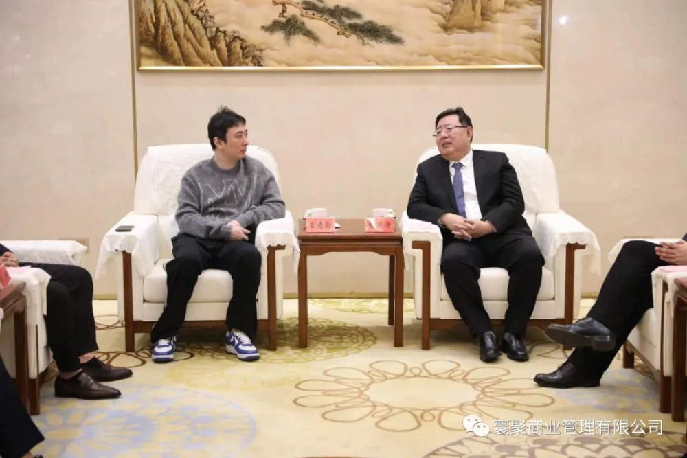
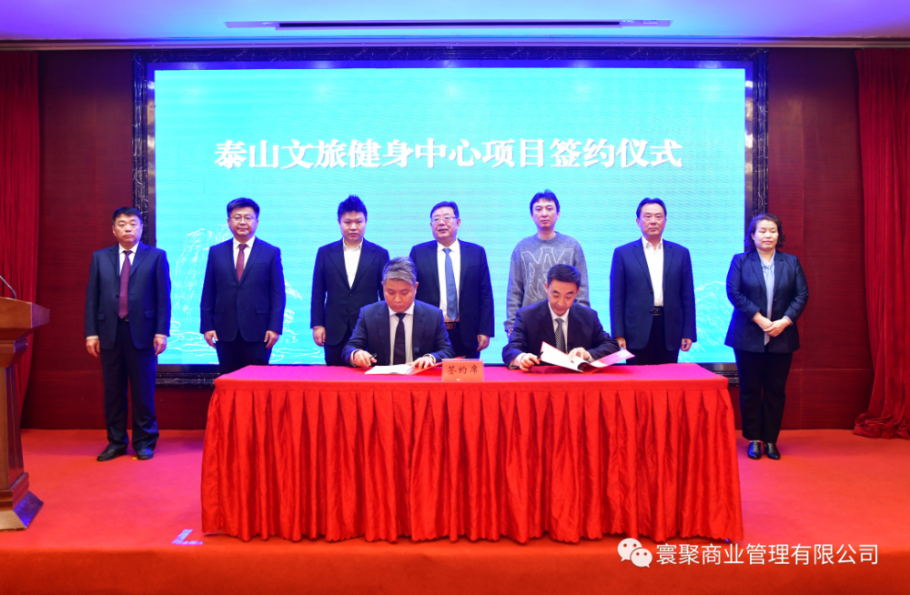
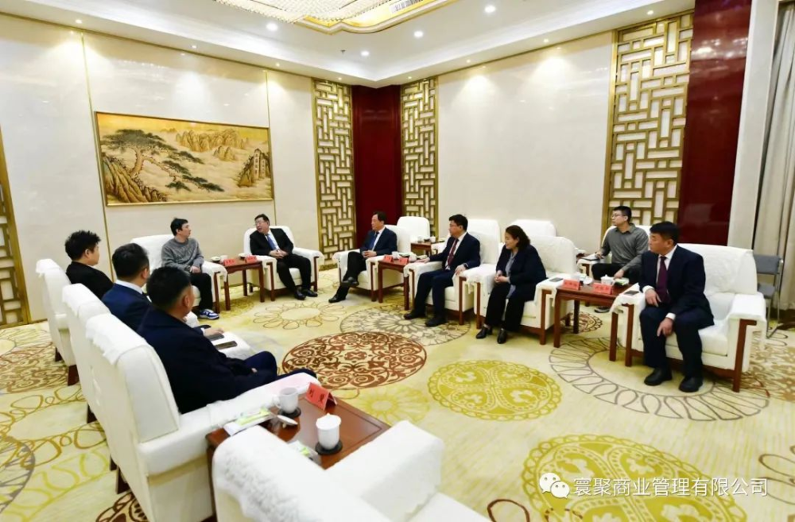

# 一身休闲装，王思聪现身山东，与泰安市委书记座谈

每经编辑：李泽东

据泰安市人民政府网11月28日消息，11月27日上午，泰山文旅健身中心项目签约仪式举行。
**泰安市委书记、市人大常委会主任杨洪涛出席活动并致辞，北京寰聚商业管理有限公司董事长王思聪出席活动。**

_图片来源：寰聚商业管理有限公司_

**仪式上，泰安市城市发展投资有限公司与北京寰聚商业管理有限公司签署项目合作协议。**

天眼查APP显示，北京寰聚商业管理有限公司（以下简称北京寰聚）成立于2023年7月20日，为香蕉计划成员，是一家从事商务服务业为主的企业，企业注册资本1000万人民币。
**王思聪任董事长，总裁李欣，执行总裁丁一。**

香蕉计划于2015年6月成立，旗下子公司包括香蕉娱乐、香蕉音乐、香蕉游戏传媒、香蕉影视、香蕉体育等。

穿透看，北京寰聚有两家股东杭州杯盏商业管理有限公司（以下简称杭州杯盏）、九桓置业发展（北京）有限公司，持股比例分别为51%和49%。

值得注意的是，天眼查APP显示，王思聪为杭州杯盏实际控制人，总持股比例为31.5%。

仪式上，杨洪涛代表泰安市委、市政府对签约仪式的成功举行表示祝贺，对企业长期以来对泰安发展的关心支持表示感谢。他指出，文化旅游是泰安的特色所在、优势所在、潜力所在。此次签约是平台优势、管理优势、人才优势和资源优势的强强联合，对于推动泰安文旅深度融合、完善泰安城区功能配套、提升泰安城市形象品位等，具有十分重要的意义。

仪式前， **杨洪涛会见王思聪一行** ，双方就文旅体育资源融合发展等方面进行座谈交流，达成广泛共识。

王思聪表示，北京寰聚商业管理有限公司将以
**“新场景、新玩法、新潮流”为切入点，以“复合业态、多重场景、深度体验”为手段，全力以赴把泰山文旅健身中心项目建设成集娱乐健身、四季滑雪、运动酷玩、青年社交和亲子科普于一体的年轻力、微度假目的地，实现以商承文、以文促旅、以旅兴商，推动文商旅融合发展。**
同时，公司将以此次签约为契机，与泰安市开展更深层次的战略性合作，以更加高效、更加务实的举措融到泰安经济社会高质量发展进程中。

据大众日报，泰山文旅健身中心项目位于长城路以西、泮河公园以南，总用地面积约67.34公顷（1010亩），总建筑面积约42万平方米，包含体育场（30000座位）、综合体育馆（6000座位）、游泳跳水馆（2000座位），以及全民健身馆。

据此前有关报道，泰山文旅健身中心项目曾被泰安市列为为民要办的10件实事之一。
**该项目2020年计划完成投资6.5亿元，截至目前已完成投资约3.5亿元。**

 _图片来源：大众视频截图_

每日经济新闻综合大众日报、泰安市人民政府网、天眼查

每日经济新闻

