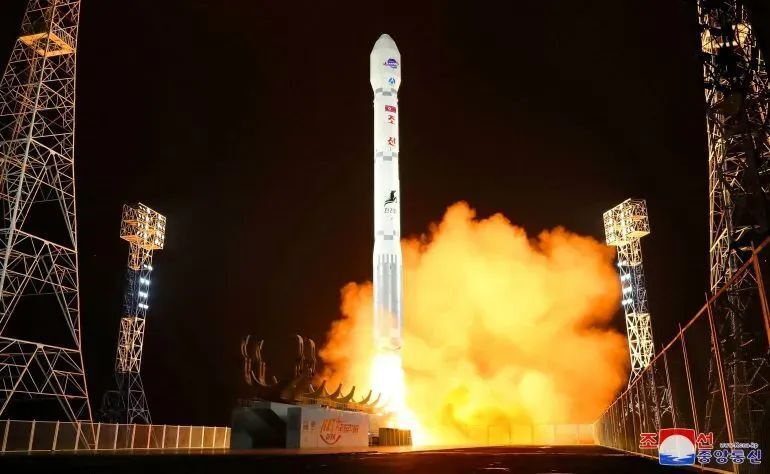
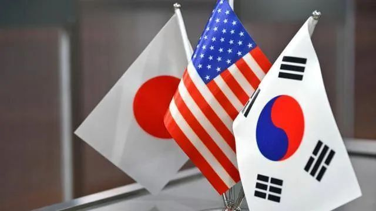

# 专家：朝韩对抗螺旋升级，半岛局势有向2017年“倒退”的风险

**直新闻：朝鲜发射侦察卫星之后，朝韩对峙态势在升级，美朝代表在联大会场互呛，您对半岛态势有何观察？**

**特约评论员 孙兴杰：**
朝鲜在上周发射了侦察卫星，近日朝鲜官方媒体宣布卫星已经回传照片，其中包括美国五角大楼、白宫以及多个军事基地等，当然，朝鲜没有公布卫星照片。韩国方面对朝鲜侦察卫星的实用性是有质疑的，但是不管朝鲜侦察卫星的能力如何，只要把卫星送上天，这件事情本身就构成了半岛局势升级的一个导火线。尤其令人关注的是，在卫星技术之外，朝韩之间进行了一场宣传战，朝鲜无疑将这颗卫星视为朝鲜重大的战略胜利，而韩国在质疑朝鲜卫星价值的同时，将在下个月初发射首颗侦察卫星。

首先，朝鲜发射侦察卫星是劳动党八大制定的战略计划的重要内容，今年已经发射过两次，但是均失败，此次发射成功标志着劳动党八大制定的战略目标迈进了一大步。从核武器到远程导弹，再到侦察卫星，朝鲜将战略武器开发作为国家的重点。国际社会关注的焦点不只是侦察卫星本身，而是朝鲜的远程投送能力。

其次，此次卫星发射之后，韩国在第二天就中止了2018年签署的9·19朝韩军事协议的部分条款，作为对朝鲜发射卫星的反应，而朝鲜则全面废止了这一协议，并且开始恢复之前拆除的前线哨所。这意味着2018年平昌冬奥会开启的半岛形势缓和的成果不复存在，半岛形势越来越回到了2017年的危险情势，相比于6年前，当下半岛形势更加危险。

最后，朝韩形成了对抗和对峙的螺旋。一方面，朝韩在过去几年进行着比较明显且越来越激烈的军备竞赛；另一方面，尹锡悦政府抛弃了文在寅时期的“阳光政策”，对朝鲜的政策是对等应对和报复。由此形成了愈加清晰和激烈的对抗局面，美韩军事同盟不断强化，另外，朝鲜的核威慑对象不只是韩国，还有美国。朝美代表在联合国会场互呛，朝方公开宣称，作为交战双方，美国以核武威胁朝鲜，朝鲜有权开发、测试、制造美国已拥有和开发的武器系统。这似乎是个危险的信号，核威慑游戏是危险的游戏，再加上朝韩在边境的对峙，擦枪走火的风险急剧上升。

**直新闻：朝鲜半岛持续对抗，美日韩三边军事合作也在升级，半岛是否会出现阵营对抗格局呢？**

**特约评论员 孙兴杰：**
当前朝鲜半岛的局势似乎有冷战的影子，也有人认为，朝鲜半岛是冷战的活化石，这种说法不无道理。朝鲜持续开发核导能力，试图建立对美国的核威慑，这似乎是冷战期间核威慑和核竞赛的重现。与此同时，美日韩的合作不断升级，三边举行联合军事演习，而韩国推行所谓的“全球枢纽国家”的外交战略，美韩同盟针对的目标超出了朝鲜半岛，而具有区域，甚至全球意义。美日韩戴维营会议以及美国对韩国的延伸遏制战略的确呈现出阵营的态势。

与此同时，朝鲜与俄罗斯之间的合作越来越紧密，双方签署了合作协议，朝俄合作与美日韩三边合作形成了螺旋对抗的态势，朝韩对抗越是激烈，同盟就会越紧密，形成阵营对抗的格局。我们需要审视和思考的是，阵营对抗对谁有利，对谁不利。半岛局势紧张，美国可以借此强化与韩国的关系，同时推进美日韩走向同盟化，进而将韩国引入到“印太战略”体系之中。而朝鲜强化与俄罗斯的合作，既可以得到粮食、能源等，同时也可以借助俄罗斯作为安理会常任理事国的影响力。至于俄罗斯选择与朝鲜合作，可以看作是俄乌冲突在东北亚的外溢效应。

在东北亚国家中，中韩是不愿意看到阵营对抗格局的，中韩关系也是避免阵营对抗的关键所在。我们看到，越是情势紧张，越需要中韩之间进行坦诚对话，中韩外长就在前两天举行了会谈，就相关问题进行了沟通与交流，中方愿为稳定半岛局势发挥作用。面对半岛形势的升级，中韩有必要就战略问题进行常态沟通和对话，以中韩合作阻断朝鲜半岛以及东北亚地区可能的冷战回潮。

作者丨孙兴杰，深圳卫视《直播港澳台》特约评论员

