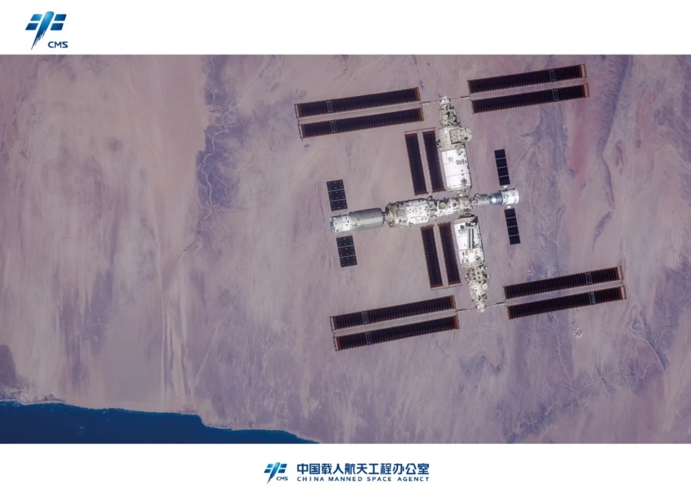
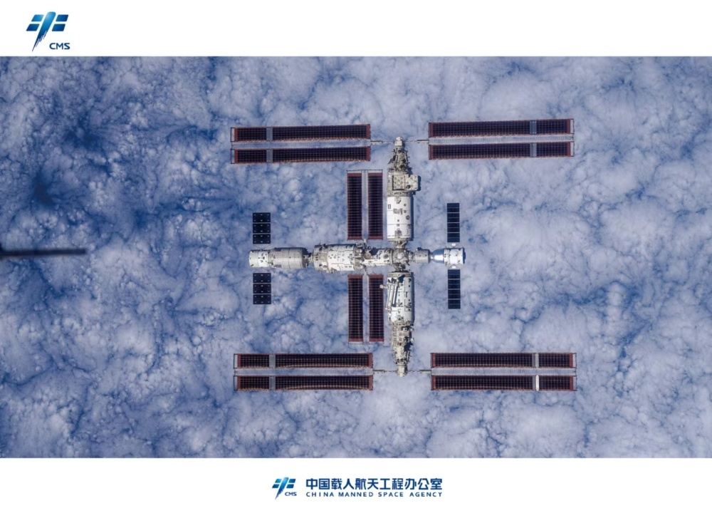
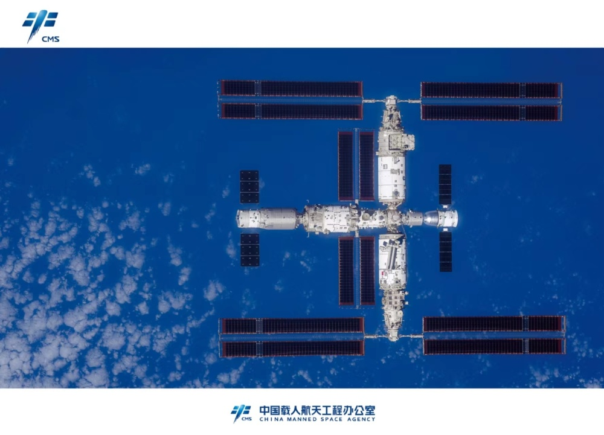

# 中国空间站全貌高清图像首次公布

据央视新闻援引中国载人航天工程办公室消息，11月28日下午，载人航天工程代表团出席由香港特区政府组织的媒体见面会。

神舟十六号乘组返回地面前手持高清相机通过飞船绕飞拍摄的空间站组合体全景照片在见面会上首次发布。这是我国首次在轨获取以地球为背景的空间站组合体全貌图像，也是中国空间站的第一组全构型工作照。

 _△摄影：神舟十六号乘组_

_△摄影：神舟十六号乘组_

 _△摄影：神舟十六号乘组_

当天，神舟十七号乘组还在空间站拍摄到神舟十六号飞船撤离返回的画面。

**相关报道**

[载人航天工程代表团在港参加媒体见面会 ](https://news.qq.com/rain/a/20231128A07Z0200)

