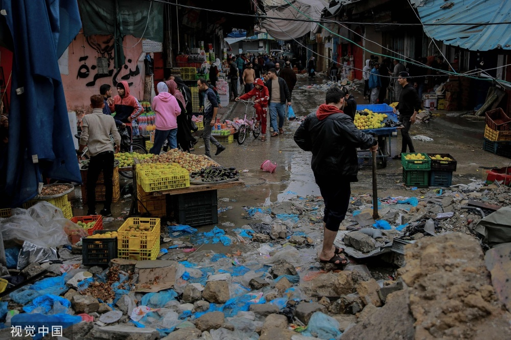

# 以色列证实临时停火协议延长两天，哈马斯或与其他团体达成新停火协议

（观察者网讯）综合《以色列时报》、《国土报》和半岛电视台报道，当地时间11月27日，以色列官员确认与哈马斯达成协议，将加沙地带的临时停火协议延长两天，以换取另外20名人质获释。

_当地时间11月27日，加沙城，以色列和哈马斯停火的第四天，巴勒斯坦人在被以色列袭击的建筑物残骸中购物。图自视觉中国_

此前，卡塔尔外交部发言人安萨里表示，以色列和哈马斯27日已达成协议，将临时停火协议延长两天。

卡塔尔外交部称，延长临时停火协议“是为了向加沙地带提供更多援助，并释放尽可能多的被扣押人员”。

当晚，一位白宫官员证实了这一协议。

27日晚间，哈马斯政治局成员哈利勒·哈亚说：“协议中写明了（延长的可能性），如果哈马斯释放更多的人质，停火时间就会更长。我们现在同意释放更多人质，并将协议延长两天。”

他表示，“我们想要结束战争，现在处于临时停火状态，但我们正在努力延长停火期限”。

此外，哈利勒·哈亚称，该组织正在努力达成一项新协议，其中包括释放更多人质，而不仅仅是妇女和儿童。在完成妇女和儿童被扣押人员的交换后，哈马斯方面可能会与其他团体达成新的停火协议。

白宫对延长临时停火协议表示欢迎，并称希望美国人能成为下一阶段被释放的人质之一。

半岛电视台指出，目前仍有8至9名美国公民被扣押。

联合国秘书长古特雷斯称，临时停火协议延长两天为加沙局势带来了“一丝希望”。但他也警告说，现在还没有足够的时间来满足加沙地带的巴勒斯坦人的援助需求。

路透社报道指出，在加沙地带南部城镇汗尤尼斯的流离失所者谈到了寒冷和雨水带来的困难、缺乏食物和电力、对回家的渴望等。他们所有人都希望继续停火。

而以色列人对于延长临时停火协议的意见分为两派，一派希望延长，以便所有人质都能回家，另一派则担心会“屈服于”哈马斯的要求。

一家旅游公司的经营者表示，他反对停火协议，认为以色列应该坚持达成更好的协议，释放所有人质，“我认为我们正在被操纵到一个对他们（哈马斯）有利的立场，就像在所有冲突中一样，如果这对一方有利，那就对另一方不利”。

当地时间11月24日上午7时，哈马斯和以色列在加沙地带的停火协议正式生效，停火为期4天。报道显示，前三轮被扣押人员交换中，已有39名以色列人和117名巴勒斯坦人获释。27日进行的第四轮被扣押人员交换中，共有11名以色列人和33名巴勒斯坦人获释。

**本文系观察者网独家稿件，未经授权，不得转载。**

