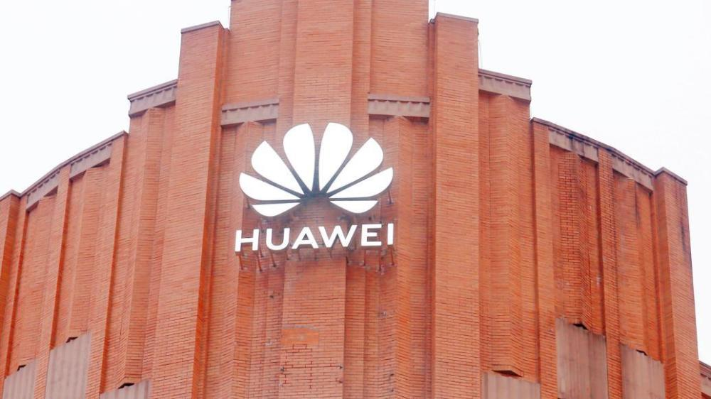

# 余承东：新成立的车企由华为主导技术研发方向，智选车伙伴会陆续加入

_华为 IC 资料图_

不独有长安汽车，其他华为智选车合作伙伴也会陆续入股新公司。

11月27日，华为智能汽车解决方案业务新公司引发资本市场汽车股强烈震荡。首批参与合资公司的长安汽车（000625）全天封死涨停，而赛力斯（601127）则一度大跌超7%，但收盘前勉强拉红。

前一天，华为披露，11月25日，华为与长安汽车于在深圳签署了《投资合作备忘录》。经协商，华为拟成立一家新公司，聚焦智能网联汽车的智能驾驶系统及增量部件的研发、生产、销售和服务。根据长安汽车公告，本次交易长安汽车及其关联方拟出资获取目标公司股权，比例不超过40%。

11月27日，华为常务董事、智能汽车解决方案BU董事长余承东对澎湃新闻记者表示，
**新合资公司还是由华为来主导技术研发方向，未来华为智选车业务的合作伙伴都会陆续加入合资公司** 。

根据华为和长安汽车的交易备忘录，华为拟将智能汽车解决方案业务的核心技术和资源整合至新公司，长安汽车及关联方将有意投资该公司，并与华为共同支持该公司的未来发展。新公司将致力于成为世界一流的汽车智能驾驶系统及部件产业领导者，并作为服务于汽车产业的开放平台，对现有战略合作伙伴车企及有战略价值的车企等投资者开放股权，成为股权多元化的公司。

**研发投入巨大，通过合资绑定“小伙伴”**

华为智能汽车解决方案业务最早的定位是做智能汽车增量部件供应商，类似于智能汽车时代的中国版“博世”。在具体落实业务布局时形成了三种业务模式：标准化的零部件模式、HI模式（Huawei
Inside模式）与智选车模式。

在华为自身不造车的大背景下，需要车企采用华为的零部件或解决方案。

但事实上，很多头部车企自研芯片，不愿意放弃自己的“灵魂”，使得华为业务拓展迟迟无法放量。因此，华为选择其他车企来共同研发和打造汽车，这是华为“智选车”模式。目前，赛力斯、长安、北汽、奇瑞、江淮等都是华为智选车合作伙伴。

华为通过智选车模式为自己培养了一批智能汽车解决方案业务的客户。比如，华为和赛力斯打造的问界，全系采用了华为的智能汽车解决方案。此外，华为自己的渠道通过销售问界汽车还可以获得类似经销商的分成。

但华为智选车规模还无法支撑华为智能汽车解决方案业务的盈利。余承东之前对外表示，要想车业务盈利，需要卖100万台车。

从华为对外披露的信息看，华为车业务研发投入相当大。据华为2022年财报，自智能汽车解决方案BU成立以来，累计投入已达30亿美元，研发团队达到7000人的规模。2022年华为智能汽车解决方案业务营收为20.77亿元。

这次通过合资公司方式把智选车合作伙伴引入来共同分担巨大的研发费用，当然也会分享未来合资公司的成长收获。

值得注意的是，就在华为和长安合作新闻公布后数小时，11月26日深夜，赛力斯在微信公众号“赛力斯集团”发布情况说明，回应华为成立智能汽车新公司的事情时表示，已收到共同投资的邀请。

赛力斯表示，其目前是华为车BU合作最深、范围最广、装车量最大的整车合作伙伴。根据双方签订的长期战略合作协议相关规定，车BU本次战略调整，不影响双方长期的战略合作伙伴关系，不影响对赛力斯的零部件供货关系，不影响为AITO问界车主和潜在用户持续提供产品和服务。

颇有意思的是，一天之后的27日，江淮汽车也在官网“官宣”积极与华为探讨参与，但随后又澄清“未收到华为邀请”。

11月27日，江淮汽车在声明中表示，本公司自2019年与华为开展战略合作以来，一直密切沟通，范围持续扩大。对于华为拟设立汽车智能系统及部件解决方案独立公司的有关事项，本公司高度关注，积极与华为共同探讨参与投资及合作的相关事宜。

27日深夜，江淮汽车（600418）发布情况说明称，公司于2023年11月27日在官网发布了《声明》，现就相关事项进一步说明如下：2019年，公司与华为开展战略合作，但目前未存在实质性进展，故前期未进行相关信息披露。此外，公司未收到华为共同投资邀请，且未参与投资及资本合作相关事项。

**华为模式对第三方解决方案公司有何影响？**

华为和长安的消息引发了汽车界广泛关注。

“华为这模式类似于Denso（日本电装公司）和丰田的关系，是个不错的趋势。”一家大厂的车计算负责人这样评价华为打造的平台，他同时也认为这多少对其他第三方解决方案公司有些影响。

这位负责人认为未来汽车行业还是会垂直分工，不可能一家车企全部自研来完成。

自动驾驶类芯片的研发投入是巨大的，即便对华为来说也不堪承受之重。一位本土自动驾驶芯片技术人士对澎湃新闻记者表示，从之前地方国资委入股的传闻到现在方案是大家都加入成立合资公司来共同分担，这两者差距还是挺大的，“共同研发是承担接下来的资金，这减轻不了多少华为的压力。”

这位技术人士表示，自动驾驶芯片技术本身并不难，难的是精度要不断打磨，这种打磨需要花费大量的时间和人工，成本巨大，“华为是‘遥遥领先’，其他家如果自动驾驶芯片还没有量产的话，已经没有机会了。”

不过，上述大厂车计算负责人则更乐观一些，他认为即便Denso（电装）和丰田的关系，丰田还是用其他公司的芯片，车企不会完全只用一家方案。

