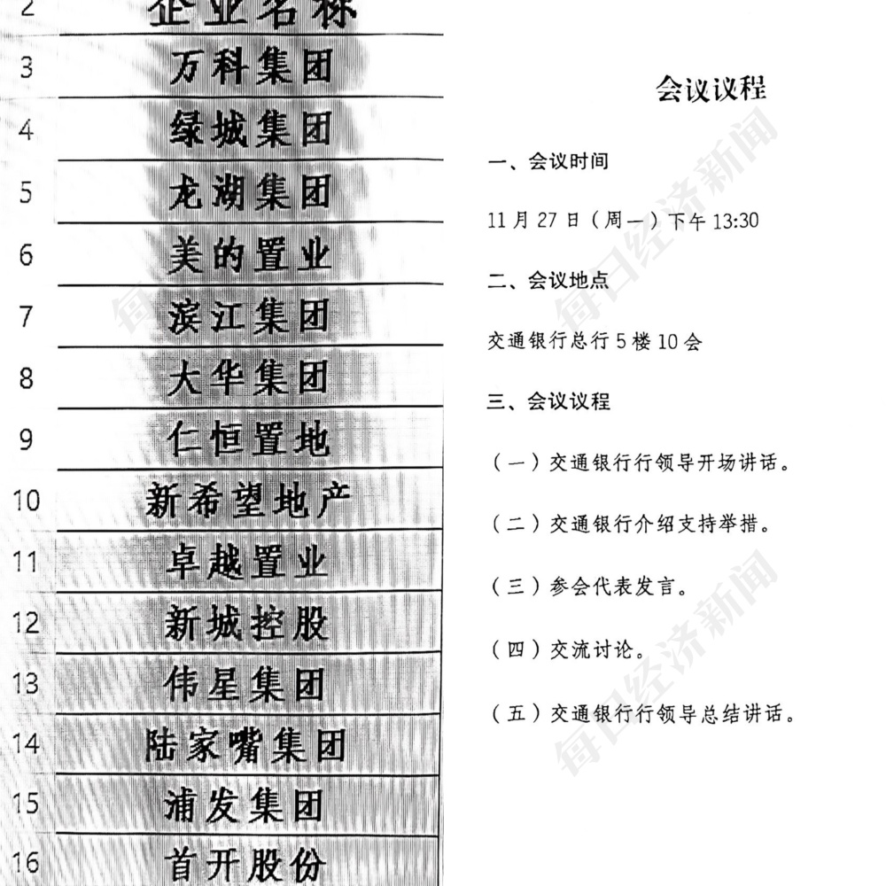
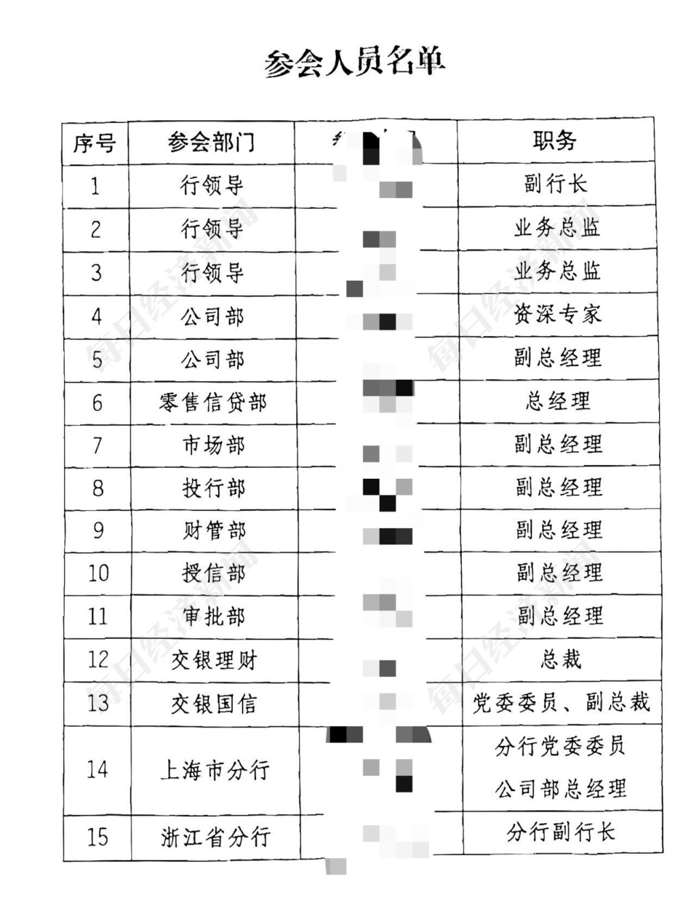

# 内幕！近5个小时，国有大银行和这些房企的座谈会谈了些什么

每经记者：包晶晶 刘颂辉 每经编辑：陈梦妤

“会议从下午1：30开到将近6点，这次（政策）要落地的，肯定会落地。”

11月28日，一家参会房企代表向《每日经济新闻》记者透露。

从“三道红线”到“三支箭”，再到“三个不低于”，房地产市场形势突变，监管层对开发企业的政策也随之调整。

11月27日下午，交通银行在上海召开座谈会，就央行、金融监管总局、证监会三部门提出的“三个不低于”指标要求，向房地产企业代表进行调研。

据《每日经济新闻》记者获取的会议资料，参会人员中包含交通银行副行长、业务总监等领导，以及各部门副总经理等。房地产企业包括万科、绿城、龙湖、美的置业、滨江集团、大华集团、仁恒置地、新希望地产、卓越置业、新城控股、伟星集团、陆家嘴集团、浦发集团和首开股份等。

_参会房企和议程 受访者供图_

据建设银行官方平台11月28日消息，建行也与6家房企代表召开了支持房地产企业合理融资需求银企座谈会。

业内专家认为，“三个不低于”指标要求提出以后，房企合理融资需求将得到进一步支持。

各家参会房企意见较为集中

11月27日下午，交通银行在总行召开座谈会，会议议程包括行领导开场讲话，交通银行介绍对房地产企业的支持举措，参会房企代表发言。

从参会人员的级别可以看出对会议的重视程度。交通银行方面的参会人员包括3位行领导，8位业务部门副总经理或总经理，以及4位来自交银理财、交银国信、上海分行、浙江分行的总裁或副行长。

 _银行参会领导 受访者供图_

有参会房企相关人士向每经记者介绍，整场会议主要是围绕管理部门提出的“三个不低于”指标要求，向房地产企业负责人调研，相关意见会在后期细则里体现。

会议还进行了交流讨论，每家房企都做了发言，各家企业的意见比较集中，比如对当前房地产市场的看法、房企经营性贷款、预售资金监管等问题。

房企经营性贷款方面，比如江苏、浙江一些大型商业地产项目存在经营性贷款需求，但得不到金融机构支持。

经营性贷款方面，开发贷款展期以后，项目销售周期还是比较长，后期如何处理，开发贷款能否进行置换。

项目预售资金监管账户方面，银行方面推出了预售资金监管保函等产品，房企能否用保函形式，将一部分资金从监管账户出提取出来。

华东地区一家房企内部人士透露，对于座谈会提出的问题，银行方面进行了收集，但未给出明确答复。

11月27日，建设银行发布消息，近日召开了支持房地产企业合理融资需求银企座谈会，银企双方研讨了房地产市场形势、业务发展机会和未来发展方向。

记者留意到，其中有6家参会房企同时也在交通银行的参会名单里。

座谈会上，房企代表分享了市场形势、困难挑战以及企业的应对策略。企业表示，近期国家出台了一系列支持政策，银行等金融机构积极响应、快速行动，逆周期调节正在发挥作用，融资环境逐步改善；房地产市场仍有结构性机会，对未来仍有坚定信心。

目前面临阶段性困难、流动性紧张，市场预期有待进一步稳定，下一步关键在于提升精细化管理水平和产品力。

建设银行表示，今年以来，对公房地产业贷款投放近3000亿元，个人住房贷款投放近万亿元，房企债券投资和承销金额超300亿元。对于正常经营的房地产企业，建设银行坚决不惜贷、不抽贷、不断贷，稳定金融支持，满足其合理融资需求。

“银行不会无差别投放贷款”

近日，央行等三部门召开金融机构座谈会，讨论多项房地产金融宽松政策，重点提出了“三个不低于”指标要求，以及50家规模房企的“白名单”。

“三个不低于”主要为：各家银行自身房地产贷款增速不低于银行行业平均房地产贷款增速；对非国有房企对公贷款增速不低于本行房地产增速；对非国有房企个人按揭增速不低于本行按揭增速。

“三个不低于”指标要求提出后引发房地产行业广泛关注，在惠誉评级11月23日召开的“转型与挑战”线下会议上，上述指标要求被参会人士屡屡问及。

惠誉评级亚太区企业评级董事石露露认为，首先，全行业的房地产贷款增速为4%，而前两年也在低个位数的水平，所以意味着即便是所有银行要达到增速水平，也不会引起开发贷的大幅增长。

其次，首次提出了不低于银行投向非国有房地产企业的贷款增速。目前惠誉在评的民企只有一家是负面展望，其他都是稳定展望，意味着在未来12个月，这些公司的信用风险可控。

在这方面，石露露分析道，银行在投向民营开发商的时候，贷款通道没有完全关闭，但一直存在选择性。如果未来政策提出要求，预计银行还是会选择性向头部民企集中，而不会是无任何差别地投放贷款。

针对“三个不低于”具体要求，克而瑞方面分析指出，此类表述并非历史首次，最早在针对2015年小微企业融资难、融资贵的问题时就出现。

值得注意的是，此次政策旨在营造行业竞争氛围，从被动放贷到主动寻贷，缓解房企流动性不足及信用问题，有助于化解房企的债务风险。另一方面，受地产影响银行业盈利能力下滑，白名单扩围或增大银行风险敞口。对50余家白名单房企的援助若严格执行，可能会将当前地产存在的风险传递给银行体系。

“国有银行面临两难选择，既要完成硬性量化指标，又要控制自身风险敞口。通过国有银行增加对房企贷款，未解决当前销售端疲软的问题，获得贷款的房企虽能‘喘口气’，但债务风险并未完全化解，仍需积极去化偿还贷款。”克而瑞指出。

每日经济新闻

