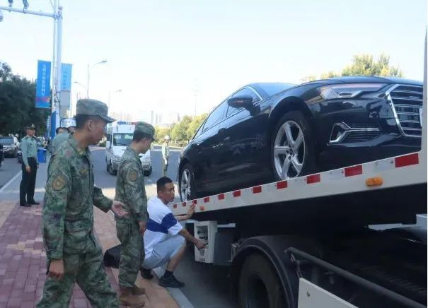
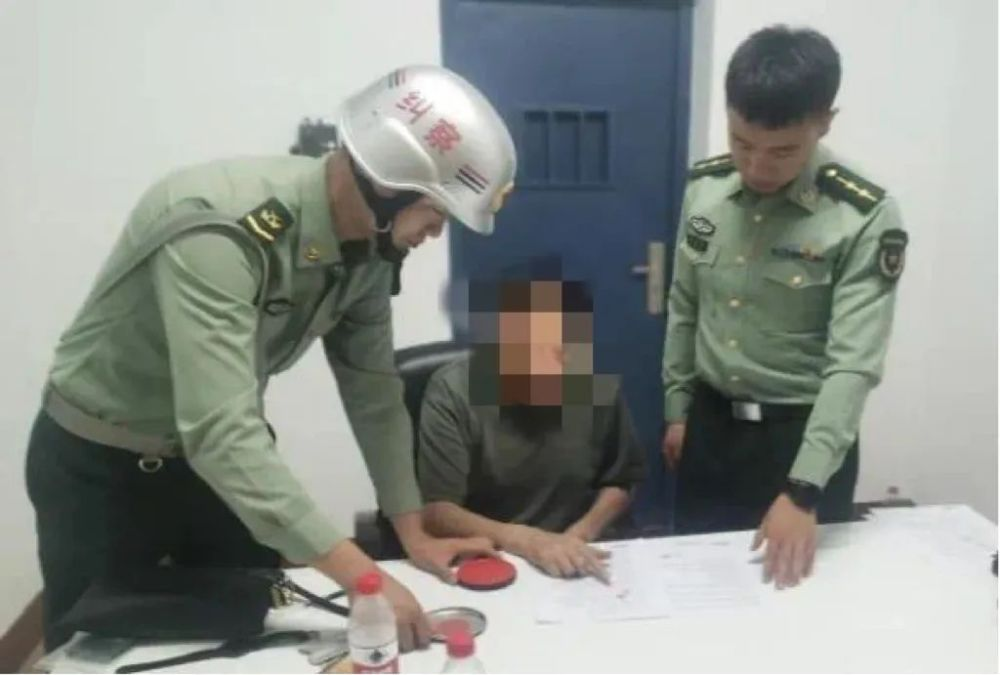
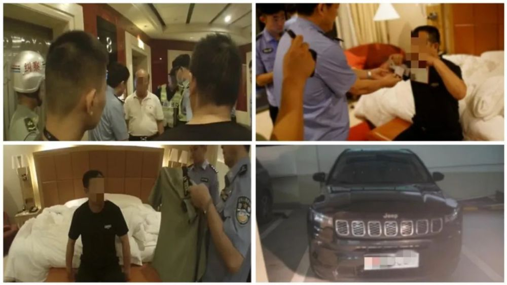
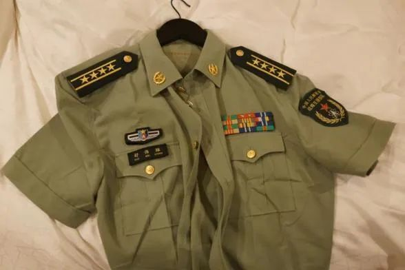
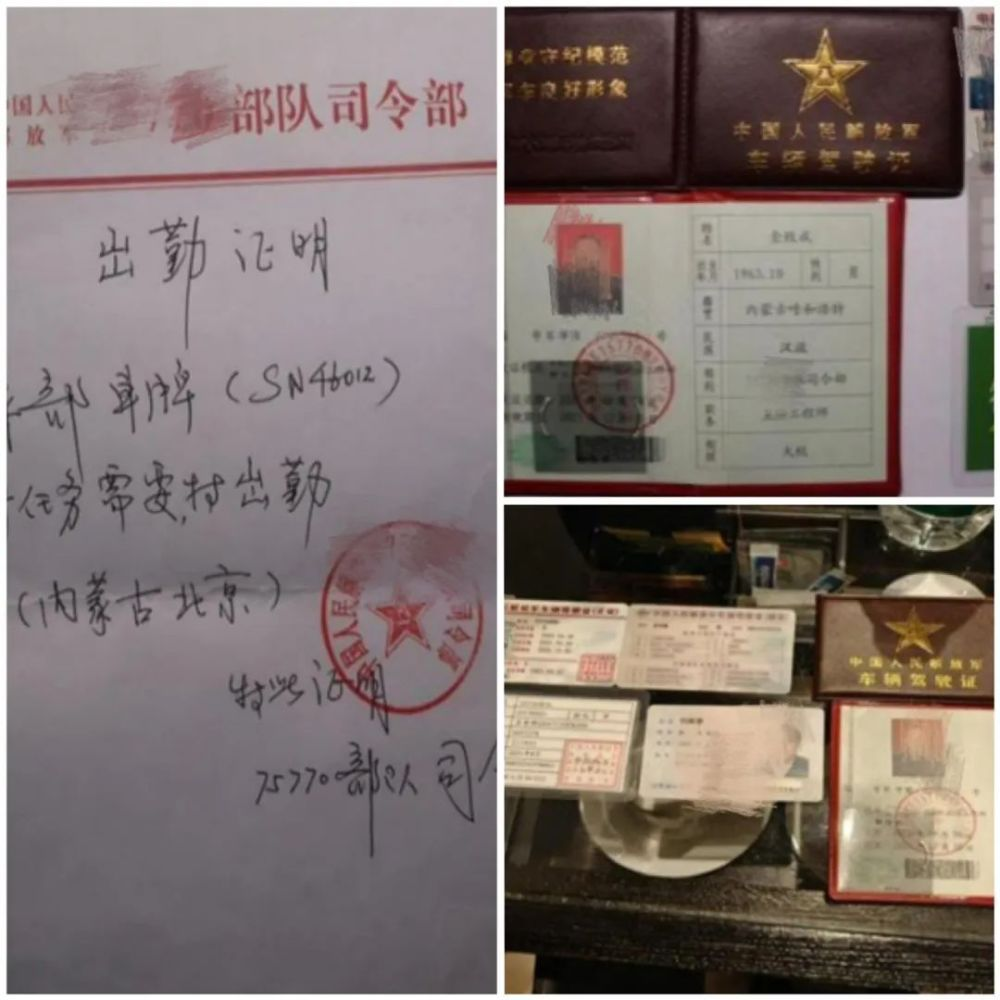

# 军警跨省抓捕假军人团伙：自称“军委部长”，诈骗金额超百万

近日，内蒙古军区与广东省军区跨省联动，成功捣毁一个假冒军人招摇撞骗的犯罪团伙。

内蒙古军区警备纠察执勤人员在呼和浩特市玉泉区查获一辆假冒军车，发现驾驶员金某持有 **假冒的军官证、行车执照、军车驾驶证和军队公文** 。

执勤人员迅速将其控制并调查询问，掌握到其上线舒某存在冒充现役军人招摇撞骗嫌疑，经常在珠三角地区活动。

执勤人员随即将金某移送公安机关立案侦查，同时将问题线索上报，通报广东省军区警备办公室。

在中央军委相关部门指导下，内蒙古、广东两地军警迅速启动跨省协查工作机制，对嫌疑人主要活动地排查后，发现嫌疑人驾驶假冒军车前往深圳。

广东省军区驻深圳警备执勤人员联合公安干警在深圳一酒店内将正在实施诈骗活动的舒某及其同伙6人抓获，现场查获军队证件、军服等涉军假冒物品数件，不到24小时，就将全部涉案人员抓捕归案。

经公安机关调查发现，
**舒某等7人自称是“军委部长”、“军委某部司令”、“某省政法委书记”等军地领导，多次以办理特招入伍、工作调动、协调关系为由，要求地方人员提供招待并索要财物，诈骗金额达一百多万元**
。

该犯罪团伙成员已被公安机关刑事拘留，案件仍在进一步侦办中。

**军人形象不容抹黑。**

监制丨刘一鸣‍‍

主编丨孙毛宁

记者丨马健翔 许熙 张翔宇 赵建勋

编辑丨谷帅

©央视军事

