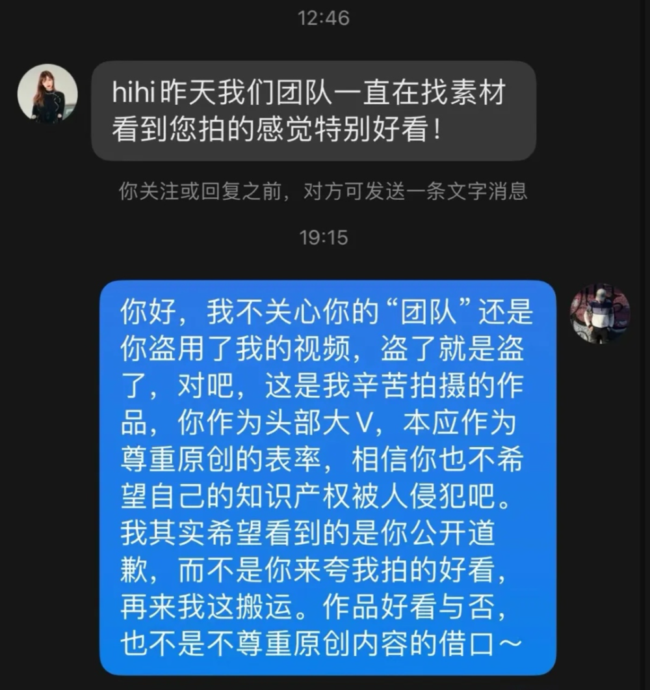

# ​千万粉丝网红痞幼公开道歉

近日，有博主“丁亦然”发文称，千万粉丝网红“痞幼”盗用自己在冰岛拍摄的作品。

11月27日，博主丁亦然通过粉丝提醒后了解到，自己在冰岛拍摄的视频被千万网红痞幼盗用了几秒。有媒体表示，丁亦然看到后很惊讶“作为一个千万粉丝的博主，还要盗用别人的视频吗？要么是不懂著作权，要么就是不在乎和不尊重。”

丁亦然因2020年拍摄冰岛后被很多人喜欢，于是2021年后全职做自媒体，长期驻扎在冰岛拍摄。在举报下，平台对视频做了处理，现已查看不到涉事视频。

 _当事博主抖音主页截图_

27日晚，“痞幼”发布正式道歉声明表示，深刻意识到自己的认知有很多错误，可因为太多“想给自己的视频丰富点”的找素材诉求，失去了对艺术创作者初心的共情。

“丁亦然老师以及创作者，对不起。”随后，丁亦然表示接受对方道歉，也无任何其他诉求，只想以此事为例，告诉大家要尊重版权。

**网友评论**

据了解，“痞幼”是风靡网络的“机车女神”，后期也涉猎美妆穿搭领域，视频风格较为多样化，目前已经在抖音积累了2874万粉丝。

今年7月，男子朱某龙从海口骑共享单车到三亚，翻进痞幼的别墅“蹭”住半个多月，还把她的6瓶茅台喝光了。她称作案男子为“茅台野人哥”。痞幼还在视频中提醒大家，如果是在南方买了不常住的房子，一定要安装好监控，“不知道会不会有这种骑自行车300公里去你家喝酒的人”。之后，三亚市公安局吉阳分局就此事依法对朱某龙刑事拘留。

来源：红星新闻综合

