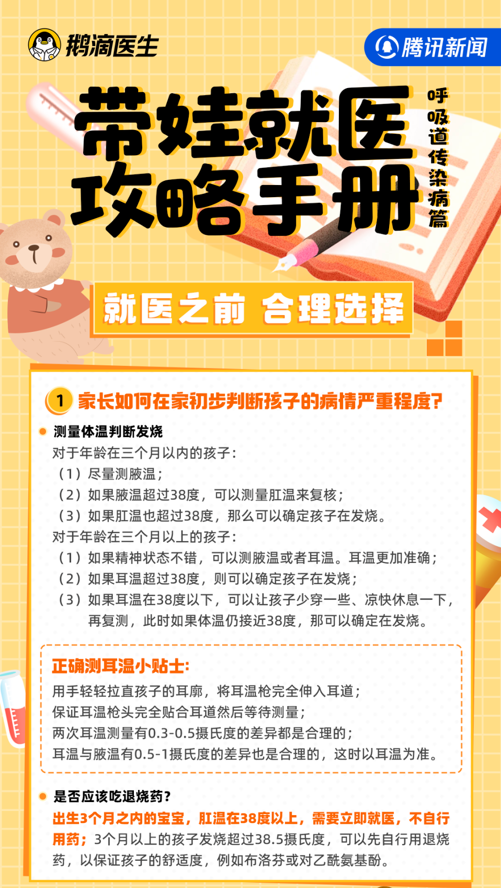
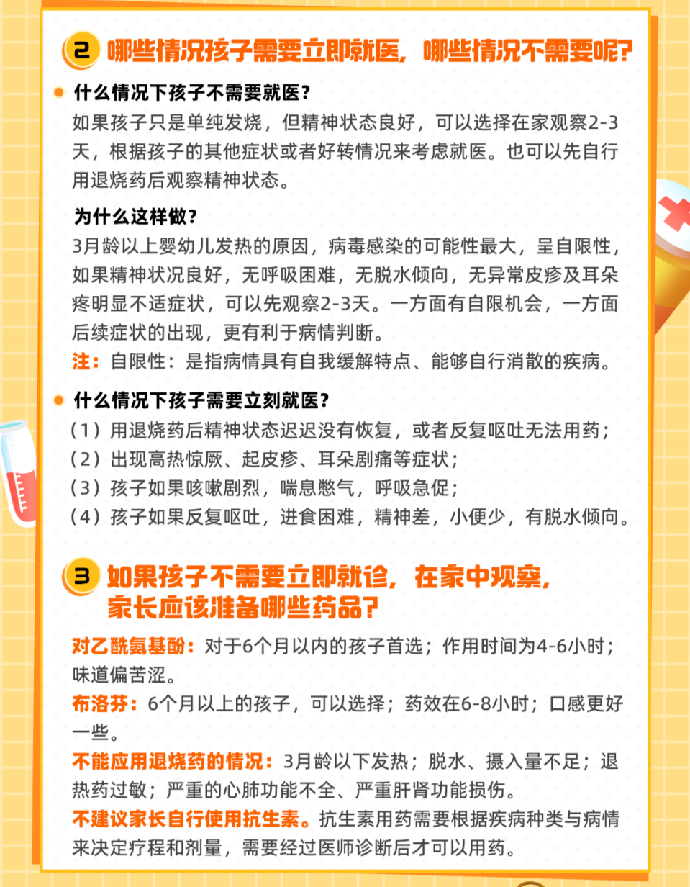
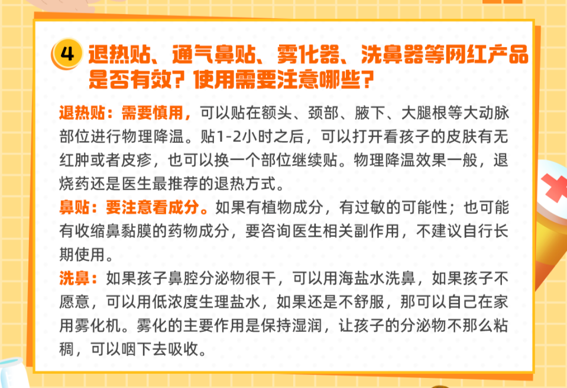
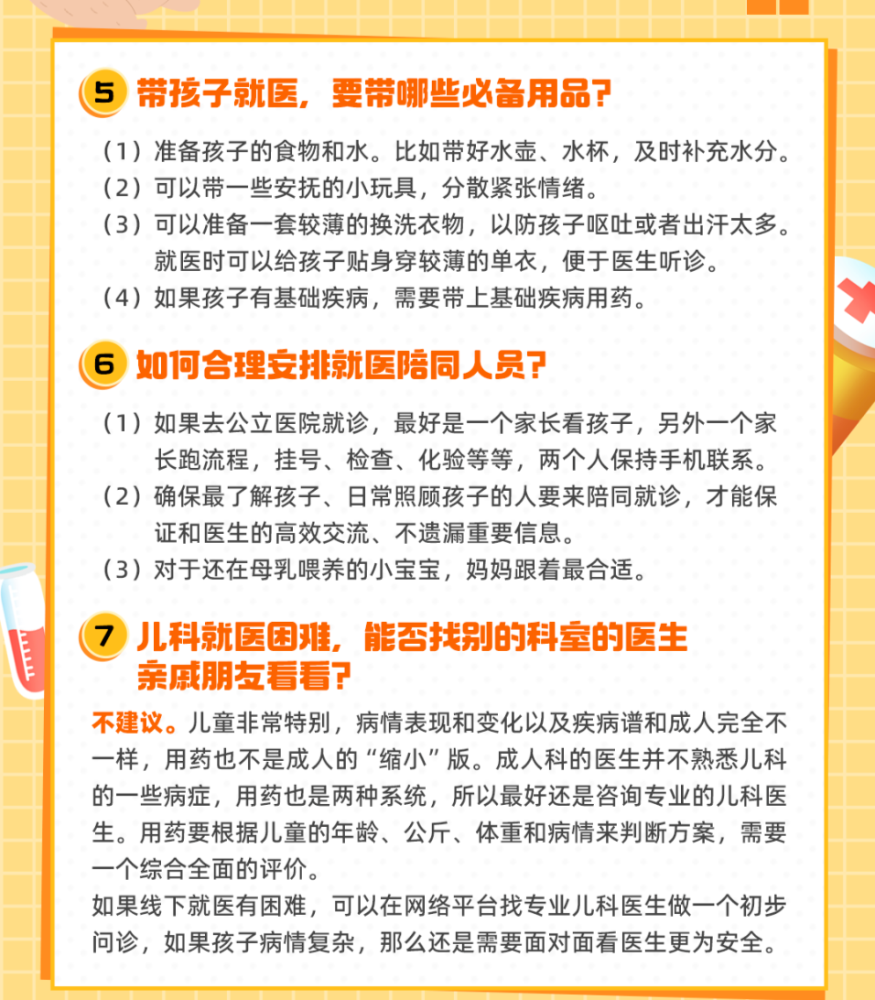
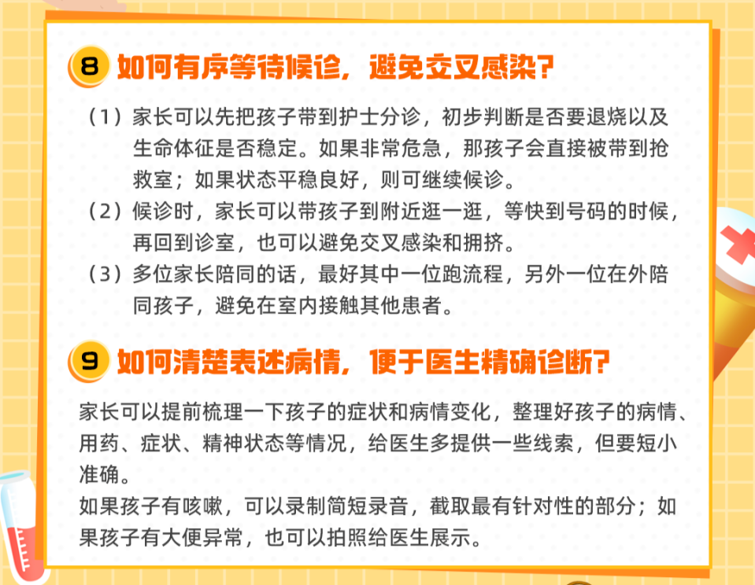
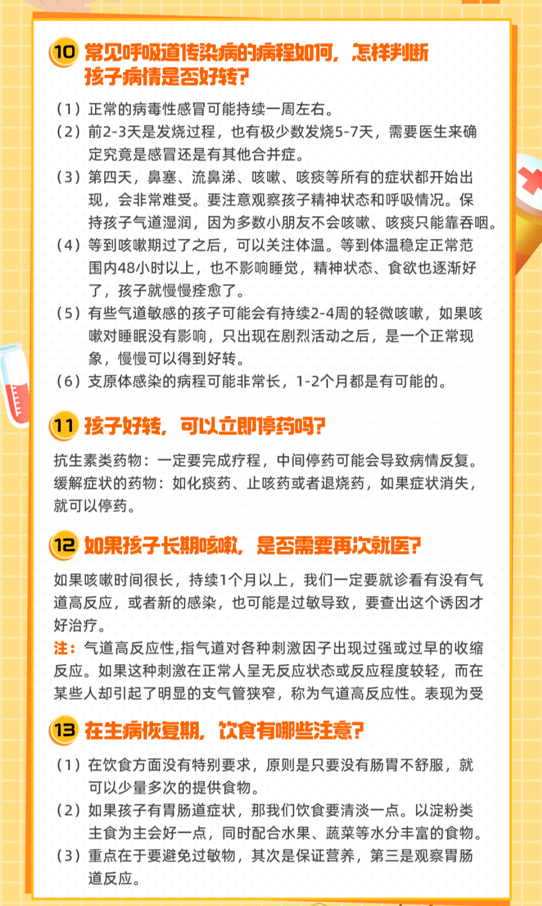

# 呼吸道传染病高发季来袭，家长如何正确带娃看病就医？

秋冬以来，支原体、流感、合胞病毒等各种病原体轮番“轰炸”，很多家庭因为孩子生病，全家出动带娃就诊如同“打仗”。该如何判断孩子的病情？如何在有限的时间内和医生沟通？回家后该如何观察孩子好转情况？鹅滴医生准备了一份带娃就医指南，希望帮助家长面对孩子生病不再无从下手，及时判断孩子的病情、合理居家观察、高效带孩子看病就诊。

就医之前 合理选择

出发之前 准备充足

配合医生 有条不紊

持续观察 悉心护理

**本文合作专家**

整理人：王子睿

编辑：陈晴

**独家说明：本文系腾讯新闻《鹅滴医生》独家稿件，未经授权禁止媒体转载，但欢迎转发至个人朋友圈。**

