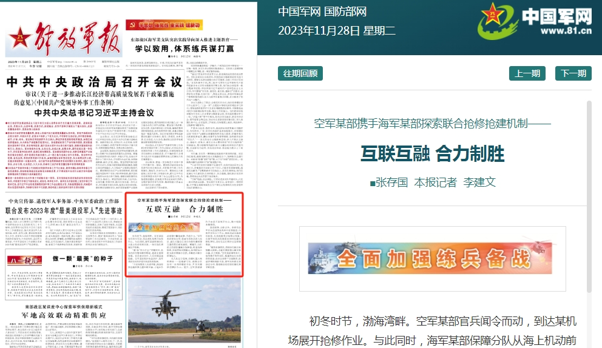
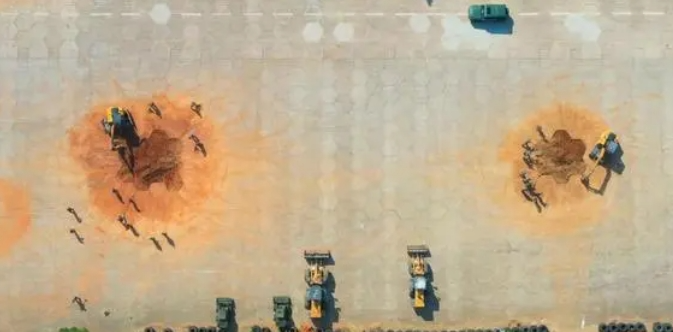

# 应对我方机场战时遭袭，军报头版披露空军、海军新动作

**撰文 | 李岩**

《解放军报》11月28日头版消息称，初冬，空军某部携手海军某部展开实战化训练，探索联合抢修抢建机制。

值得注意的是，本轮军改，解放军始终强调跨军兵种的联合、体系化作战。而今，实战化背景下遭袭单位的抢修工作，也已开始进行跨军种联合合作的尝试。

报道援引空军某部领导介绍称，随着体系练兵深入推进， **部队对整合区域内抢修抢建保障力量的需求愈发强烈。**

**如何联合**

那么，空军和海军如何跨军种联合抢修抢建？

报道透露——

**渤海湾畔，实战化训练中我方机场遭“敌”空中打击，空军某部做好伪装防护，海军某部官兵同步进行伪装效果检测。**

**空军某部官兵闻令而动，到达某机场展开抢修作业。与此同时，海军某部保障分队从海上机动前来支援。**

**参训的空军官兵迅速携装具奔向受损跑道，与海军官兵分工作业，很快完成对跑道的抢修，机场起降等功能得以恢复。当海军某部战机降落在临时抢建的停机坪时，场站官兵已做好应急保障准备。**

空军某部领导介绍，训练中， **他们成立抢修抢建联合指挥部，畅通指挥链路，突破传统保障模式，运用新技术新方法实现融合创新** ，不断提升联合保障能力。

空军某部领导总结，他们携手海军部队，畅通常态化协调联络渠道，组织业务骨干交流集训，验证多项保障新手段，跨军兵种跨区域动态协同、整体联动的抢修抢建机制不断完善。

**解 读**

就此，军事评论员宋忠平向政知君解读称，跨军种的联合抢修模式相当于战时联合保障机制，更加有助于资源的整合。体系化作战不光涵盖联合打击，联合抢修、保障同样是应有之义。和联合打击一样，联合保障比各自为战，效率、效能都要上升一个档次。

_△解放军抢修机场（资料图）_

具体来看这场海空军的联合训练，宋忠平介绍，正由于海军、空军都有下辖航空兵，双方对于机场的使用需求、保障手段有很大同一性。当然，各军种都配属有各自的保障力量，但体系化作战背景下，就近保障、交叉保障、联合保障，显然比各自为战要更有效率，也更利于灵活应对战场事态，尽快恢复受损机场功能。

宋忠平强调，跨军兵种的联合保障机制走向成熟，还可以一定程度上规避保障力量重复建设、重复投资的问题，做到事半功倍。“当然，实现这种联合保障体系并非易事。战时背景下，不同军兵种的指挥调度、协调配合等都是很重要的环节。因此海空军此次旨在探索联合抢修机制的实战训练，意义重大。”

宋忠平还提到，上述联合抢修保障的新尝试，也可以看出，解放军保障手段、保障设备的标准化生产、模块化应用程度很高，这是解放军武器装备融合发展、标准化生产的重要体现，对于战时快速补充具备重要意义。

军报报道还介绍称，这场训练中保障分队运用一系列排爆新手段——

**无人机空中探测、排爆机器人转移弹体，保障分队运用一系列排爆新手段，开展未爆弹药搜排作业。随后，空军某部操作手集中销毁未爆弹药。**

宋忠平解读称，近来国际上多场冲突都已经证实，无人设备在战场上的作用非凡。在抢修保障工作中，无人设备的优势同样明显，广泛应用也是一个必然的趋势。“战时抢修任务一样充满危险，比如排查未爆炸弹药和敌方后续专门针对抢修作业的袭击等。无人设备的投入可以有效保护我方人员安全，也可以第一时间开展抢修任务，提高效率。”

“无人设备参与排爆、运输等抢修任务，足见解放军无人设备种类丰富、功能齐全，在智能化建设方面已取得长足发展。”宋忠平说。

**【版权声明】本文著作权归政知新媒体独家所有，未经授权，不得转载。**

