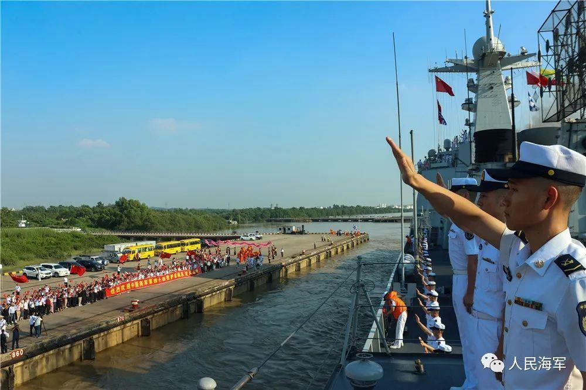
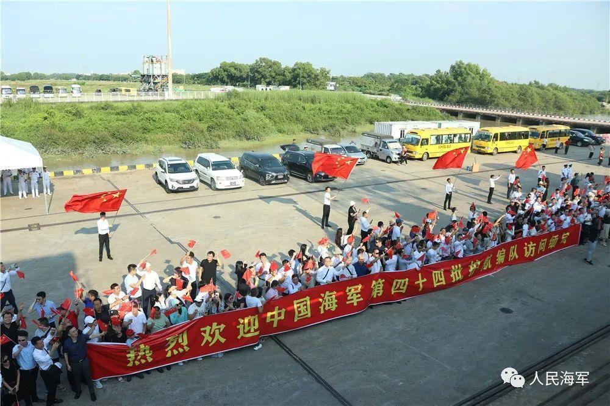
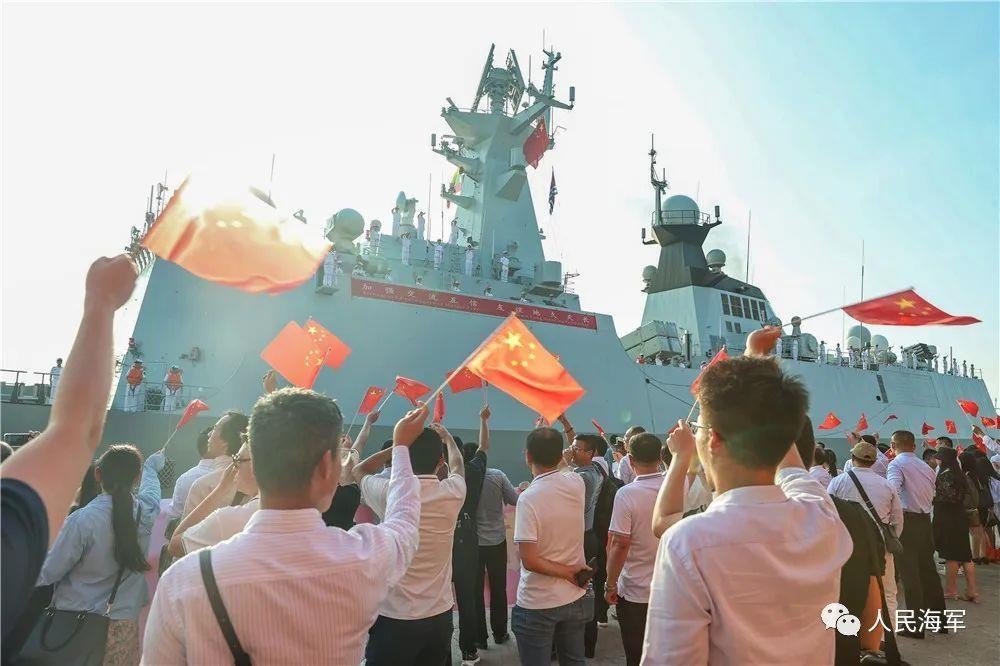
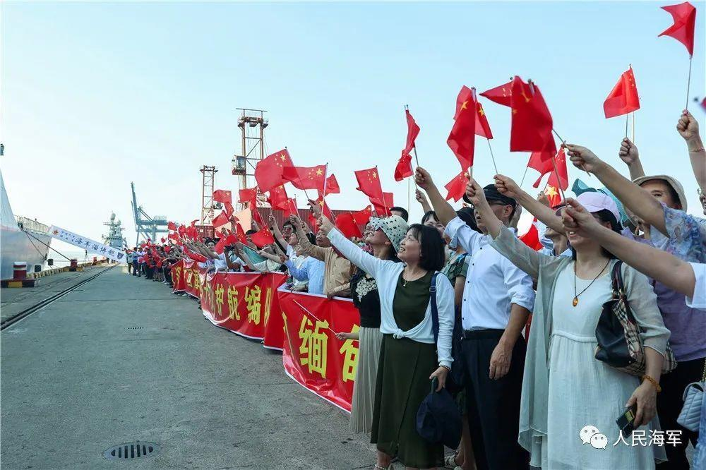
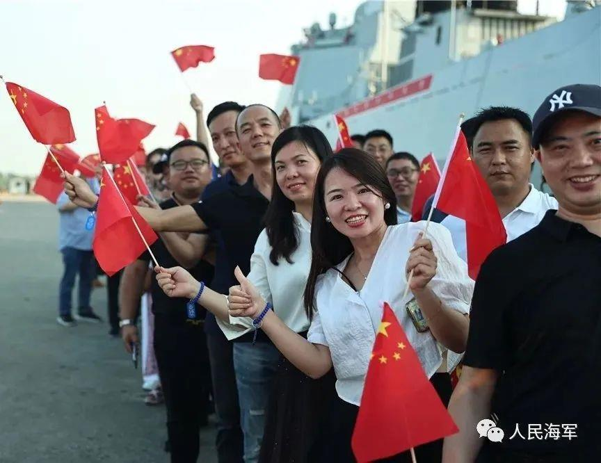
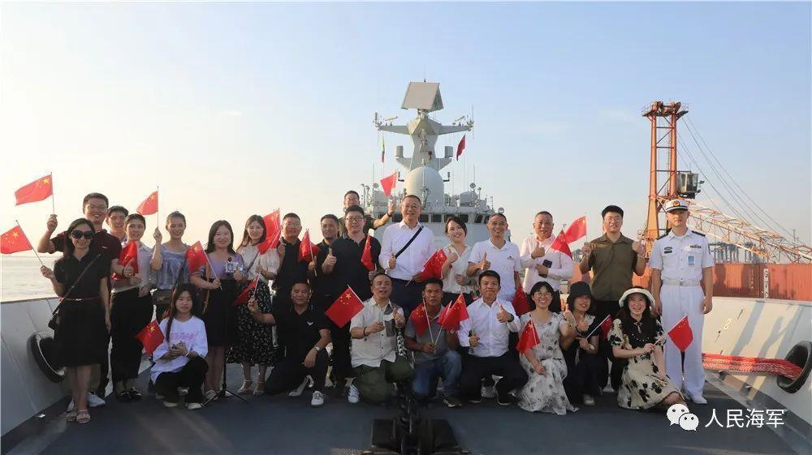
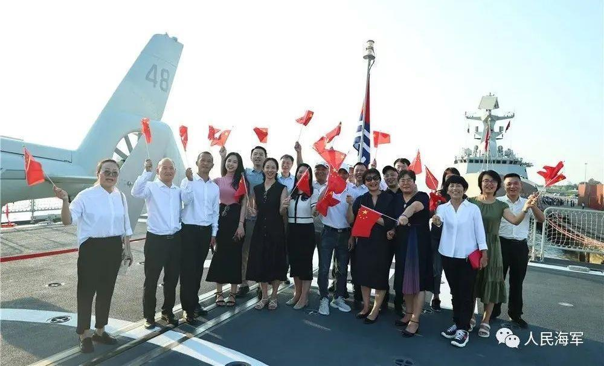
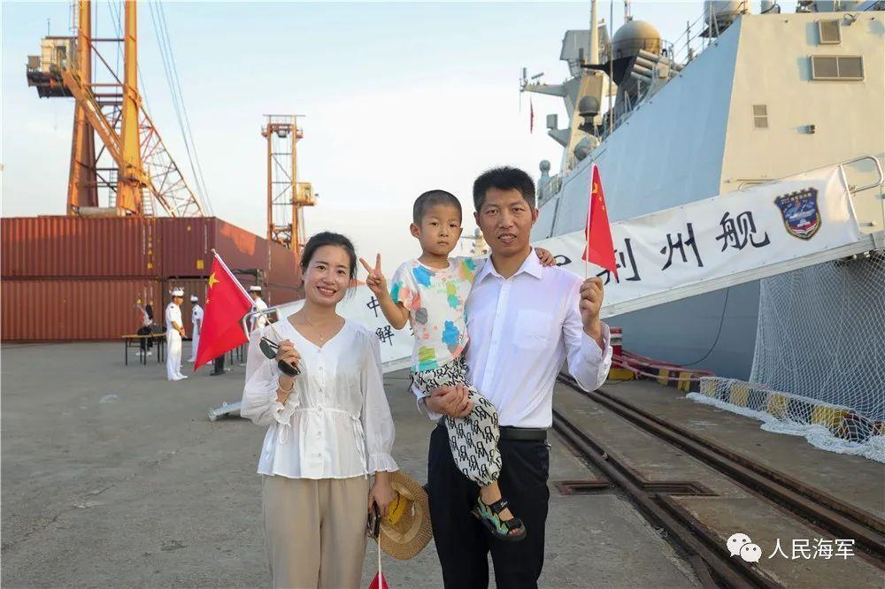

# 海军第44批护航编队抵达缅甸

当地时间11月27日，海军第44批护航编队抵达缅甸仰光，开始进行为期4天的友好访问。中国驻缅甸大使陈海携使馆工作人员、缅海军船坞基地司令佐温少将携官兵代表以及华人华侨等约500人到码头迎接。

_△11月27日下午，海军第44批护航编队访问缅甸仰光。图为官兵整齐列队，向码头欢迎人群挥手致意。_

_△图为码头欢迎人群挥舞五星红旗，热烈欢迎海军官兵。_

 _△图为码头欢迎人群挥舞五星红旗，热烈欢迎海军官兵。_

当日15时许，悬挂“中缅友谊万古长青”等横幅的中国海军淄博舰、荆州舰，在缅海军“德彬瑞梯”号护卫舰引导下，缓缓靠上仰光迪拉瓦码头。

编队官兵身着洁白的军装，在甲板上分区列队，精神抖擞。欢迎人群打着“热烈欢迎中国海军第44批护航编队访问缅甸”的横幅，挥舞着中缅两国国旗欢迎中国海军的到来。

_△图为码头欢迎人群挥舞五星红旗，热烈欢迎海军官兵。_

 _△图为码头欢迎人群挥舞五星红旗，热烈欢迎海军官兵。_

 _△图为码头欢迎人群挥舞五星红旗排队参观舰艇。_

靠港后，陈海大使在淄博舰舰长、政委的陪同下，检阅了淄博舰仪仗队，并与编队指挥员进行了座谈交流。缅甸海军领导、我驻缅甸大使馆工作人员，以及前来欢迎的华人华侨登上淄博舰参观。

 _△图为欢迎人群登舰参观，并合影留念。_

_△图为欢迎人群登舰参观，并位舰艇飞行甲板合影留念。_

_△图为华人华侨在舰艇前合影留念。_

据悉，这是中国海军舰艇编队第6次访问缅甸。期间，编队指挥员将拜会缅军地高层领导，慰问当地小学师生。编队官兵将与缅海军官兵进行专业交流、文体竞技以及相互参观军事设施等活动。淄博舰、荆州舰将举行舰艇开放并举办甲板招待会。

来源：人民海军

