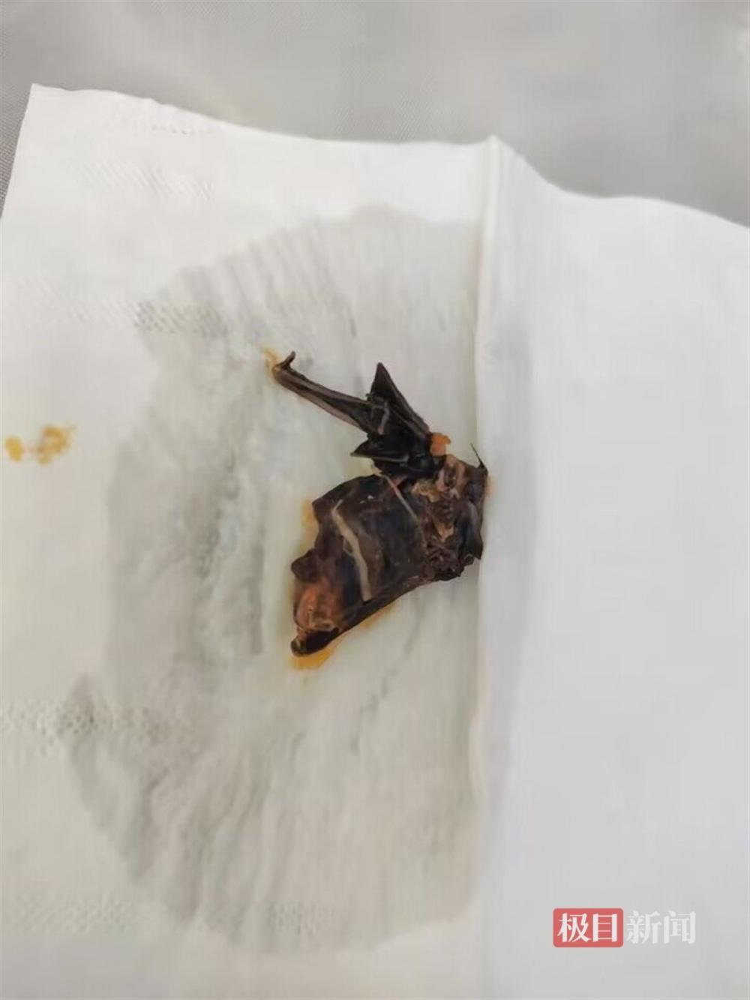
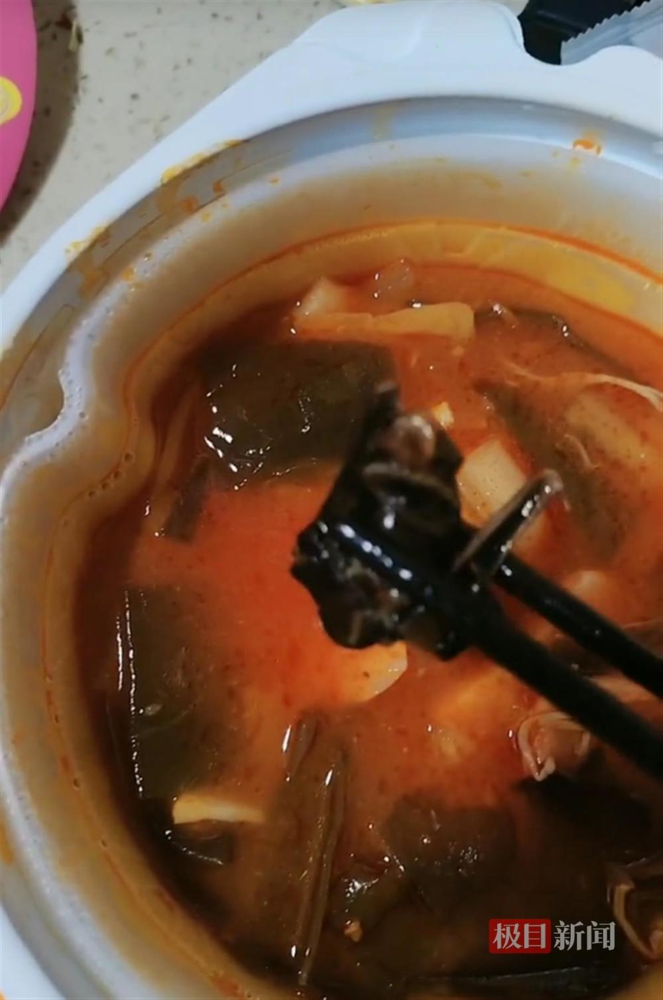
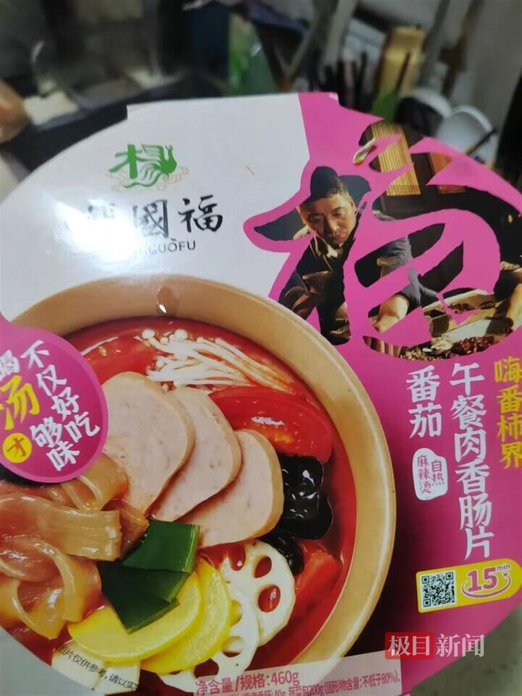
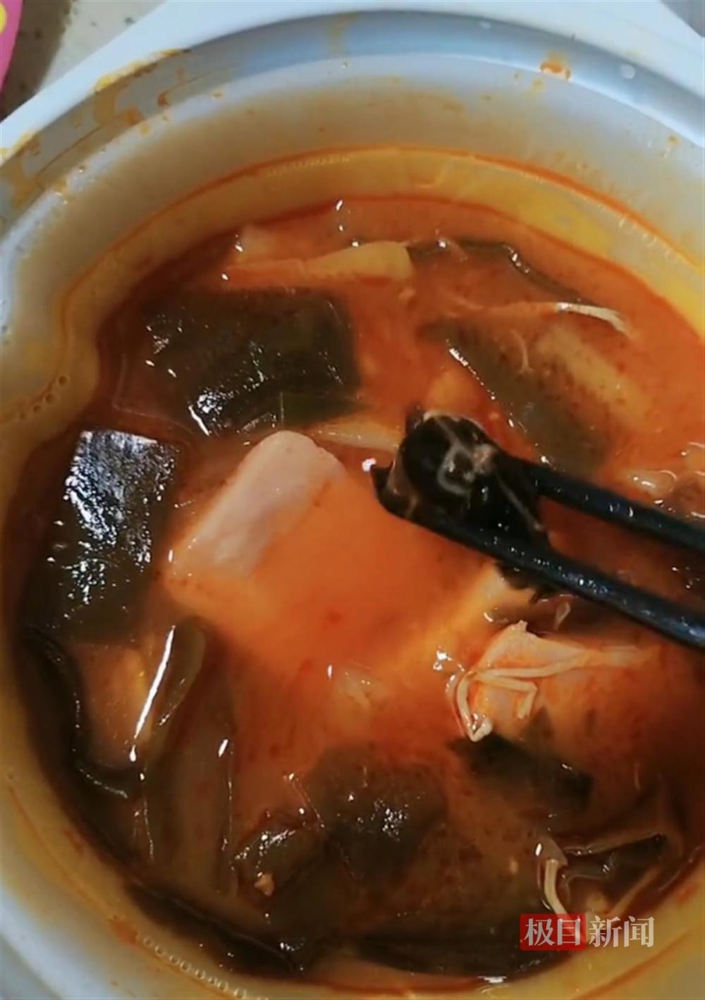

# 消费者称在杨国福自热麻辣烫中疑似吃出蝙蝠，商家回应

极目新闻记者 张万军

11月27日，天津一名消费者反映，她女儿在食用一盒杨国福自热麻辣烫时，在碗里疑似发现了一只蝙蝠，他们感到既恶心又担心。11月28日，杨国福集团工作人员向极目新闻记者表示，已将此事转给相关部门跟进处理。

_消费者在火锅中发现的疑似蝙蝠的异物（受访者供图）_

视频显示，一盒已开封的杨国福自热麻辣烫中有一块黑色的不明物体，展开后有一部分高度类似蝙蝠的翅膀。

 _消费者在火锅中发现的疑似蝙蝠异物（受访者供图）_

视频发布者称，她的女儿在食用杨国福自热麻辣烫时，在碗中发现了异物，应该是蝙蝠，希望厂家给一个说法。

 _消费者购买的杨国福麻辣烫自热火锅（消费者供图）_

11月28日，视频发布者刘女士告诉极目新闻记者，她来自天津。11月25日，她在当地一家超市购买了一盒杨国福自热麻辣烫，11月27日晚上，女儿在食用这个自热麻辣烫时，将一块黑色物质当成海带，夹给了她。她感觉不对劲，将情况告知了丈夫。当晚，丈夫回家后，检查发现黑色物质疑为一只蝙蝠。

“目前孩子的精神状态不太好，没精神，也不想吃东西。”李女士表示，他们发现蝙蝠后，感到既恶心又担心。目前，他们已向12315投诉了此事，正在等待相关部门的回复。

 _消费者在火锅中发现的疑似蝙蝠的异物（受访者供图）_

11月28日，极目新闻记者致电杨国福集团客服电话，向工作人员反映了相关情况，一名工作人员表示，已将此事转给相关部门跟进处理。

极目新闻记者致电天津政务服务便民热线，暂未获得正面回复。

（来源：极目新闻）

**更多精彩资讯请在应用市场下载“极目新闻”客户端，未经授权请勿转载，欢迎提供新闻线索，一经采纳即付报酬。24小时报料热线027-86777777。**

