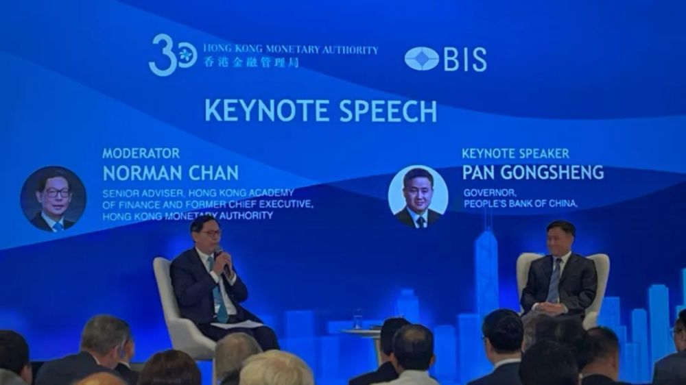

# 潘功胜谈房地产：调整已出现积极迹象，金融外溢风险可控

**摘 要：**
潘功胜表示，虽然此前房地产市场有所承压，但目前已看到了积极发展迹象。前三季度，在中国房地产市场，新房销售下降趋势有所收窄，二手房市场热度则有所上升

**文｜康恺 发自中国香港**

**编辑｜袁满**

“调整中的中国房地产市场已出现积极发展迹象，对金融体系外溢影响总体可控。”11月28日，中国人民银行（下称“中国央行”）行长潘功胜在香港金融管理局—国际清算银行高级别会议上表示。

**在他看来，在快速发展几十年后，中国房地产市场进入转型期。**
虽然此前房地产市场有所承压，但目前已看到了积极发展迹象。前三季度，在中国房地产市场，新房销售下降趋势有所收窄，二手房市场热度则有所上升。

房地产及相关产业占中国国内生产总值（GDP）近四分之一，该行业的变动“牵一发而动全身”。如果地产商违约，将冲击银行的资产负债表及地方政府税收，并使居民财富缩水，由此引发金融风险。

**潘功胜表示，长期来看，房地产市场的调整对于中国经济增长和可持续发展是有益的，但短期内应当防止溢出性风险。**
对此，中国央行已采取了一系列措施，包括降低首付比例，降低房贷利率，鼓励商业银行和借贷者去商谈更优惠的利率，提供金融支持保交楼等。

**他认为，房地产市场调整对金融体系的外溢影响总体可控，“中国央行一直遵循非常审慎的借贷政策。目前，房地产相关贷款占银行贷款余额的23%，其中约80%为个人住房贷款。”**

对于中国经济的另一风险——地方债问题，潘功胜表示，中国政府的整体债务在国际水平中处于中低位。“对有债务问题的地方政府，将限制其新增贷款，严格控制其借贷行为；鼓励这些地方政府出售资产还债；要让金融机构与地方政府按照市场规则进行协商等等。”他表示，未来一些欠发达省份的债务问题将会逐步得到解决。

**潘功胜认为，中国经济持续恢复向好、总体回升的态势更趋明显，预计全年能够顺利实现5%的经济增长目标。**

_（中国人民银行行长潘功胜在香港金融管理局—国际清算银行高级别会议上演讲，图片来源：《财经》记者现场拍摄）_

房地产调整呈现积极信号

**潘功胜表示，中国房地产市场正进入调整期。**
首先，居民对新房需求有所下降，正将视线转向二手房。不仅如此，租赁需求也有所增加；另一方面，房地产市场在不同城市间呈分化趋势。一、二线城市房价将持续稳定，三、四线城市房价将有所下降。

**他表示，虽然中国房地产市场正在调整，但目前已看到了积极发展迹象。** 前三季度，在中国房地产市场，新房销售下降趋势有所收窄，二手房市场热度则有所上升。

第三方研究机构克而瑞发布的销售数据显示，10月单月，百强房企实现销售操盘金额4066.9亿元，与2022年同期相比，虽有所下降，但环比表现则有约0.6%的上涨。

**潘功胜引用标普信评报告称，中国房地产市场的情绪和价格都开始呈现正常化的趋势，该报告预计房地产市场即将触底。**

11月27日，标普信评发布题为《筑底与新平衡：2024年房地产开发行业信用趋势展望》报告。该机构认为，2024年仍是房地产销售的筑底之年，但市场也不会再度大幅下跌，预计全年商品房销售额同比下降5%左右。

**潘功胜表示，长期来看，房地产市场调整对中国经济增长和可持续发展是有益的，短期内应当防止其溢出性风险。**

“对此，我们采取了一系列措施，包括降低首付比例，降低房贷利率，鼓励商业银行和借贷者去商谈更优惠的利率，提供金融支持保交楼，向地方政府提供资金支持，向低收入人群提供公租房，也鼓励金融机构支持房地产商进行债务重组、支持房地产市场并购。”他说。

实际上，潘功胜在11月中上旬接受采访时便表示：“8月，我们把存量房的贷款利率调降下来，让商业银行和借款人之间相互协商，调降的幅度平均大概是0.8个百分点。我们也算了一下，5000万户家庭，大概1.5亿人，每年家庭节省的利息支出大概是1700亿。同时，我们密切关注一些领域的金融风险。总体看，房地产金融风险可控。长期看，居民家庭改善性住房需求较大，可以为房地产市场和行业长期稳定发展提供支撑。”

房地产金融外溢风险可控

**房地产市场产业链较长，且与金融市场息息相关。**
一方面，居民在购房时大多会向银行借贷，如果居民无法按时还贷，银行坏账将因此增加。另一方面，地产商同样也向银行举债融资。非一线城市的房价承压，地产商存在偿债风险。在此背景下，房地产债权人或受违约冲击，地方政府的税收亦将受到影响。

Wind（万得）数据显示，2023年上半年，A+H股亏损房企数量达72家。标普全球评级数据显示，2021年-2022年期间，房地产行业的债券违约总额约为810亿美元。

**对此，潘功胜表示，房地产市场调整对金融体系的外溢影响总体可控。**
他表示，中国央行一直遵循非常审慎的借贷政策。目前，房地产相关贷款占银行贷款余额的23%，其中约80%为个人住房贷款。

11月8日，潘功胜在2023金融街论坛年会上发表讲话时亦表达了相似观点。“行业发展长周期繁荣背景下，部分房地产企业长期‘高杠杆、高负债、高周转’经营，资产负债快速扩张，叠加房地产市场供求关系的重大变化、疫情冲击等，以恒大为代表的企业风险显性化并向行业扩散。”他说道。

他进一步称，近三年来，按照党中央、国务院部署，行业主管部门和地方政府采取了多项措施，金融部门配合从供需两端综合施策，改善行业融资性和经营性现金流，优化调整房地产金融政策，包括出台“金融16条”，设立保交楼专项借款，调整首付比、按揭贷款利率等宏观审慎金融政策。随着经济回升向好，加上房地产政策效果显现以及市场的自身修复，8月以来，房地产市场成交总体改善。

 _（中国人民银行行长潘功胜在香港金融管理局—国际清算银行高级别会议上演讲。图片来源：《财经》记者现场拍摄）_

分析中国经济要注意两个视角

对于中国经济增速，潘功胜表示，前三季度，中国GDP同比增长5.2%，预计全年能够顺利实现5%的经济增长目标。近期，国际货币基金组织将中国今年经济增长预测上调至5.4%，这个增速在全球主要经济体中保持领先。

从GDP的主要组成部分看，消费对经济增长的贡献率持续上升，服务业表现良好。10月，社会消费品零售总额继续反弹，同比增长7.6%。投资方面，今年1-10月，制造业投资同比增长6.2%，扣除房地产开发投资的民间项目投资同比增长9.1%，高技术产业投资持续较快增长，同比增长11%。外贸方面，10月，以人民币计价的进出口额止跌回升，同比增长约1%。反映实物量的进出口货运量保持10%左右的增长。

**潘功胜特别提及，分析中国经济需要注意两个视角。一是当前中国的GDP总量已超120万亿元人民币，约合18万亿美元。庞大的基数决定了中国经济很难像此前那样维持每年8%-10%的高速增长。**

**二是中国正在经历经济增长模式的转型。**
传统增长模式过度依赖基础设施和房地产投资，也许短期内能实现更高增速，但也会固化结构性矛盾，损害增长的可持续性。高质量和可持续发展更加重要，我们必须更加关注经济结构调整，培育新的增长点。这是我们必须要经历的转型之路。

在货币政策方面，潘功胜表示，今年以来，中国人民银行综合运用多种政策工具，包括下调存款准备金率，降低政策利率，带动贷款报价利率（LPR）等市场利率下行等。

**上述举措为高质量发展营造了良好的货币金融环境。**
10月，广义货币（M2）和社会融资规模存量同比分别增长10.3%和9.3%。9月，企业贷款加权平均利率为3.8%，处于历史最低水平。

同时，中国央行还发挥好结构性货币政策工具作用，加大对小微企业、绿色发展、科技创新等重点领域的支持力度。数据显示，三季度末，结构性货币政策工具余额约7万亿元，约占中国人民银行资产负债表规模的15%。

对于中国地方政府债务问题，潘功胜表示，中国政府的整体债务在国际水平中处于中低位，到2022年底，中国政府的债务余额约为60万亿元人民币，约为当年国民生产总值的50%，中央政府债务率约为21%，处在相对较低水平。即使按照国际清算银行（BIS）数据，我国政府总债务率约为78%，而G20国家约为94%、新兴市场平均值约为65%。

**(作者为《财经》记者)**

